> 前排提醒：本文仅代表个人观点，以供交流学习，若有不同意见请评论留言，笔者一定好好学习，天天向上。无关学习的讨论笔者或会“不小心”没看到。笔者英文不好，看到好玩的变量名请不要嘲笑。

//@[TOC](目录)

## 一、前言

最近在学习如何制作 FPS 游戏，学习了如何使用角色控制器来控制角色的移动跳跃等等，结合之前学到的使用 transform，刚体等使物体移动，不同的移动方式适用于不同的场景，今天就来简要盘点一下各种移动方式以及其优劣之处，若有不对之处，请多多指教。

---

## 二、使用 Transform 组件

> Unity 场景中的每个游戏对象都拥有一个 Transform 组件，用于存储该对象的位置、旋转、缩放等基础属性，此种方式的原理就是通过 Update 函数每帧更新其位置来达到移动目的。
> 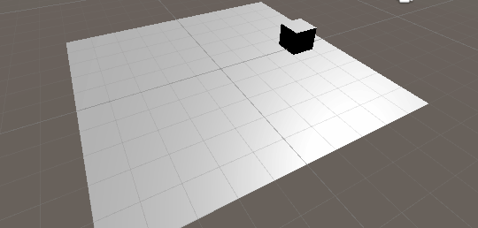

#### 1. Transform.position

> 最最基础的移动方式，每帧+=计算好的新位置，更加直观

```C#
    public float speed = 3.0f;
    void Update()
    {
        transform.position += new Vector3(0, 0, speed * Time.deltaTime);
    }
```

#### 2. Transform.Translate

> 每秒向某方向移动多少距离，此种方法和上一种没有太大区别，但当需要坐标转换时，使用此方法可省略转换步骤。
> **translate(V3 向量，坐标系(留空默认为 Space.Self));**

```C#
    public float speed = 3.0f;
    void Update()
    {
        transform.Translate(Vector3.forward * Time.deltaTime * speed);
    }
```

---

## 三、使用 Vector3 的插值方法

> Vector3 类型可以存储物体的位置、方向。上述的 transform 组件的基本信息就是由 Vector3 类型存储的，所以可以 V3 自带的类方法通过对位置的一些运算得到相对平滑的参数，其移动本质还是修改物体的 position。需视情况和需求来选择 V3 的 4 种插值方法。Mathf 类中也有这些方法，不过参数是 float，使用方法大致相同，读者若感兴趣，自行学习吧。

#### 1. Vector3.Lerp

> 两个向量之间的线性差值，适用于从某点移动到某点（或跟随某物体），缓动效果
> 这里线性移动是由时间参数控制的，若写成 Speed\*Time.deltaTime 则理论上永远也抵达不了，但这里就不讨论如何用 Lerp 实现匀速了，以后再写。
> **Lerp(当前位置(V3)，目标位置(V3)，时间(float))** 时间越小，缓动效果越慢
> 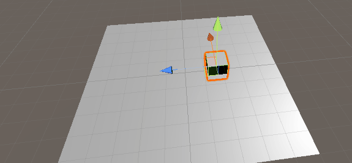

```C#
    public Transform target; //被跟随的物体
    public float speed = 3.0f;
    void Update()
    {
        Vector3 lerp =  Vector3.Lerp(transform.position, target.position, Time.deltaTime * speed);
        transform.position = lerp;
    }
```

#### 2. Vector3.Slerp

> 两个向量之间的球形（弧线）差值，适用于从某点移动到某点（或跟随某物体），缓动效果，当前位置与目标位置距离越远，效果越明显
> **Slerp(当前位置(V3)，目标位置(V3)，时间(float))** 时间越小，缓动效果越慢
> 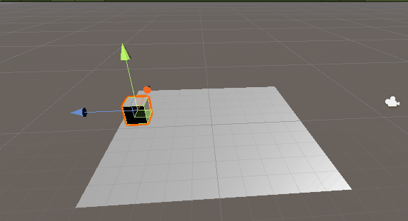

```C#
    public Transform target; //被跟随的物体
    public float speed = 3.0f;
    void Update()
    {
        Vector3 slerp =  Vector3.Slerp(transform.position, target.position, Time.deltaTime * speed);
        transform.position = slerp;
    }
```

#### 3. Vector3.MoveTowards

> 和 Lerp 函数基本相同，但此函数多了一个最大速度限制，且是**匀速**朝目标运动，而 Lerp 和 Slerp 则是将抵达位置时放缓（减速）
> **MoveTowards(当前位置(V3)，目标位置(V3)，最大速度(float))**
> 速度参数：取正向目标靠近，取负则远离目标
> 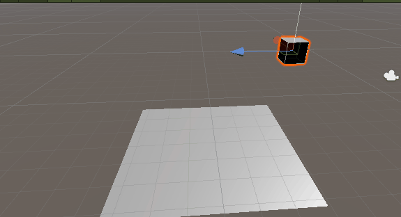

```C#
    public Transform target; //被跟随的物体
    public float speed = 1.0f;
    void Update()
    {
        Vector3 movetowards =  Vector3.MoveTowards(transform.position, target.position, Time.deltaTime * speed);
        transform.position = movetowards;
    }
```

#### 4. Vector3.SmoothDamp

> 官方翻译为：“平滑阻尼”，无比丝滑的从 A 移动到 B 点，速度可控，比较适用于摄像机跟随，Lerp 也比较适用于摄像机跟随，这俩的区别在于
> **SmoothDamp(当前位置(V3)，目标位置(V3)，当前速度(ref:V3)，所需时间(float)，最大速度(float，可选)，Time.deltaTime(默认)(可选))**
> 当前速度：一开始赋值为 0，每次调用该方法自动修改此参数，注意设为全局变量，且为 ref
> 所需时间：该值越小，越快抵达目标
> 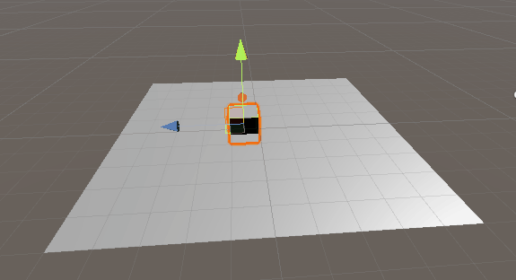

```C#
    public Transform target; //被跟随的物体
    public Vector3 currentVelocity = Vector3.zero; //当前速度
    public float smoothTime = 0.3f; //所需时间
    void Update()
    {
        Vector3 smoothdamp = Vector3.SmoothDamp(transform.position, target.position, ref currentVelocity, smoothTime);
        transform.position = smoothdamp;
    }
```

---

## 四、使用刚体（Rigidbody）组件

> Rigidbody 组件通过物理模拟来控制一个物体的位置，当使用此组件控制物体移动时，应在 FixedUpdate 函数中更新数据，该方法会在每一次执行物理模拟前被调用，这样要比 Update 函数更加精确，具体原因以后再说或可自行搜索。

#### 1. AddForce

> 添加一个方向的力到刚体，刚体将开始移动，这种方式适合模拟外力作用下的刚体运动，如子弹。但注意，此力是累加的，不适合重复施加力来模拟物体！
> **AddForce(有方向的力(V3)，力的模式(ForceMode,默认：ForceMode.Force))**
>
> > ForceMode(力的模式):
> > Force(可持续的力，受质量影响)
> > Acceleration(可持续的加速度，不受质量影响)
> > Impulse(一个瞬间冲击力，受质量影响)
> > VelocityChange(一个瞬间速度变化，不受质量影响)
> > 笔者对于这些东西的区别有点懵，还是大家自己悟吧，例图演示的是第一种力，20 的向 Z 的力
> > 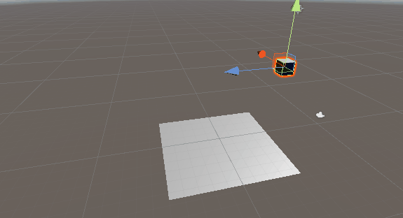

```C#
    public float forceNumber = 20f;
    public Rigidbody rig; //获取当前物体的刚体组件
    void FixedUpdate()
    {
        Vector3 force = new Vector3(0, 0, forceNumber);
        rig.AddForce(force, ForceMode.Force);
    }
```

#### 2. MovePosition

> 移动刚体到一个新的位置，移动的同时受到物理模拟的影响
> **MovePosition(新的位置(V3))**
> 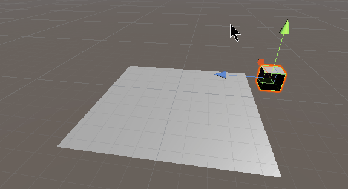

```C#
    public Vector3 speed = new Vector3(0, 0, 1);
    public Rigidbody rig; //获取当前物体的刚体组件
    void FixedUpdate()
    {
        rig.MovePosition(transform.position + speed * Time.deltaTime);
    }
```

#### 3. Velocity

> 瞬间给一个物体恒定的速度，将该物体提升到这个速度，保持。相比较 AddForce 更加适合跳跃功能。每次跳跃都是恒定高度，做跳跃的话，图二记得每次跳跃完置零就行。
> 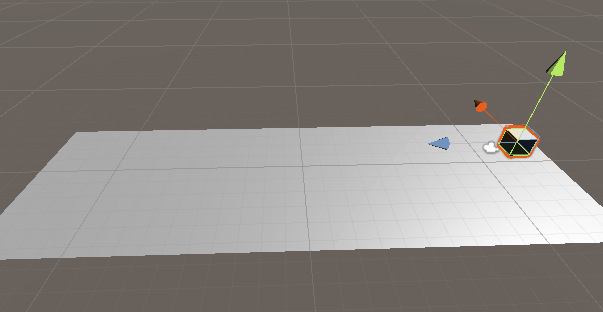

```C#
    public Vector3 high = new Vector3(0, 0, 10);
    public Rigidbody rig; //获取当前物体的刚体组件
    private void FixedUpdate() {
        rig.velocity += high * Time.deltaTime;
    }
```

> 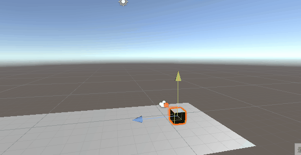

```C#
    public Vector3 high = new Vector3(0, 10, 0);
    public Rigidbody rig; //获取当前物体的刚体组件
    private void Update() {
        if(Input.GetKeyDown(KeyCode.J))
        {
            rig.velocity = high;
        }
    }
```

---

## 五、使用角色控制器（Character Controller）组件

> 角色控制器顾名思义，是 Unity 推出的特别用于角色移动的组件，使用角色控制器的物体有刚体的效果，但不会翻滚（意思是运动仅受限于碰撞体，不受其他因素影响），很适合角色移动。还可以设置斜坡参数，一定坡度自动抬升，本身也是个碰撞体，具体的细节本篇就不多赘述。

#### 1. SimpleMove

> 以一定速度移动角色，**以秒为单位**，无需乘以时间，具备重力
> **SimpleMove(有方向的力(V3))**
> 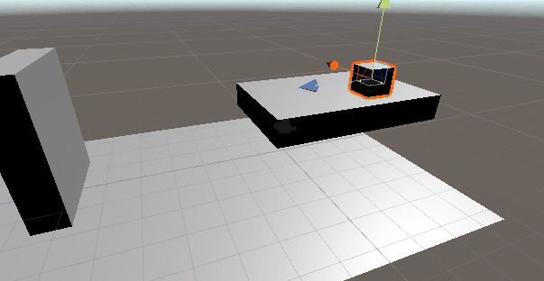

```C#
    public float speed = 5;
    public CharacterController cc; //获取当前物体的刚体组件
    void Update() {
        cc.SimpleMove(transform.forward * speed);
    }
```

#### 2. Move

> 以一定速度移动角色,不具备重力，需要自行计算下落
> **Move(有方向的力(V3))**
> 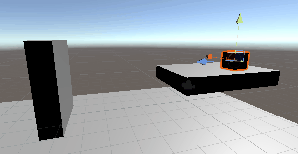

```C#
    public float speed = 5;
    public CharacterController cc; //获取当前物体的刚体组件
    void Update() {
        cc.Move(transform.forward * speed * Time.deltaTime);
    }
```

---

## 六、总结与参考资料

### 1.总结
> 简单区分以上几种方式，可分为物理移动和非物理移动，读者应自行区分何种物体应该使用何种方式。
>
> - 如关卡中的移动障碍应用非物理移动，因为不需要相关障碍进行物理运算。
> - 如摄像机跟随人物移动，简单方式可直接作为角色的子物体或直接算出偏移量，直接加给摄像机的 position，但太生硬，所以考虑加入 Lerp 或 SmoothDamp，让摄像机跟随更加平滑。
> - 比如角色移动，若使用非物理方式，则无法与环境交互，若使用刚体组件，则可能发生碰撞倾倒，会产生很多方向的力，处理比较复杂，所以考虑使用角色控制器，仅在发生碰撞时限制物体运动，不会导致很多奇怪的情况发生。
> - 对于 V3 插值函数的应用，可对某些运动转换更加流畅的处理，具体用法读者自行拓展。

> 本篇中我还有好多没有理清楚的地方，日后理清楚了会再修改，若读者对其中的一些片段有些不同的看法，请留言讨论。

### 2.参考资料
1.https://blog.csdn.net/jiumengdz/article/details/78537758
2.https://www.cnblogs.com/claireyuancy/p/7266586.html
3.https://www.sohu.com/a/211459755_667928
4.https://www.cnblogs.com/CasualAttachment/p/7308993.html
5.https://blog.csdn.net/six_sex/article/details/51114083
6.https://blog.csdn.net/renkai0406/article/details/63800248
7.https://blog.csdn.net/weixin_44370124/article/details/90080871
