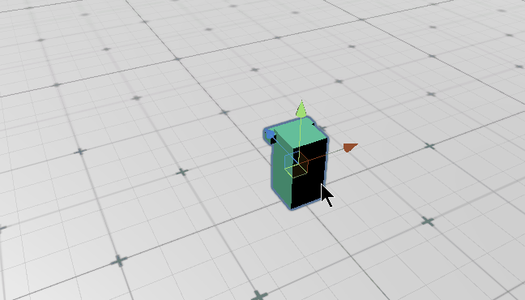
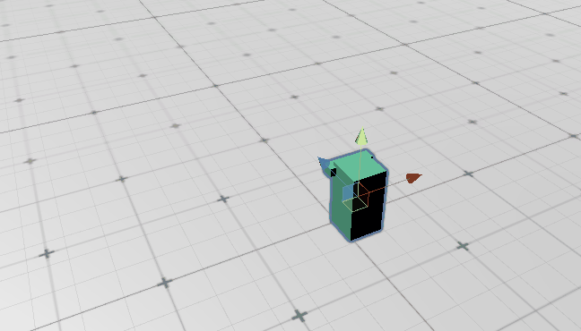
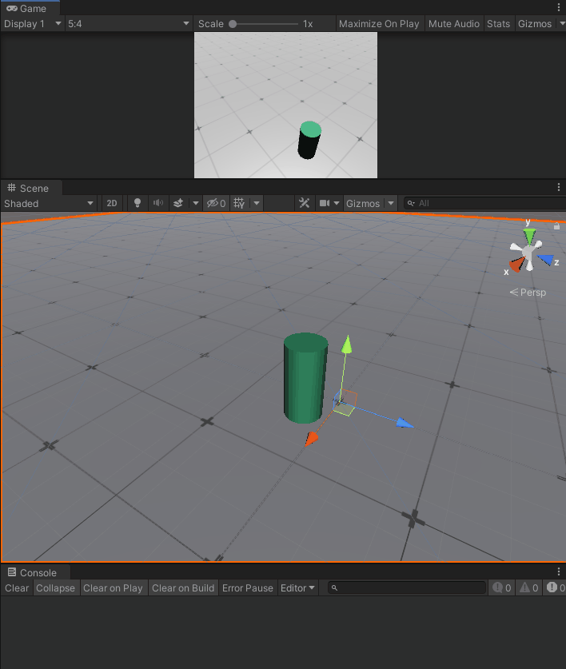
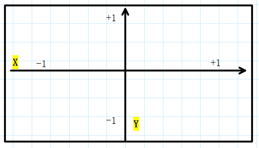
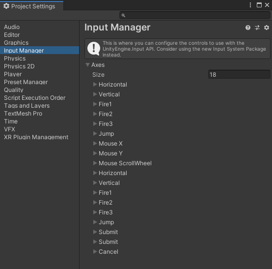
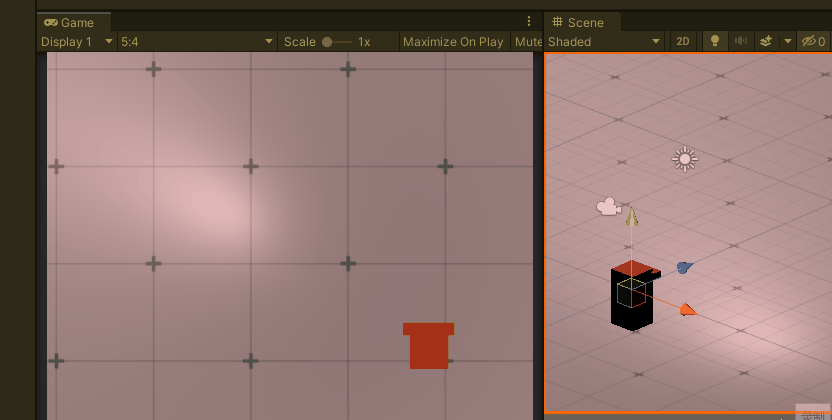
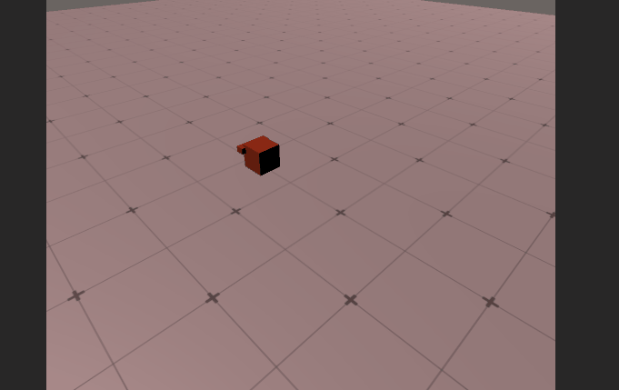

## 前言

上一篇写了数种Unity中的移动方式，有物理移动，有非物理移动等，这篇我们来谈谈Unity中的移动控制方式，来结合上一篇所说的方法，用起来。一般控制是通过获取用户输入来处理角色移动逻辑的，而用户输入的设备有键盘、鼠标、手柄等等，本篇仅介绍最常用的键鼠控制角色移动方式。

//@[TOC](目录)

> 前排提醒：本文仅代表个人观点，以供交流学习，若有不同意见请评论留言，笔者一定好好学习，天天向上。

**本篇统一使用Translate来演示移动控制，若想使用其他移动方法，更新其移动逻辑即可**

---

## 一、监听指定键 Input.GetKey()

> 在Input类中有专门用于监听指定按键的，如GetKey(是否持续按下某键)、GetKeyDown(是否按下某键)，可以通过if判断这些键是否被按下来触发相应的移动逻辑，将整体的逻辑放到更新函数中，循环监听执行，来达到移动控制目的。

>使用GetKey函数来监听某键是否持续按下，如果你想同时响应多个方向，请不要写成if..else形式
> 
```CSharp
    public float speed = 3.0f;
    void Update()
    {
        Move_Update();
    }
    private void Move_Update()
    {
        if (Input.GetKey(KeyCode.W))
        {
            transform.Translate(Vector3.forward * speed * Time.deltaTime);
        }
        if (Input.GetKey(KeyCode.S))
        {
            transform.Translate(Vector3.back * speed * Time.deltaTime);
        }
        if (Input.GetKey(KeyCode.A))
        {
            transform.Translate(Vector3.left * speed * Time.deltaTime);
        }
        if (Input.GetKey(KeyCode.D))
        {
            transform.Translate(Vector3.right * speed * Time.deltaTime);
        }

    }
```
---

## 二、监听虚拟键（轴向） Input.GetAxis()

> 在Input类中也有专门用于监听轴向的，你可以这么理解：
> Unity内置了一些虚拟键，其中Vertical代表当你按下“上”键或“下”键时触发，Horizontal代表当你按下“左”或“右”键时触发，而触发则返回一个范围在正负1的float值，而这个返回值就可以代替上一个例子中的Vertor.forward、back等值。这样定义的好处在于移植性高，比如这个例子移植到手机上依旧能正常运行，当拖动手机屏幕摇杆向上则触发Vertical，其余同理。

>关于GetAxis定义的虚拟键的详细信息，大家可以到Edit-Project Settings-Input Manager中找到。

>使用GetAxis函数来监听虚拟键是否持续按下，这种写法要比上一种更加简洁，且移动停止也更加柔和，对比上一个可以看到明显的生硬
> 

```CSharp
    public float speed = 3.0f;
    void Update()
    {
        Move_Update();
    }
    private void Move_Update()
    {
        Vector3 v = Input.GetAxis("Vertical") * Vector3.forward;
        Vector3 h = Input.GetAxis("Horizontal") * Vector3.right;
        //此处乘以V3向量是为了Translate,因为此函数只接受V3向量
        
        transform.Translate(v * speed * Time.deltaTime);
        transform.Translate(h * speed * Time.deltaTime);
    }
```

## 三、监听虚拟键 Input.GetButton()
> 上一节说Unity内置了一些虚拟键，其中Vertical代表当你按下“上”键或“下”键时触发..这些只是用于方向，鼠标等真正具有轴向的虚拟控制键。而对于哪些功能性很强的，如跳跃，射击，出拳等操作没法用轴来定义了，Unity就又定义了一些虚拟键，用于这些功能。监听使用GetButton函数。

> 关于GetAxis定义的虚拟键的详细信息，大家可以到Edit-Project Settings-Input Manager中找到。

> **使用GetAxis函数来监听轴向，使用GetButton函数来监听虚拟键**

比如下面这个例子，使用了GetButton来监听开火键（鼠标左键）、跳跃键（空格），因为一般开火键都是鼠标左键嘛，空格都是跳跃嘛。所以这些是属于约定俗成的东西。当然你完全可以更改，你改成鼠标左键跳跃也行，只要有人愿意买单就行，毕竟游戏引擎只是工具而已。
> 

```CSharp
    void Update()
    {
        if (Input.GetButtonDown("Jump"))
        {
            transform.GetComponent<Rigidbody>().AddForce(transform.up * 100);
        }
        if(Input.GetButtonDown("Fire1"))
        {
            Debug.Log("开火！");
        }
    }
```
---

## 四、物体跟随鼠标移动

上一个例子我们通过监听虚拟键来控制物体前后左右移动，这次我们通过控制鼠标移动来让物体跟随，依旧用到了Input类中的值，当设置好监听键然后当鼠标移动时，会触发返回一个范围在正负1的float值，如下图所示，这是一个屏幕范围，鼠标向屏幕正右移动则返回大于0且小于1的相对与屏幕的比例数字，向左则相反。若你只想让返回的数值是正负1的话，可避免使用GetAxis()，而是使用GetAxisRaw()，本例就使用这种方法来做演示吧。
> 

> 再次重复关于Input定义的虚拟键的详细信息，大家可以到Edit-Project Settings-Input Manager中找到。
 
> 而本例则会使用Mouse X和Mouse Y这两个虚拟键。

> 
> 本例仅简单的通过修改transform的XZ坐标来实现移动的，若要做出精准的物体跟随鼠标运动，需要将屏幕坐标转换为世界坐标，才能通过对转换后的世界坐标位置进行位移操作，下一个例子就用到了转换坐标的相关知识。

```CSharp
    public float speed = 10f;
    void Update()
    {
        Move_Update();
    }
    private void Move_Update()
    {
        float mouseX = Input.GetAxisRaw("Mouse X");
        float mouseY = Input.GetAxisRaw("Mouse Y");
    
        transform.Translate(Vector3.right * mouseX * Time.deltaTime * speed);
        transform.Translate(Vector3.forward * mouseY * Time.deltaTime * speed);
    }
```


---

## 五、鼠标点击移动角色

> 上述几个例子都是通过键盘控制或鼠标移动控制，也有很多游戏是通过鼠标点击来移动的，获取鼠标点击时的位置信息也有很多方法，但其重点在于如何将2维平面转换为3维世界的实际位置，这涉及到世界坐标和屏幕坐标的相互转换，以及射线相关知识，读者可自行查阅API了解。后续我也会写相关的这类文章。

> 通过鼠标点击来移动角色思路如下：当鼠标点击时，从当前鼠标点击位置生成一条射线，穿过屏幕通过转换来获取实际世界坐标，然后通过更新函数来移动角色抵达相应位置
> 

```CSharp
    private bool isNextMove = false;
    private Vector3 point;
    void Update()
    {
        Ray ray = Camera.main.ScreenPointToRay(Input.mousePosition);
        RaycastHit hitInfo;

        if (Input.GetMouseButtonDown(0))
        //当鼠标点击时，才触发射线检测
        {
            if (Physics.Raycast(ray, out hitInfo))
            //当检测到地面
            {
                isNextMove = true;
                point = hitInfo.point;
                //将isNextMove设为true，然后保存当前撞击点位置
            }
        }

        if(isNextMove == true)
        //当isNextMove为真，则不停调用Move
        {
            Move(point);
        }
    }
    void Move(Vector3 pos)
    {
        //使用Vector3的插值函数来移动位置
        transform.position = Vector3.MoveTowards(transform.position, pos, Time.deltaTime * 3.0f);

        if (transform.position == pos)
        //当目标抵达位置的时候，将isNextMove置为false，等待下一次移动指令
            isNextMove = false;
    }
```
---

## 六、总结和资料参考
### 1.总结
本篇主要介绍了关于移动控制的实现
- 通过Input.GetKey()监听键盘
- 通过Input.GetMouseButton()监听鼠标
- 通过Input.GetAxis()监听虚拟轴向
- 通过Input.GetButton()监听虚拟键

### 2.资料参考
[1]网络.Unity官方API & Unity圣典API
[2]梦天幼.[详解Unity的几种移动方式实现](https://blog.csdn.net/weixin_43147385/article/details/123892842)
[3]梦天幼.[详解Unity中的射线与射线检测](https://blog.csdn.net/weixin_43147385/article/details/124179148)