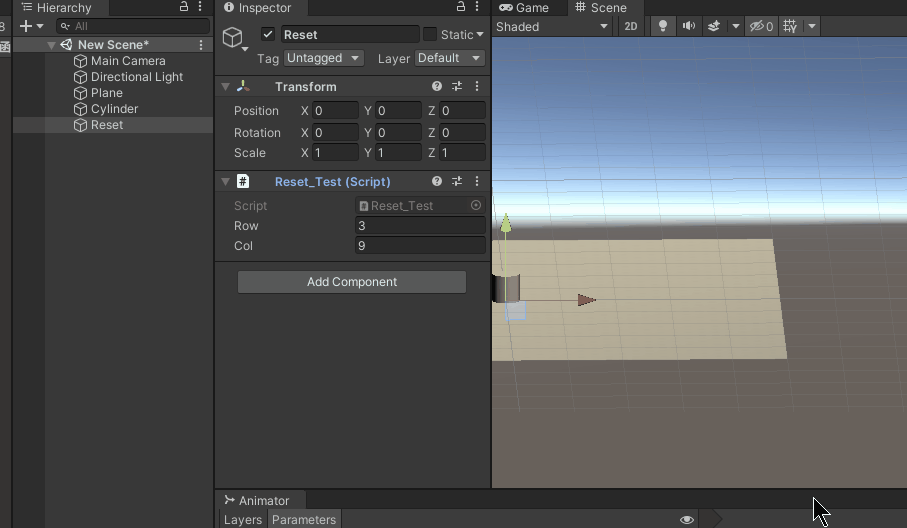
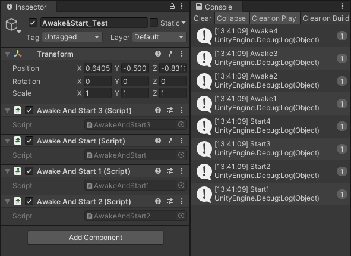
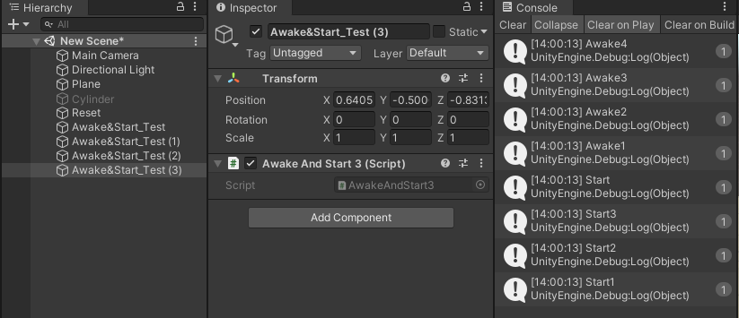
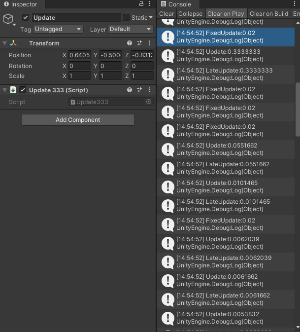
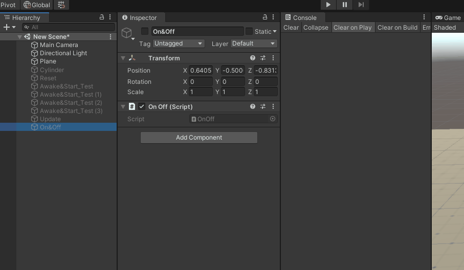
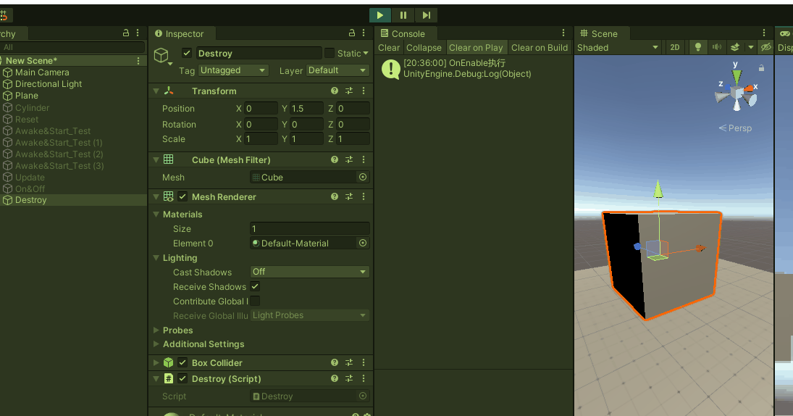
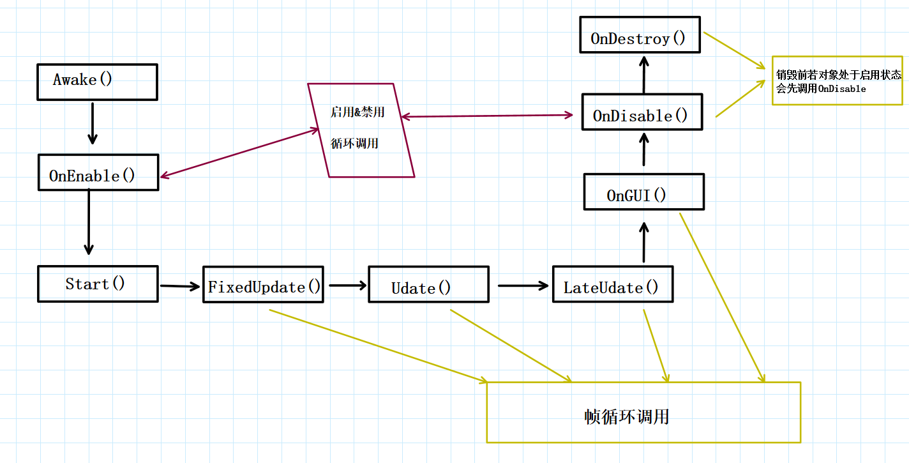

//@[TOC](目录)

## 一、前言

Unity 中，有一个特别重要的知识点，生命周期函数。这些东西全部都是系统定义好的，运行时自动调用，但**需要继承 MonoBehaviour 类才能使用**。这个类是从 Unity 中创建脚本就自动继承了。正是因为继承了 MonoBehaviour 这个类，Unity 才能依次调用我们的脚本代码，执行游戏逻辑。

> 前排提醒：本文仅代表个人观点，以供交流学习，若有不同意见请评论留言，笔者一定好好学习，天天向上。

---

## 二、常用生命周期函数

### 1.什么是生命周期

> 在 Unity 中，脚本可以理解为附加在游戏对象上的，用于定义游戏对象行为的指令代码。一个脚本必须绑定在游戏对象上才能被调用，才能开始它的生命周期。比如一颗子弹，从按下鼠标左键被生成时，附属于此游戏对象的脚本开始了它的生命周期，直到触发某个逻辑而被销毁时，才结束它的生命周期。期间可能依次调用了 Awake,Start,OnDestroy 等周期函数，也可能一直循环执行了 Update,FixedUpdate 等函数，而着一条或多条的执行线就是贯穿此脚本的生命周期。

### 2.Reset() + 示例

> 这个函数会在用户首次添加该组件时或单击 Reset 按钮时被调用，且只在编辑器生效。可应用于大批量生成修改编辑器节点，这么说大家可能不明白，举个例子。

> 假如我们有一个地图，需要添加大量的树（这里用圆柱代替），这些树需要组成特定图案，且以一定规则命名，这个时候笔刷就无法胜任工作了，或许程序运行时可通过代码动态修改，但是一旦程序运行结束，这些树又要被销毁了，且还很消耗程序运行资源。这个时候，通过 Reset 函数，可直接在编辑器阶段完成此需求。

> 在编辑器创建一个空节点"Reset"，将脚本"Reset_Test.cs"赋予此空节点，代码和运行结果如下
> 
>
> 需要注意的是，所有初始化操作都应在 Reset 中完成，因为它仅调用 Reset 函数，不会调用 Start 等函数，因为这是在编辑器中操作，程序还没运行呢

```CSharp

    public int row = 3;
    public int col = 9;
    private void Reset()
    {
        GameObject t = null;
        GameObject tree = GameObject.Find("Cylinder");
        for (int i = 0; i < row; i++)
        {
            for (int j = 0; j < col; j++)
            {
                Vector3 position = new Vector3(i * 2, 0, j * 2);
                t = Instantiate(tree, position, Quaternion.identity);
                t.transform.SetParent(transform, false);
                t.gameObject.name = "tree:" + i + "," + j;
            }

        }
    }
```

**Awake()**

> 此函数在脚本实例被载入时调用，仅被调用一次

**OnEnable()**

> 当脚本被启用时调用一次，当游戏对象被禁用时，仅监听响应此函数

**Start()**

> 在 Awake 之后和 Update 之前被调用，仅被调用一次

**FixedUpdate()**

> 物理更新函数，循环执行，0.02 秒执行一次（不受 FPS 帧率影响，时间可更改），所有和物理相关的更新都应在此函数处理

**Update()**

> 更新函数，每帧执行一次，受 FPS 帧率影响

**LateUpdate()**

> 稍后更新函数，在所有 Update 执行完后调用，帧间隔时间和 Update 一样

**OnGUI()**

> 在渲染和处理 GUI 事件时被调用，每帧都执行

**OnDisable()**

> 当脚本被禁用时调用一次，当脚本反复被禁用或启用，则反复调用 OnDisable 和 OnEable

**OnDestroy()**

> 当脚本被销毁时被调用，只会在被激活的物体上调用


---

## 三、区别与演示

### 1.Awake 和 Start 的区别

#### (1).测试一个对象挂载四个脚本，运行截图和代码如下

> 

```CSharp
//AwakeAndStart.cs
    private void Awake() {
        Debug.Log("Awake1");
    }
    private void Start() {
        Debug.Log("Start1");
    }
//AwakeAndStart1.cs
    private void Awake() {
        Debug.Log("Awake2");
    }
    private void Start() {
        Debug.Log("Start2");
    }
//AwakeAndStart2.cs
    private void Awake() {
        Debug.Log("Awake3");
    }
    private void Start() {
        Debug.Log("Start3");
    }
//AwakeAndStart3.cs
    private void Awake() {
        Debug.Log("Awake4");
    }
    private void Start() {
        Debug.Log("Start4");
    }
```

#### (2).测试四个对象挂载四个脚本，运行截图和代码如下

> （对照着顺序挂载，脚本代码未作更改）
> 
> 看这结果..似乎 Awake 是倒序执行，而 Start 则乱序了，但执行多次，依旧是这个结果，能确认的结果是**Awake 执行完毕，才执行 Start**，笔者能力有限很难理清这个顺序，若需要在一个脚本中创建，在另一个脚本中获取对象，而无法控制脚本之间的执行顺序，**那么推荐使用 Awake 创建游戏对象，Start 获取对象，这样才能保证不会空指针报错。**

### 2.FixedUpdate\Update\LateUpdate 的区别

> 这些函数都是帧执行函数，但执行时间是不一样的，下图说明了这些函数的帧间隔时间和执行顺序
> 
> 从图中可以看出 FixedUpdate 最先执行，Update 和 LateUpdate 依次执行，就帧间隔而言，FixedUpdate 永远都是 0.02 秒执行一次，而 Update 和 LateUpdate 则是相同帧间隔时间，有时候，FixedUpdate 都执行多次了，Update 和 LateUpdate 才执行一次。
> 人人皆知，物理相关操作要放到 FixedUpdate 中，正是因为 Update 执行时间不固定，会造成卡顿延迟效果，所以放到 FixedUpdate 中。
> FixedUpdate 固定时间可修改，Edit->Project Setting->time->Fixed timestep。

```CSharp
//这里Update是靠前的，所以代码执行顺序和代码书写顺序是无关的
    private void Update() {
        Debug.Log("Update:" + Time.deltaTime);
    }
    private void LateUpdate() {
        Debug.Log("LateUpdate:" + Time.deltaTime);
    }
    private void FixedUpdate() {
        Debug.Log("FixedUpdate:" + Time.deltaTime);
    }
```

### 3.禁用、启用和销毁游戏对象的演示

> #### (1).当游戏物体被禁用或被启用的时候，所挂载的周期函数演示如下
> 
> 大家可从动图演示中直观的看到，当物体被禁用时，Awake 和 Start 是不被执行的，当物体被多次禁用和启用，其 Awake 和 Start 也仅执行一次，而 OnEnable 和 OnDisable 则会被多次调用。当程序退出时，若对象处于启用状态，程序会先禁用，再销毁。

```CSharp
//OnOff.cs
    private void Awake() {
        Debug.Log("Awake执行");
    }
    private void Start() {
        Debug.Log("Start执行");
    }
    private void OnEnable() {
        Debug.Log("OnEnable执行");
    }
    private void OnDisable() {
        Debug.Log("OnDisable执行");
    }
    private void OnDestroy() {
        Debug.Log("OnDestroy执行");
    }
```

#### (2).当游戏对象被销毁时，演示如下
> 
> 这里我按下了 D 键，它监听到后，先执行了 OnDisable 再执行的 Destroy。
> 
> **当游戏对象被禁用，Destroy 不会被监听**

```CSharp
    private void Update()
    {
        if (Input.GetKeyDown(KeyCode.D))
            Destroy(this.gameObject);
    }
    private void OnEnable()
    {
        Debug.Log("OnEnable执行");
    }
    private void OnDisable()
    {
        Debug.Log("OnDisable执行");
    }
    private void OnDestroy()
    {
        Debug.Log("OnDestroy执行");
    }
```

---

## 四、执行流程与示例图



> 自己画的图，若有不对请批评指正

---

## 五、总结和参考资料

### 1.总结

> 关于 OnGUI 我了解的不多，这次没有说到，以后会修改补充
> Awake 一般用于初始化创建对象操作，然后使用 Start 获取，可以确保绝对控制下的顺序执行
> FixedUpdate 用于物理操作，确保帧间隔时间相同，操作平滑
> 当物体被禁用时，仅 OnEnable 被监听，其他均不响应
> FixedUpdate-Update-LateUpdate 循环执行，但 FixedUpdate 频率可能高或低一些
> 当手动销毁或父对象被销毁时，调用 Destroy，但首先会先调用 OnDisable

### 2.参考资料

1.https://www.jianshu.com/p/32ce8768607f 
2.https://blog.csdn.net/qq_42351033/article/details/83047657 
3.https://www.xuanyusong.com/archives/2378 
4.https://blog.csdn.net/Marine_snow/article/details/117127889 
5.https://blog.csdn.net/REIONE/article/details/52400015 
6.https://www.jianshu.com/p/27190f23a01b
