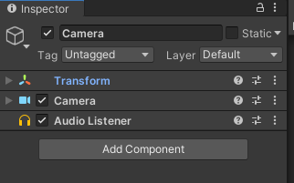
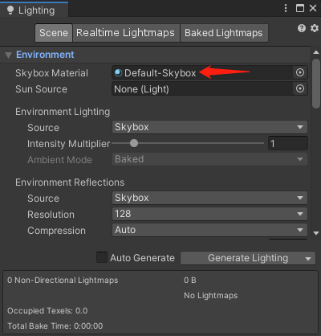
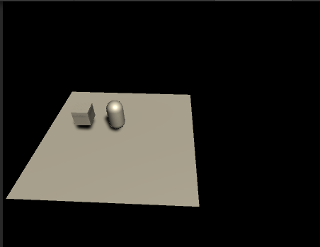
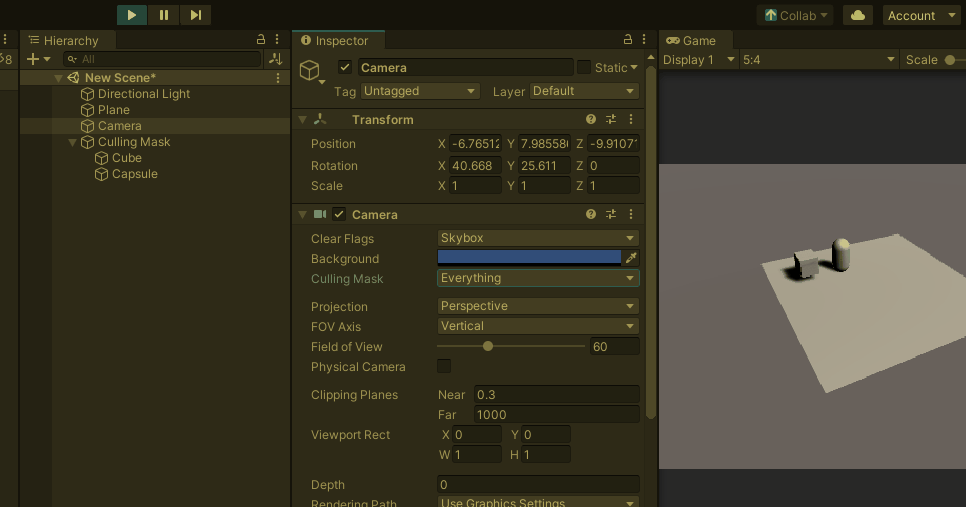
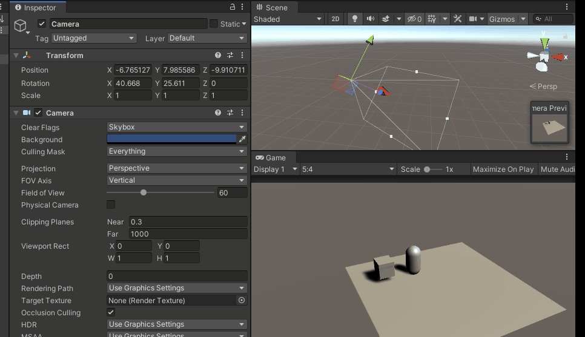
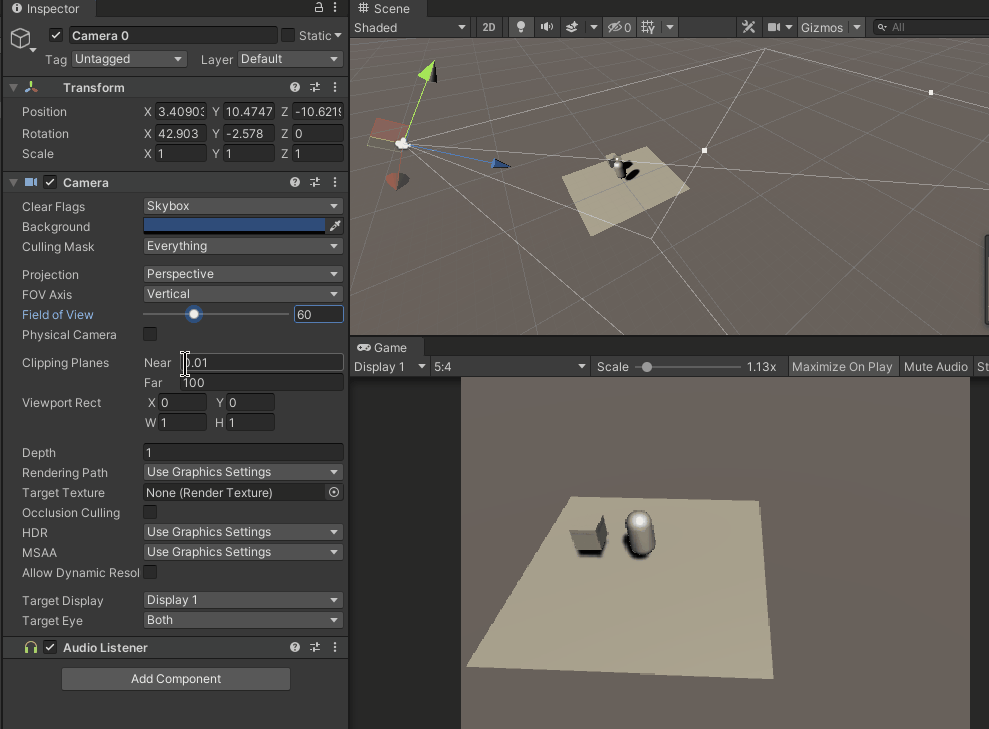
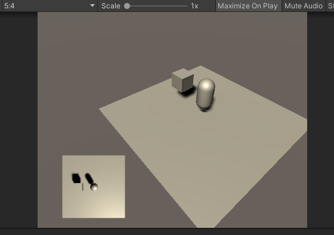
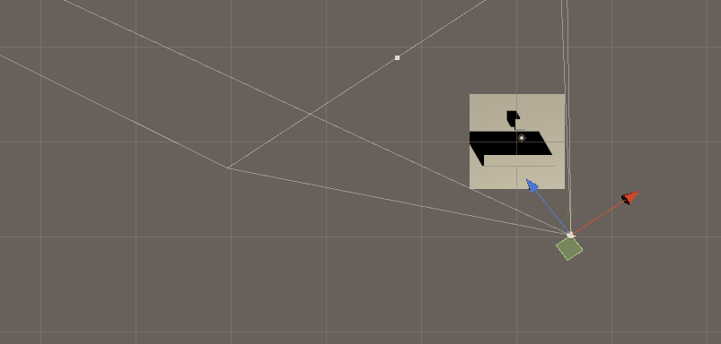
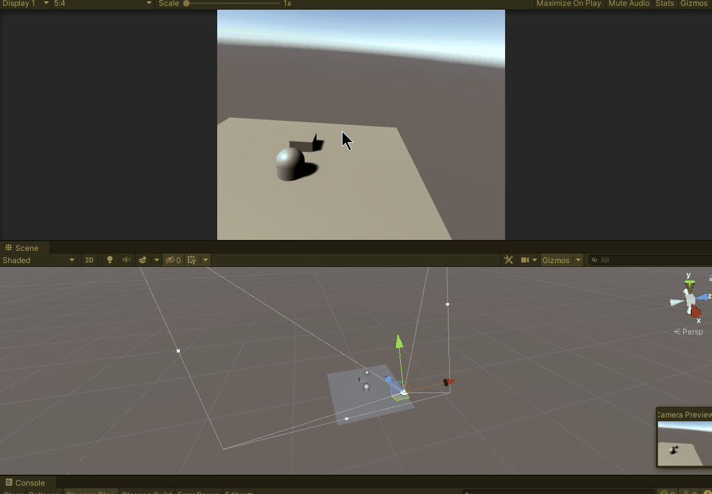

## 前言

Unity中，通过摄像机来呈现给玩家精彩纷呈的游戏世界。开发者可以通过摄像机来固定玩家的游玩视角，渲染出特定画面来呈现给玩家。本文介绍了Camera组件的相关参数以及如何使用摄像机的一些应用实例和误区。

//@[TOC](目录)

> 前排提醒：本文仅代表个人观点，以供交流学习，若有不同意见请评论留言，笔者一定好好学习，天天向上。
> 阅读此文章时，若有不理解的地方，推荐观看本文列出的参考资料来对照阅读。

**Unity版本[2019.4.10f1] 梦小天幼 & 禁止转载 2022.4.3**

---

## 一、摄像机组件及参数介绍
当你创建一个场景，Unity会自动创建一个Main Camera，若你删除它，那么你的世界会一片漆黑。我们可以在Hierarchy窗口右键，创建一个Camera，这时你会发现，你的世界又恢复了一片光明。

当我们新建了Camera，这时你会发现，它挂载了三个组件，分别是Transform、Camera和Audio Listener，其中Transform是每个游戏对象都拥有的，Camera和Audio Listener则是此摄像机的耳朵和眼睛。下面我们来详细介绍关于Camera组件的相关参数。
> 
> 新建一个Camera，自动添加这三个组件。

### 1.ClearFlags: 清除标记（背景）
摄像机渲染视图时，会缓存颜色和深度信息，绘制出来的图像中那部分没有被绘制到的部分是空白，默认会显示天空盒的颜色。
* Sky Box：使用天空盒填充空白部分，默认使用渲染设置[Window-Rendering-Lighting Settings]中的天空盒，若渲染设置也没有设置天空盒，则会使用背景颜色。
    > 
* Solid Color：使用摄像机背景色填充空白部分
* Depth Only：不填充
    > 这个也很容易理解，除去绘制之外的部分用默认黑色填充，若此时有其他相机（Depth比当前低），则填充其他相机画面。
    > 
* Don't Clear: 不清除颜色和深度缓存。(这里用处不多，不解释了，反正我也没搞懂)

Background: 背景颜色（当ClearFlags选择Solid Color时，此选项生效）

### 2.Culling Mask: 选择渲染层
通过选择层来渲染指定层的对象，Unity中每个对象都被分配了一个层，默认为“Default”层
> 
> 我将圆柱和正方体放到了层“Camera Culling Mask”，通过演示读者应该能明白此参数作
> 通过Camera.cullingMask来在代码中修改此值，Int类型，默认值为0


### 3.Projection: 投影方式 （透视（默认）和 正交）
* FOV Axis：还没搞明白
* Field Of View: 视角范围（相机的视野拉伸），视角越大，视野越大，同时焦距越短
> 
> 代码中可以通过Camera.fieldOfView类变量来修改此值，单位为度，当相机为正交模式时，此参数被忽略
* Physical Camera: 以后再说，笔者还没搞明白


### 4.Clipping Planes: 裁剪平面 
顾名思义，Near和Far指定了其裁剪的区域范围，若不处于这个范围的不被渲染，可以节省计算量，设置多少合适，看需求。
> 
> 代码中可通过Camera.farClipPlane 和 Camera.nearClipPlane类变量来修改此值

### 5.Viewport Rect: 视图矩形（摄像机位置宽高）
这里提供了四个数值，其中X和Y代表摄像机原点，一般不改动。
W和H则代表了摄像机的宽高，默认1则是占满全屏，这里使用了屏幕坐标系来计算，不理解的读者可以去我专栏里查看关于Unity中坐标系的讲解（预计22.4.10会写出来），
> 可以通过修改W和H来使两个摄像机视图叠加起来的效果。具体如何应用，下面再说
> 
> 这里我设置了两个摄像机，其中主要的摄像机先被渲染，然后左下角的摄像机后被渲染，且设置了这个摄像机的ClearFlags为Depth Only，这样不会渲染多余部分，就实现了上图所示效果。

### 6.Depth: 深度（摄像机渲染次序）
用于控制摄像机渲染次序，一般数值较小的会先渲染，数值较大的则会叠加到上一个摄像机上，上一个例子就用到了，其中左下角的摄像机次序为：0，主背景摄像机次序为：-1，所以能保证主背景摄像机先被渲染，然后再被左下角的摄像机叠加。
> 通过Camera.depth类变量来在代码中修改此值

### 7.Occlusion Culling：遮挡剔除的开关
这个选项勾选有助于提升游戏性能，比如不在摄像机范围内的物体，将不会被渲染出来
> 
> 需要注意的是，场景中的物体需要预计算，且是静态物体，勾选时Unity才能快速实时判断物体是否在摄像机范围内。

### 8.其余属性，暂时用不到，就不赘述了
其实就是我没搞明白，等我搞明白再添加上来

---

## 二、摄像机的实例应用
通过上述参数，读者应该基本了解了Unity中的摄像机，下面通过几个简单的小案例来巩固一下吧。
### 1.控制摄像机场景漫游
需求：通过WASD来前后左右移动摄像机，通过QE可以抬升下降，按住Shift可以加速。
通过鼠标滚轮可以缩放视图，鼠标按下鼠标右键并移动，可以旋转摄像机
> 演示动态图如下：
> 

整部分代码其实并没有应用上太多摄像机相关的参数，例子比较简单。但是代码写的又臭又长，供新手参考一下，没啥质量。且这段代码是有Bug，旋转没有锁定Z轴，这会导致镜头莫名其妙就围着中心打转。
高情商：请大家找出Bug并修复
低情商：我懒得写了
```CSharp
    public Camera camera_;
    // 摄像机移动速度和旋转灵敏度
    public float mouseSenstivity = 100;
    public float speed = 5;
    void Update()
    {
        //键盘控制摄像机移动
        Move_Update();

        //鼠标滚轮控制场景缩放
        MousewheelZoom_Update();

        //鼠标右键控制场景旋转
        MousergihtRot_Update();
    }
    private void Move_Update()
    {
        if (Input.GetKey(KeyCode.W))
        {
            camera_.transform.Translate(Vector3.forward * Time.deltaTime * speed);
        }
        if (Input.GetKey(KeyCode.S))
        {
            camera_.transform.Translate(Vector3.back * Time.deltaTime * speed);
        }
        if (Input.GetKey(KeyCode.A))
        {
            camera_.transform.Translate(Vector3.left * Time.deltaTime * speed);
        }
        if (Input.GetKey(KeyCode.D))
        {
            camera_.transform.Translate(Vector3.right * Time.deltaTime * speed);
        }
        if (Input.GetKey(KeyCode.Q))
        {
            camera_.transform.Translate(Vector3.up * Time.deltaTime * speed);
        }
        if (Input.GetKey(KeyCode.E))
        {
            camera_.transform.Translate(Vector3.down * Time.deltaTime * speed);
        }

    }
    private void MousewheelZoom_Update()
    {
        if (Input.GetAxis("Mouse ScrollWheel") < 0)
        {
            camera_.fieldOfView += 2;
        }
        if (Input.GetAxis("Mouse ScrollWheel") > 0)
        {
            camera_.fieldOfView -= 2;
        }
    }
    private void MousergihtRot_Update()
    {
        if (Input.GetMouseButton(1))
        {
            // X轴控制上下旋转，Y轴控制左右旋转
            float mouseX = Input.GetAxis("Mouse X") * Time.deltaTime * mouseSenstivity;
            float mouseY = Input.GetAxis("Mouse Y") * Time.deltaTime * mouseSenstivity;
            
            // 注意这里因为X轴是控制上下的，Y轴是控制左右的
            // 而mouseX返回的是屏幕的左右值，所有他俩调换了一下
            // 又因为mouseY向下为负值，而摄像机Y轴向下则为正值，则对mouseY进行了一个取反。
            // 这里要是理解不了，推荐看参考资料的第一篇博文，总结了Unity相关的移动控制方法。
            camera_.transform.Rotate(new Vector3((0f - mouseY), mouseX, 0));
        }
    }
```

---

## 三、总结和参考资料
### 1.总结
没啥可总结的，主要把摄像机的几个参数的作用记住就行。

### 2.参考资料
[1].梦天幼.[详解Unity的移动控制实现](https://blog.csdn.net/weixin_43147385/article/details/124194236?spm=1001.2014.3001.5501)
[2].梦天幼.[详解Unity的几种移动方式实现](https://blog.csdn.net/weixin_43147385/article/details/123892842)
[3].雪庭.[unity中camera摄像头控制详解](https://www.cnblogs.com/machine/p/unity.html)
[4].灵宝儿.[Unity Physical Camera中Focal Length和Field of View关系](https://zhuanlan.zhihu.com/p/52708189?from_voters_page=true)
[5].syddf_shadow.[天空盒(SkyBox)的实现原理与细节](https://blog.csdn.net/yjr3426619/article/details/81224101)
[6].游戏蛮牛.[[蛮牛教程] Unity3D 浅析－Camera（摄像机） ](https://www.sohu.com/a/163126162_667928)
[7].邢小鹏.[unity摄影机depth模式_Unity3d摄像机详解](https://blog.csdn.net/weixin_35739967/article/details/112809689)