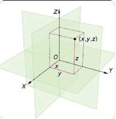
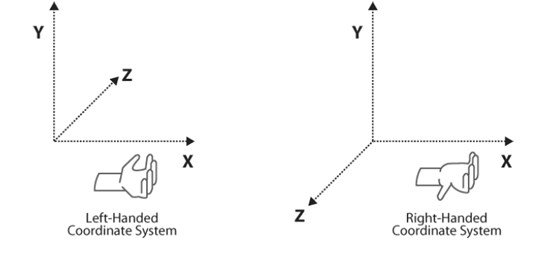
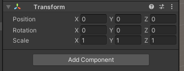
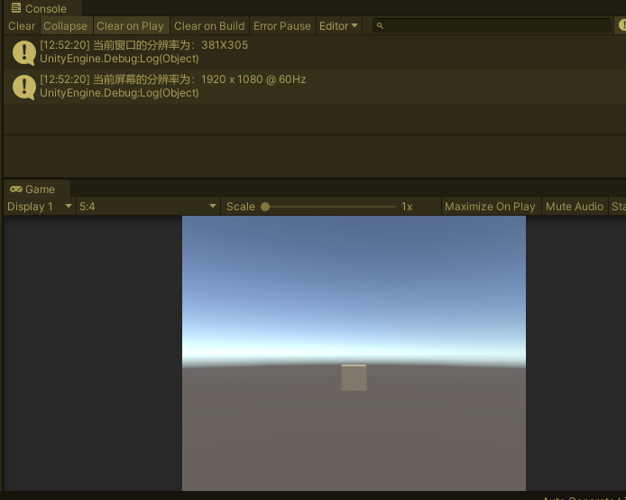
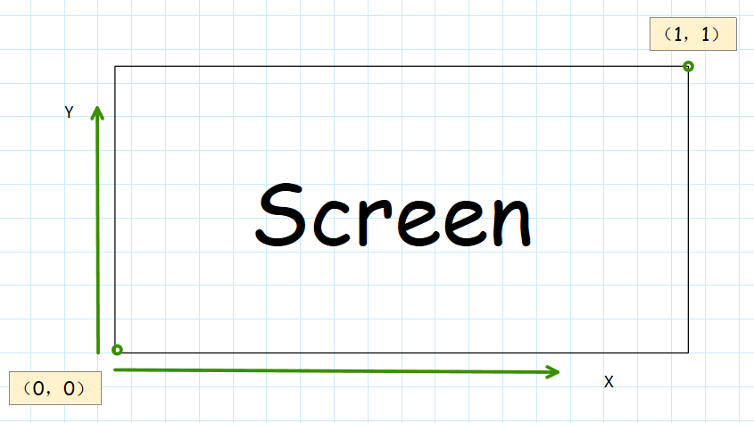
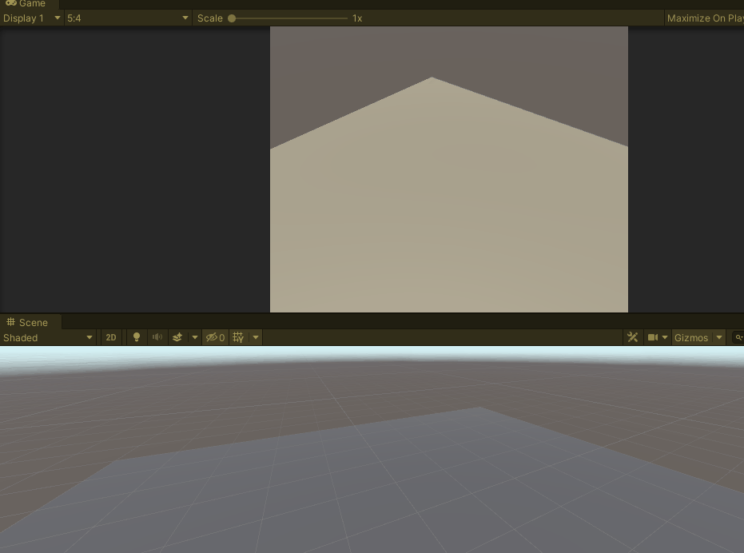

## 前言

在Unity中有很多坐标系，诸如世界坐标系、局部坐标系、屏幕坐标系、视口坐标系等等，这些坐标系往往会给新手（我）带来很大的困扰，但又缺一不可。比如当你需要获取鼠标在世界坐标的位置时，你就需要明白什么是世界坐标和屏幕坐标，以及两者如何转换，本篇详细介绍了各种坐标系以及它们的转换方法及应用，希望能帮助到大家。

//@[TOC](目录)

> 前排提醒：本文仅代表个人观点，以供交流学习，若有不同意见请评论留言，笔者一定好好学习，天天向上。

> 阅读此文章时，若有不理解的地方，推荐观看本文列出的参考资料来对照阅读。

> 笔者数学比较渣，本篇中关于坐标系的讲解还请读者带着审视的目光观看，若有错误烦请指正，笔者感激不尽！

**Unity版本[2019.4.10f1] 梦小天幼 & 禁止转载**

---

## 一、Unity中的坐标系

### 1.世界坐标
世界坐标是按照笛卡尔坐标系定义出来的绝对坐标系，当你从Unity中新建了一个物体对象，它所具有的Transform参数所采用的就是世界坐标系。
初中数学我们学过关于二维坐标的概念，任意一个点可以用x,y来表示，当这个概念延申到三维世界就是使用x,y,z来表达一个物体在三维世界的坐标。为了确定空间中任意一点的位置，需要在空间中引进坐标系，最常用的坐标系是空间直角坐标系。(空间直角坐标系)
>  
而空间直角坐标系又可分为左手坐标系和右手坐标系，其中如图所示。**其中左手坐标系就是Unity中的世界坐标系**，而右手坐标系在数学中更加常用，这里笔者就不讨论了。
>  
希望读者不要混淆其中的概念，数学中有空间直角坐标系，其分为二，分布是左手和右手坐标系，而Unity中采用了其中的左手坐标系，也就是Z轴为正，X轴为右，Y轴为上。

Unity中一个物体的坐标信息，通过Transform.position来存储，它是一个Vector3变量，是一个三维向量，存储了XYZ的信息。
>  

在Unity中，可通过Transform.forward来表示正方向，Vector3.forward也可以表示正方向，这两者的区别在于：
> **Vector3.forward的值永远是(0,0,1)，而transform.forward的值则是根据当前物体的自身坐标系Z轴，不一定等于(0,0,1)** 怎么理解呢，举个例子。
> 首先一个物体的transform.position，一定是该物体在世界坐标的位置，相应的transform.localPosition才是该物体的局部坐标，那么transform += Vector3.forward时，就等于在向世界坐标的Z轴前进，而transform += transform.forward时，则等于再向局部坐标的Z轴前进。

### 2.屏幕坐标系
屏幕坐标系就是把屏幕看作一个坐标系，从左下角开始计算，也就是(0,0)，而右上角则是(Screen.widht,Screen.height)，所以又叫做像素坐标系，现在我运行下面这行代码就是得出我当前游戏视窗的屏幕分辨率。
```CSharp
    void Start()
    {
        Debug.Log("当前窗口的分辨率为：" + Screen.width + "X" + Screen.height);
        Debug.Log("当前屏幕的分辨率为：" + Screen.currentResolution);
    }
``` 
>  
鼠标位置坐标就是属于屏幕坐标系，通过屏幕坐标和世界坐标互转，可得到鼠标在Unity3D中的实际交互位置，然后就可以通过逻辑做出反馈。

### 3.视口坐标系
该坐标系计算方式和屏幕坐标系类似，只不过把其参数标准化了，更加适用于比例计算。
左下角为(0,0)  右上角为(1,1)
>  
这里不管是视口坐标还是屏幕坐标，其z值还是有的，是表示深度的。

### 4.GUI坐标系
该坐标是从左上角开始计算的，左上角(0,0)，右下角为(Screen.width,Screen.height);

---

## 二、坐标系的相互转换
Unity中采用多种坐标系就是为了在不同的情况下使用不同的坐标更加方面。既然采用了多种坐标那么就必定会提供相关的转换方法，下面就简要总结一下上述坐标的相互转换。
其实这些坐标系看起来眼花缭乱，很多的样子，实际深究起来也就一个世界转屏幕（或屏幕转世界）值得探讨，其他的都很容易实现。

### 1.世界坐标和屏幕坐标的相互转换
> 屏幕坐标转世界坐标
> **Camera.ScreenToWorldPoint(Vector3 Pos);**

> 世界坐标转屏幕坐标
> **Camera.WorldToScreenPoint(Vector3 Pos);**

> 关于应用：
> 这些转换一般应用于想要通过鼠标来操作世界物体，比如物体跟随鼠标移动..

#### 案例演示：
物体跟随鼠标移动，xyz都移动
 
可能你看这段代码的时候不理解，比如感觉明明直接用下面这句话，就可以啦，为什么要大费周章呢？看到这里你应该去试一下再往下看

> Camera.main.WorldToScreenPoint(Input.mousePosition);

好了，你应该已经明白了，若直接使用上面那句话，那么世界坐标会缺少Z值，所以转换之后的坐标一定是错误的
所以我们要通过巧妙的方式弥补这个Bug，代码如下。(这个写法是网上查到的，我找不到出处了)
```CSharp
    void Update()
    {
        // 首先将要操纵的物体的世界坐标转为屏幕坐标
        Vector3 screenPos = Camera.main.WorldToScreenPoint(transform.position);
        // 然后获取鼠标的屏幕坐标
        Vector3 mousePos = Input.mousePosition;
        // 然后将已经转换好的物体的屏幕坐标的Z值赋给缺失z值的鼠标屏幕坐标
        mousePos.z = screenPos.z;
        // 然后将已经完整的鼠标屏幕坐标转成世界坐标
        Vector3 worldPos = Camera.main.ScreenToWorldPoint(mousePos);
        // 最后每帧修改物体世界坐标位置
        transform.position = worldPos;
    }
```
### 2.世界坐标和视口坐标的相互转换
> 世界坐标转视口坐标
> **Camera.WorldToViewportPoint(Vector3 Pos)**

> 视口坐标转世界坐标
> **Camera.ViewportToWorldPoint(Vector3 Pos);**
这个原理和上一个差不多，因为屏幕和视口是可以相互转换的，所以把上面的转换函数换成下面的也是成立的，前提是最后用视口转世界坐标时，要把鼠标位置屏幕坐标先转成视口再使用，听不懂的话，我简单改一下，把代码贴出来，动态示意图就不放了，因为是一样的效果。
```CSharp
        // 首先将要操纵的物体的世界坐标转为视口做坐标
        Vector3 screenPos = Camera.main.WorldToViewportPoint(transform.position);
        // 然后获取鼠标的屏幕坐标
        Vector3 mousePos = Input.mousePosition;
        // 然后将已经转换好的物体的屏幕坐标的Z值赋给缺失z值的鼠标屏幕坐标
        mousePos.z = screenPos.z;
        // 将屏幕坐标转为视口坐标
        mousePos = Camera.main.ScreenToViewportPoint(mousePos);
        // 然后将已经完整的视口坐标转成世界坐标
        Vector3 worldPos = Camera.main.ViewportToWorldPoint(mousePos);
        // 最后每帧修改物体世界坐标位置
        transform.position = worldPos;
```
### 3.屏幕坐标和视口坐标的相互转换
> 屏幕坐标转视口坐标
> **Camera.ScreenToViewportPoint(Vector3 Pos)**

> 视口坐标转屏幕坐标
> **Camera.ViewportToScreenPoint(Vector3 Pos);**

上面举过例子了，这里不演示了

### 4.世界坐标和局部坐标的相互转换

> 世界坐标转局部坐标
> **transform.InverseTransformPoint(Vector3 Pos);**
> **transform.worldToLocalMatrix**

> 局部坐标转世界坐标
> **transform.TransformPoint(Vector3 Pos);**
> **transform.localToworldMatrix**

---

## 三、坐标系混淆
大家在使用坐标系的时候，可能听过很多很多别称，对于新手来说，很容易对一些较为生僻的叫法产生疑惑，这里给大家梳理一下。
- 世界坐标、全局坐标、左手坐标、绝对坐标
- 局部坐标、自身坐标、物体坐标、本地坐标、相对坐标
- 屏幕坐标、像素坐标
- 视口坐标、视窗坐标
- GUI坐标、UI坐标
> 我听过的大概就这些，以后还能遇见其他叫法，再行补充。

## 四、总结和参考资料
### 1.总结
Unity的坐标系
- 世界坐标（绝对坐标，物体在世界中的位置坐标）
- 局部坐标（物体本身具有的坐标）
- 屏幕坐标（游戏窗口的像素大小，左下角开始计算）
- 视口坐标（左下角[0,0]右上角[1,1]）
- GUI坐标（UI专用坐标系，左上角开始计算，右下角为屏幕像素大小）

Unity坐标系转换
- 唯一需要注意的点：屏幕转世界
    - 屏幕需要有z值，转世界的时候才能得到正确的值

### 2.参考资料
[1].叫我东方小巴黎.[空间直角坐标系、左手坐标系、右手坐标系](https://blog.csdn.net/weixin_41838721/article/details/121323373)
[2].qq_38806355.[Unity将屏幕坐标转为世界坐标的思路](https://blog.csdn.net/qq_38806355/article/details/82938553)
[3].GolDHeaven.[Unity中屏幕坐标、视图坐标和世界坐标的相互转换](https://www.jianshu.com/p/b5b6ac9ab145)
[4].AbnerHu.[Unity 屏幕坐标转换世界坐标之物体跟随鼠标移动](https://blog.csdn.net/abc764725516/article/details/81199934)
[5].Peter_Gao_.[Unity各空间下的位置：世界坐标、屏幕坐标、相机坐标、本地坐标](https://blog.csdn.net/qq_42672770/article/details/118958061)
[6].Htlas.[Unity3D 坐标系浅析（2）: 屏幕坐标系、视图坐标系](https://blog.csdn.net/Htlas/article/details/79746446)