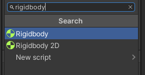

## 前言

Unity 中内置了一套完成的物理引擎，能够完成现实世界的近似模拟。而在 Unity 物理引擎中，刚体组件和碰撞体组件则是无法避开的，刚体组件是让物体产生物理行为的组件，而碰撞体组件则是让刚体与物体产生碰撞的组件，今天就来简要认识一下这种组件吧。

//@[TOC](目录)

> 前排提醒：本文仅代表个人观点，以供交流学习，若有不同意见请评论留言，笔者一定好好学习，天天向上。
> 阅读此文章时，若有不理解的地方，推荐观看本文列出的参考资料来对照阅读。

**Unity 版本[2019.4.10f1] 梦小天幼 & 禁止转载**

> **掌握基础物理常识再阅读本篇会较为容易**

---

## 一、刚体（Rigidbody）组件参数

刚体组件有两种，分别是 Rigidbody 组件和 Rigidbody2D 组件，本篇只谈前一种刚体组件。
在 Unity 中，若想要一个物体具有在现实世界中的物理效果，比如受重力影响，就要为其添加 Rigidbody 组件，该组件是让物体产生物理行为的组件。通过刚体组件可以给物体添加一些常见的物理属性，如质量、摩擦力、碰撞参数等。
在物理学中，刚体是一个理想模型，通常把在外力作用下，物体的形状和大小保持不变，而且内部各部分相对位置保持恒定的理想模型称为刚体。
按下物体对象的 Inspector 面板的 Add Component 按钮，搜索 Rigidbody 即可添加该组件。(或通过 Physics->Rigidbody 分类)

> 
> 

### 1.Mass 质量

> 设置物体的质量，默认质量是 1 千克（KG），这时根据物理学原理来讲，只需要给这个物体一个向上的力（9.8N），就可以抵消重力，稍微大于 9.8N，便可以上升。

！！！！！！！演示两个例图，一个关于 1KG 的 mass，自由下落，一个关于加上脚本，给一个上升的力（大于 9.8）的力。

### 2.Drag 阻力

> 设置物体的阻力，默认为 0，则没有阻力。阻力的方向与物理运动方向相反，该参数数值越大，所受到的阻力也就越大，速度的衰减也就越快。极大时物体将会立即停止运动。
> 

### 3.Angular Drag 角阻力

> 设置物体的角阻力（旋转阻力），与该物体的旋转方向相反，默认为 0.05。设置该值后，物体在任何方向上的旋转运动都将受到影响。若设置为 0，则物体一旦开始旋转就不会停止（无重力状态下）。该值越大，旋转衰减越快。
> 
> 该例子中，下面的物理没有勾选使用重力选项，用以模拟无重力，当该物体收到外力影响，若没有角阻力的影响，则会不停旋转，若没有阻力的影响，则该物体会不断移动。

### 4.Use Gravity 使用重力

> 设置该物体是否受重力影响，模拟现实世界中自由落体运动。勾选则受到影响，不勾选则模拟无重力环境下的运动状态。
> 
> 底下三个物体没有勾选此项，若你看到这里了，别光看着，自己动手玩玩，还挺好玩的。

### 5. Is Kinematic 是否遵循动力学

> 设置该物体是否受动力学模拟，勾选则表示该物体不受重力、速度、阻力、质量等物理模拟的影响，只受脚本和动画的影响而运动。这个有什么用呢，比如当你首先勾选肯定能降低性能消耗，物理系统已经不会计算它了，其次它虽然不受物理模拟的影响，但是它依旧是可以影响其他物体的，比如移动通过脚本移动它的 transform，依旧可以撞击其他刚体！注意仅影响到刚体！
> 
> 如图所示，图中的两个障碍物仅添加了碰撞体，而没有勾选此选项的刚体会受到碰撞体的影响，勾选之后则不会受到碰撞体的影响，但是依旧能影响且推动同样有着刚体组件的物体。至于用途，就要读者自行发挥想象了，游戏就是想象！
> 移动的物体是使用脚本驱动的，不受物理世界影响的：代码如下。很简单的一句

```CSharp
    public float speed = 3;
    void Update()
    {
        transform.position += new Vector3(0, 0, Time.deltaTime * speed * -1);
    }
```

### 6.Interpolate 插值

> 该参数用于解决Unity中物理模拟和画面渲染不同步的问题，当不进行插值处理时，计算得到的物理数据是上一个物理模拟时间点的数据，而插值则是获取最近似当前渲染时间点数据的一种手段。当你发现刚体移动时会发生抖动，建议调整一下此选项。
> 一共两个参数
> * Interpolate
> * Extrapolate
>  emmm找不到这方面的资料，我也不太懂，以后学到了再行补充吧。

### 7.Collision Detection 碰撞检测

> 该属性用于控制避免高速运动的物体穿过其他对象而没有发生碰撞。
> * Discrete 离散碰撞检测（默认，适用于大部分刚体，这个肯定是最省资源的，毫无疑问，一般情况下默认这个，不要改）
> * Continuous 连续碰撞检测（适用于被高速撞击的物体）
> * Continuous Dynamic 连续动态碰撞检测（适用于高速移动的物体）
> * Continuous Speculative 连续扫描碰撞检测（emmm，不知道，资料好难找）
给大家举个例子，就明白了
> 
> 
> 第一个的碰撞检测是默认的离散检测，物体直接掉下去了，第二个则是连续动态检测，成功拦住了，这方面资料较少，个人没这个能力就不往深处讲了。

### 8.Constraints 约束条件

> 约束物体在某一个方向上的运动和旋转，默认不约束，各轴的运动旋转受物理系统控制。这个应该很好理解，举个例子。
> 
> 这里我冻结了这扇门的 XYZ 轴的运动和 XZ 轴的旋转，现在使用物体推门，一个简单的门就做好了。若想要单扇门的推动效果（不过这里用 Joints 物理关节更简单，以后我会写相关的文章的），读者自行拓展吧。

---

## 二、基本碰撞体(Collider)组件参数

当一个物理添加了碰撞体组件后，它会默认阻挡刚体的运动，如上述例子中，我添加了一块 Plane，它就会默认阻挡受重力影响的刚体的下坠。这是因为当我创建它的时候它就自带了一个碰撞体组件。
碰撞体组件定义了物体的物理形状，且碰撞体本身是隐形的，大家可以想想空气墙的例子。
当你创建了一个 Cube，该物体就自带了一个 Box Collider。最简单且最节省计算资源的碰撞体就是一系列基本碰撞体。当你右键创建一系列基本模型时，它们就自带了一系列基本碰撞体。
一个物体可以带有多个碰撞体组件，这样就形成了组合碰撞体。

> 

### 1.基本参数

> 
> 基本碰撞体组件的参数如下，Edit Collider用于编辑碰撞体大小，Center和Size用于指定中心和范围，就不多说了，下面重点说说Is Trigger属性和Material属性

### 2. Is Trigger

> 前面说过，碰撞体会默认阻挡刚体的运动，但是有些时候需要检测两个物体发生重叠但又不想引起物理上的碰撞，就需要**勾选此选项，将碰撞体变成一个触发器**。
> 当勾选此项后，该物体就不会再阻挡刚体运动了，但当有刚体与当前物体发生重叠的时候，会调用 OnTriggerEnter()方法。
> 
> 这里我给底下的平面加了触发函数的脚本，然后将其碰撞体设置成了触发器。也就是勾选了 Is Trigger

```CSharp
    private void OnTriggerEnter(Collider other) {
        Debug.Log("检测到物体【" + other.name + "】与当前碰撞体发生重叠！");
    }
```

### 3.Material 物理材质

这个选项用于模拟物体表面的物理材质，对于地面而言，比如冰面、木板、水泥板这些。对于物体本身而言，比如物理自身的弹性，物理自身的平滑度之类的，都会直接影响到物理模拟的效果。

> 创建物理材质和创建普通材质的方法是一样的，右键菜单里面找到 Physic Material，物理材质参数如图所示
> 

- Dynamic Friction 运动摩擦力
  - 取值范围 0~1
- Static Friction 静止摩擦力
  - 取值范围 0~1
- Bounciness 表面弹性
  - 取值范围 0~1，值为 0 时无弹性
- Friction Combine 摩擦力混合
  - 发生碰撞的两个碰撞体对象的摩擦力的混合方式
  - Maximum 取最大值
  - MuItiply 取相乘值
  - Minimum 取最小值
  - Average 取平均值
- Bounce Combine 弹性混合
  - 发生碰撞的两个碰撞体对象的摩擦力的弹性方式
  - Maximum 取最大值
  - MuItiply 取相乘值
  - Minimum 取最小值
  - Average 取平均值

> 来举个例子，比如模拟冰块在冰面上
> 
> 我同时给三个碰撞体和 Plane 都给了如下参数的物理材质，同时给 Plane 加了一点倾斜角度
> 

---

## 三、碰撞体的分类

碰撞体因为是否具有刚体组件以及刚体组件上是否设置动力学刚体等，都会导致具有该组件的物体的物理碰撞特性发生变化，所以根据以上不同之处，将碰撞体分为三类：静态碰撞体、刚体碰撞体、动力学刚体碰撞体。

### 1.静态碰撞体（Static Collider）

> 没有挂载刚体组件的碰撞体叫做静态碰撞体。
> 常用于制作游戏中的固定部分，比如地形，障碍物，树木等，因为这些部分一般没有移动的需求，刚体撞击的时候，位置也不会变化，比如大名鼎鼎的 GTA5 里面，树木就是无敌的。
> 对于有移动碰撞体的需求，建议使用刚体碰撞体或动力学刚体碰撞体。请不要使用此种方式，否则会增大物理系统的计算量。

### 2.刚体碰撞体（Rigidbody Collider）

> 挂载了刚体组件的碰撞体叫做刚体碰撞体。
> 物理引擎会一直计算该碰撞体的物理状态。

### 3.动力学刚体碰撞体（Kinematic Rigidbody COllider）

> 挂载了刚体组件且刚体组件设置为动力学刚体的碰撞体叫做动力学刚体碰撞体。（好绕）
> 常用于制作如门，固定轨迹移动的关卡道具等。

---

## 四、刚体的休眠

上面关于碰撞体的分类中说过，刚体碰撞体会被物理引擎一直计算物理状态。但是！这样会不会太耗费资源了呢？Unity 中怎么解决的呢，这就引入了一个概念，刚体的休眠。

当一个刚体的移动速度和旋转已经慢于某个事先定义的阈值了（一般很小很小，可修改），并且保持了一定的时间，那是否可以说，这个刚体短时间内已经相对静止了，这时就可以说该物体进入了“休眠”状态，休眠状态中的刚体会被物理系统视而不见，所以自然就节约了运算资源，直到它被重新“唤醒”为止，也就是移动速度和旋转高于预定值了，开始运动了。

请注意，刚体的休眠完全是自动发生的，唤醒刚体自然也是自动发生的。

> 在 Rigidbody 组件中，带有 sleepVelocity 和 sleepAngularVelocity 属性，Unity 就是通过这两个属性来判定刚体是否需要进入休眠状态的。但需要特别注意的是！**Unity 目前已经弃用这两个属性，转而使用 sleepThreshold**，根据官方 API 的描述，“该属性经过质量标准化的能量阈值，当低于该阈值时，对象开始进入休眠状态”。说人话，就是将上述两个属性通过一些算法合二为一了，只需要判断 sleepThreshold 是否低于预设的阈值就可以判断该刚体是否休眠了。该阈值一般为 0.005，可通过，[Edit]->[Project Settings]->[Physics]来设置，如下图所示。
> 

> 在 Rigidbody 组件中，你也可以通过 IsSleeping()函数来判断刚体是否正在休眠。但是该函数的本质还是判断 sleepThreshold。

> **当刚体进入休眠状态，是无法和碰撞体发生碰撞的**，因为刚体进入休眠状态，其物理系统就已经不再计算了，自然也无法产生碰撞信息和触发碰撞事件。

> 你也可以 WakeUp()来强制唤醒一个刚体。

> 下图这个例子中演示了刚体休眠时，则刚体不会对碰撞体产生碰撞
> 
> 大正方体带有刚体组件，其他仅有碰撞体，当大正方体下落时，受物理系统重力影响，自由下落，与其他碰撞体发生碰撞，当落下静止时，刚体立刻休眠，这时拖动底下的碰撞体，则直接穿过，这时刚体处于悬空状态，被物理系统唤醒，又受到重力影响，开始下落，又与地面发生碰撞，立刻休眠。

```CSharp
    public Rigidbody rig;
    public bool IsSleeping;
    void FixedUpdate()
    {
        IsSleeping = rig.IsSleeping();
    }
```

---

## 五、刚体和碰撞体的碰撞测试及触发方法

写到这，基本可以画上句号了，但是这里还是单开一小节，列举一下刚体和碰撞体之间，到底需要满足何种条件才会发生碰撞呢？需要满足何种条件才会触发事件呢？

> 首先必须两个都是碰撞体，且运动一方为非运动学刚体，才可以发生碰撞！碰撞时会产生碰撞事件，OnCollision()
> 其次，一方碰撞体必须勾选 Is Trigger 才会触发 OnTrigger()事件

### 1.什么时候才会发生碰撞

第三小节我们说过关于碰撞体的分类，一共分为三类静态碰撞体、刚体碰撞体、运动学刚体碰撞体，我们把它两两组合，下面简要罗列一下可能出现的情况，一共 9 种情况。

> 
>
> 这里如果看不明白，建议再去第三小节反复观看！
> 注意：当发生碰撞，双方都会触发 OnCollision()事件，当不发生碰撞，则双方都不会触发事件。

### 2.什么时候才会触发 OnTrigger

这里请回到第二小节看看关于碰撞体变成触发器的说明，明白了请往下看。根据上文可得，当碰撞体勾选了 Is Trigger 之后才可能触发 OnTrigger()事件，若不勾选，那只能触发 OnCollision()事件，这里希望读者思路清晰，别乱。每看一段，就自己做一次实验，慢慢来。
下面罗列一下可能触发 OnTrigger 的情况，一共有...36 种

> 

> 注意：这里绝对不会出现一个触发 OnCollision，另一个触发 OnTrigger 的情况，如果在表格中打勾，这就说明，双方必定都会触发 OnTrigger 事件！上一个图也一样，若表格打勾，则双方必定都会触发 OnCollision 事件！

### 3.碰撞和触发方法

> 上面你能看懂，这些肯定不成问题，就不废话了。

触发检测
1.OnTriggerEnter( Collider other )当进入触发器
2.OnTriggerExit( Collider other )当退出触发器
3.OnTriggerStay( Collider other )当逗留触发器


碰撞检测：
1.OnCollisionEnter( Collision other ) 当进入碰撞器
2.OnCollisionExit( Collision other ) 当退出碰撞器
3.OnCollisionStay( Collision other ) 当逗留碰撞器

---

## 六、总结与参考资料

### 1.总结

- 关于碰撞体组件中还有 Mesh(网格)碰撞体、Wheel(车轮)碰撞体和 Terrain(地形)碰撞体，篇幅有限，这些组件以后详说。
- **双方必须都要有碰撞器，且运动的一方必须是非运动学刚体才可以发生碰撞（N 次强调，这句话很重要！）**
- 碰撞体分类：静态碰撞体，刚体碰撞体，运动学刚体碰撞体。
- 当刚体进入休眠状态，无法与碰撞体发生碰撞
- 勾选Is Trigger可以将碰撞体变为触发器

### 2.参考资料
[1]吴亚峰.《Unity3D游戏开发标准教程》
[2]马瑶.《Unity 3D脚本编程与游戏开发》
[3]郑洪智.[Unity刚体详解](https://www.jianshu.com/p/aa6e39f4d2be)
[4]冬菊子.[unity3d 理解刚体(Rigidbody)和碰撞体(Collider)以及触发器(Is Trigger)，边学边更新](https://blog.csdn.net/Monzart7an/article/details/22739421)
[5]一白梦人.[【Untiy学习笔记】Rigidbody组件及其常用函数](https://blog.csdn.net/a1208498468/article/details/118724425)
[6]亿洋.[Unity 理解刚体(Rigidbody)和碰撞体(Collider)和触发器(Is Trigger)以及刚体休眠（Rigidbody Sleeping）](https://blog.csdn.net/m0_37283423/article/details/72639358)
[7]Tonge.[Unity3D深入浅出-物理材质（Physics Materials）](https://www.cnblogs.com/tonge/p/3929824.html)
[8]只待苍霞.[论Collision Detection的作用](https://tieba.baidu.com/p/2741418294?red_tag=3377232435)
[9]月落乌啼霜月落.[【Unity 22】 Unity 力，扭矩，刚体，触发器的简单使用](https://blog.csdn.net/zb756999355/article/details/99762573)
[10]网络.[解决Unity物体速度过快无法进行碰撞检测（碰撞检测穿透）](https://wenku.baidu.com/view/6ae8f0376ddb6f1aff00bed5b9f3f90f76c64dae.html)
[11]网络.Unity圣典和官方API以及部分百度百科