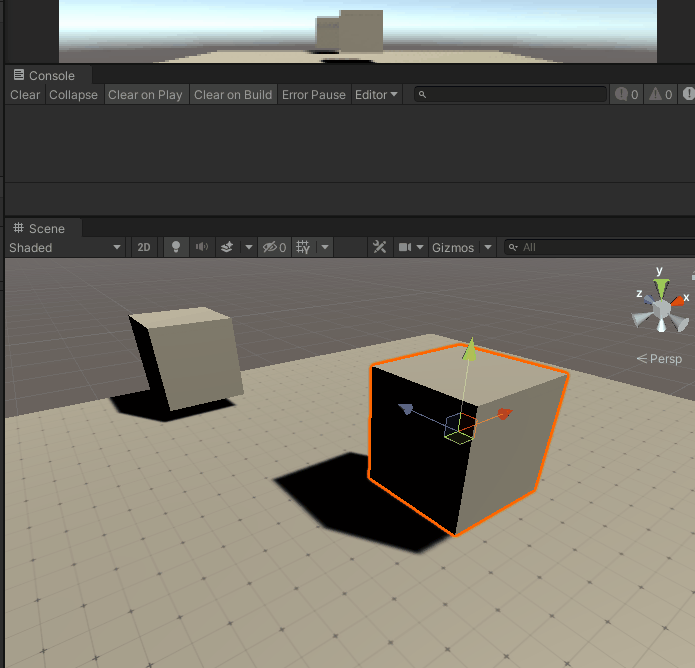

## 前言

碰撞检测可以帮助我们实现诸如抵达某个地点自动触发剧情、判断子弹是否击中玩家等功能，但我如果想要实现如当鼠标悬浮某个人物上，自动弹出该人物信息，要如何判断呢？这时使用碰撞检测，从摄像机生成一个透明碰撞体朝着人物移动，等碰撞到了人物再弹出该人物信息？会不会太繁琐了。或许你又会想，若我直接生成一个足够长的透明碰撞体呢，是不是在创建的那一刻就可以触发该人物的弹出信息逻辑？没错这样的确可以，而这就是射线！不过是把无限长的透明碰撞体变为了无限长的一条线，仅此而已。

//@[TOC](目录)

> 前排提醒：本文仅代表个人观点，以供交流学习，若有不同意见请评论留言，笔者一定好好学习，天天向上。
> 阅读此文章时，若有不理解的地方，推荐观看本文列出的参考资料来对照阅读。

> 了解射线检测前最好对碰撞检测有所了解，详情可参考我写的关于刚体与碰撞体的文章。

**Unity版本[2019.4.10f1] 梦小天幼 & 禁止转载**

---

## 一、创建并使用射线
射线和碰撞检测不同的地方在于，刚体和碰撞体是作为组件添加的，代码处理碰撞逻辑。而射线则是纯代码处理的，Unity的物理引擎为我们提供了相关射线类以及函数接口，我们需要自行调用这些API来实现一条射线。
> **射线检测：从某个初始点开始，沿着特定的方向发射一条不可见且无限长的射线，通过此射线检测是否有任何模型添加了Collider碰撞器组件。一旦检测到碰撞，停止射线继续发射。**

> **Collider组件中Is Trigger选项的开关并不影响射线检测**
>! 对了还有一个参数，写在Raycast末尾，QueryTriggerInteraction（指定该射线是否应该命中触发器），上面我说过Is Trigger选项的开关不影响射线检测，但是前提是QueryTriggerInteraction该参数设置为检测触发器了，你也可以将该参数设置为仅对碰撞器进行检测，这个参数可以全局设置。

(Physics.Raycast一共有16个重载方法，自行组合吧，今天只拿两个举例子)

> Physics.Raycast(origin(V3), direction(V3), hitInfo(RaycastHit), distance(float), LayerMask(int));
> 射线的发射点、具体方向、碰撞信息（结构体）、距离（可选，不写默认无限长）、碰撞层（可选，不写默认检测所有层）

```CSharp
//第一个简单小栗子
    void Update()
    {
        Ray ray = new Ray(transform.position, transform.forward);
        //声明一个Ray结构体，用于存储该射线的发射点，方向
        RaycastHit hitInfo;
        //声明一个RaycastHit结构体，存储碰撞信息
        if (Physics.Raycast(ray, out hitInfo))
        {
            Debug.Log(hitInfo.collider.gameObject.name);
            //这里使用了RaycastHit结构体中的collider属性
            //因为hitInfo是一个结构体类型，其collider属性用于存储射线检测到的碰撞器。
            //通过collider.gameObject.name，来获取该碰撞器的游戏对象的名字。
        }
    }
```
```CSharp
//第二个简单小栗子
    void Update()
    {
        RaycastHit hitInfo;
        if (Physics.Raycast(transform.position, transform.forward, out hitInfo))
        {
            Debug.Log(hitInfo.collider.gameObject.name);
        }
    }
```

> 本例和上一个基本差不多，唯一差别在于没有声明射线，而是直接把射线的起始点和终点作为参数赋予Raycast了。个人认为第一种比较好，声明好射线之后，如果后续还要用，可以直接拿来用了。这就相当于用speed存速度，后续要使用或修改，直接改speed即可。
> 

> 关于RaycastHit结构体相关参数，参考下图（截取自Unity圣典API）
> 

---

## 二、让射线现出原形
刚才这个例子可能不够直观，是因为这条射线是隐形的，读者只能自行根据动作来脑补，哦！原来那里有一条射线啊。有时候开发者想要这条射线显示出来，以便更好的调试游戏。而Unity中刚好能满足开发者的需求，在场景窗口让射线现出原形。
> Uniyt中通过使用Debug.DrawLine()和Debug.DrawRay()都可以让射线现出原形。本例使用DrawLine
> 但是！需要特别注意的是，这里画出的线其实跟射线毫无关联的，因为就算没有射线，这里也能画出线来。两点一线，只要确定两个点就行了。所以这里的线只是辅助开发者而已。

> 但是！又需要特别注意的是，如果你的射线不显示的话，估计是因为！我就是刚刚不小心把它关了，然后挠头找不到原因，我已经犯了好几次这样的错误了！！！！！这个按钮主要是用于显示和关闭场景中的辅助图形之类的（如灯光，射线、摄像机等）！


```CSharp
//在原有代码的基础上，加上这句话即可（加在IF中，因为也需要每帧绘制）
    Debug.DrawLine(transform.position,hitInfo.point,Color.yellow);
//Debug.DrawRay(transform.position, transform.position + transform.forward * 10, Color.yellow);
```
> 这两者的不同点在于
> - DrawLine ：真正的两点确定一条线
> - DrawRay ：从初始点出发画一条射线，所以需要一个初始点，加上一个具有方向和长度的向量，就得到了一条射线。


起始点我们可以使用transfrom.position，终点呢，我们就用上面声明的hitInfo结构体中的point，该属性存储了射线碰撞到碰撞器的碰撞点，也是一个V3类型向量

---

## 三、Unity中的层级
Unity中，层有着很大的用途，比如控制摄像机仅渲染指定层来节省资源，控制光源仅照亮哪些层等，当然层也可以控制射线仅检测某些碰撞器而忽略其他的碰撞器，下面一节的应用实例就讲解的非常详细。

> 这里关于层级的知识需要用到位操作，以及其他乱七八糟的东西，最重要的是，笔者不会，所以就不写了。空在这里，日后补上或者新开一篇补上。

> **注意：第 31 层为 Editor 的预览窗口内部机制使用,为了防止冲突，请勿使用此层。(来自官方API的提醒)**
完了...不认识层这个字了，层层层层层层层层层层层层层层层层层层层层层层层层层层层层层层；好了，现在你也不认识了hhhh

---

## 四、应用实例
其实射线检测内容并不是很多，反正肯定没碰撞检测的内容多，但是要想实际应用起来，也挺简单的...hhh，这里举几个简单的小栗子
### 1.被指到的坏人会变红，而好人不会
> 两个注意点，好人和坏人的区分，被指到的物体需要更换材质

> 代码参考与动图演示：


```CSharp
    public LayerMask mask;
    public Material enemyMaterial;
    //用于存储需要检测的层、需要更换的材质
    void Update()
    {
        Ray ray = new Ray(transform.position, transform.forward);
        RaycastHit hitInfo;
        if (Physics.Raycast(ray, out hitInfo, Mathf.Infinity, mask))
        //这里的Mathf.Infinity代表射线无限长，省略不写也可以
        {
            hitInfo.collider.gameObject.GetComponent<Renderer>().material = enemyMaterial;
            //通过hitInfo存贮的碰撞信息来获取实际对象的Renderer组件，然后更换其材质。
            Debug.DrawLine(transform.position, hitInfo.point, Color.yellow);

        }
        else
        {
            //当射线没有检测到与物体碰撞则画一条蓝色线条，检测到了则画黄色线条，仅起到辅助作用。
            Debug.DrawRay(transform.position, transform.forward * 10, Color.blue);
        }
    }
```

### 2.让射线穿透检测
> 大家看上一个例图，似乎有一个坏人被前面的挡住了，导致最后没有变红，这里我们可以用一行代码解决这个问题，坏人被挡住的原因是因为在他前面还有一个坏人，那么！把前面那个坏人变成好人，让射线忽略他，不就能检测到后面的坏人了吗？所以原理就是，把已经检测到的物体换一个层即可。

这里放上代码和演示动态图

> 代码就没必要全贴上了，关键的核心代码如下：(这句话放到IF判断中，当判断发生碰撞时，就把当前碰撞物体的层改掉，这样射线就会忽略，所以就实现了这个穿透功能)

```CSharp
    hitInfo.collider.gameObject.layer = 10;
    // 这里的数字10代表第十层，没错！LayerMask使用数字来表示层的。
```

### 3.让射线检测多个
> 通过上述学习我们知道可以通过RaycastHit结构体获得检测到的碰撞体，但是似乎每次只能返回一个，我们如果想要所有已经检测到的碰撞体的合集该怎么办呢？聪明的读者可能想到了，我们可以声明一个RaycastHit结构体数组，在if判断中，将每次检测到的值存入数组中。事实上，Unity也想到了Raycast的弊端，为此它提供了RaycastAll()，这个函数所需要的RaycastHit结构体就是一个结构体数组。

```CSharp
//篇幅有限，这个就不放演示图了，没啥演示的意义
    private void Update()
    {
        Ray ray = new Ray(transform.position, transform.forward);
        RaycastHit[] hitInfos;
        //声明了一个RaycastHit结构体数组

        hitInfos = Physics.RaycastAll(ray);
        //注意!Raycast是返回bool值，而这里则是返回一个数组

        Debug.DrawRay(transform.position, transform.forward * 100);
        //这里遍历输出检测到的游戏对象名字
        for (int i = 0; i < hitInfos.Length; i++)
        {
            Debug.Log(hitInfos[i].collider.gameObject.name);
        }
    }
```


### 4.鼠标悬浮显示场景物体名称
> 原理很简单，从摄像机发射一条射线，然后获取碰撞物体的对象的名字即可

> 需要用到：Camera.ScreenPointToRay(position);
> 这个函数的作用是发射并返回一条射线，射线从相机的近裁剪面出发，穿过屏幕的XY（这里使用的当前鼠标的屏幕坐标XY）。


```CSharp
using UnityEngine;
using UnityEngine.UI;
public class MouseShow : MonoBehaviour
{
    private LayerMask mask;
    private Text show;
    void Start()
    {
        //通过Start来给文本组件和需要检测的层初始化
        mask = LayerMask.GetMask("we");
        show = GameObject.Find("show").GetComponent<Text>();
    }
    void Update()
    {
        Ray ray = Camera.main.ScreenPointToRay(Input.mousePosition);
        RaycastHit hitInfo;

        if (Physics.Raycast(ray, out hitInfo, Mathf.Infinity, mask))
        {
            show.text = hitInfo.collider.gameObject.name;
            //把获取到的碰撞组件的对象的名字显示到UI组件上
            Debug.DrawLine(Camera.main.transform.position, hitInfo.point);
            //用于演示的线，不用管
        }
        else
        {
            show.text = "当前无物体信息";
        }
    }
}

```

### 5.鼠标点击移动
> 这个原理很简单，但是代码有点小绕。具体就是当你鼠标点击时，从摄像机发射一条射线，穿过鼠标的屏幕坐标XY位置，然后抵达世界空间，当检测到设置的层时（也就是地面），将当前碰撞点保存，调用Move函数，然后移动当前物体到这个位置。


```CSharp
    private bool isNextMove = false;
    private LayerMask mask;
    private Vector3 point;
    void Start()
    {
        mask = LayerMask.GetMask("plane");
    }
    void Update()
    {
        Ray ray = Camera.main.ScreenPointToRay(Input.mousePosition);
        RaycastHit hitInfo;

        if (Input.GetMouseButtonDown(0))
        //当鼠标点击时，才触发射线检测
        {
            if (Physics.Raycast(ray, out hitInfo, mask))
            //当检测到地面
            {
                isNextMove = true;
                point = hitInfo.point;
                //将isNextMove设为true，然后保存当前撞击点位置
            }
        }

        if(isNextMove == true)
        //当isNextMove为真，则不停调用Move
        {
            Move(point);
        }
    }
    void Move(Vector3 pos)
    {
        //使用Vector3的插值函数来移动位置
        transform.position = Vector3.MoveTowards(transform.position, pos, Time.deltaTime * 3.0f);

        if (transform.position == pos)
        //当目标抵达位置的时候，将isNextMove置为false，等待下一次移动指令
            isNextMove = false;
    }
```

> 这个例子还是有不足之处和Bug的，比如没有写转向，导致完全是平移，还有就是如果地面处于倾斜状态，当前物体依旧是90度垂直，看起来很不和谐。读者自行补充吧，我好懒啊。。

---

## 五、总结和参考资料
### 1.总结
- 想要一个物体被射线检测到，就必须加上Collider组件，Is Trigger并不影响射线检测
- 生成一个射线需要五个参数，起始点，方向，碰撞信息结构体，范围距离，检测层
    - 起始点一般使用transform.position来表示
    - 方向一般使用transform.forward，表示当前物体正前方
    - 碰撞信息使用RaycastHit结构体来存贮，需要事先声明
    - 检测范围是float型，可不写，默认无限长
    - 检测层可不写，默认全检测
- 如果你使用Debug.DrawLine()画了一条线而没有显示出来，不妨看看Gizmos有没有被关闭
- Raycast返回值是Bool,而RaycastAll返回值则是RaycastHit结构体数组
- 混淆点
    - Ray是一个类，表示射线
    - RaycastHit是一个结构体，记录射线的碰撞信息
    - Raycast和RaycastAll是函数，使用射线来检测碰撞，通过Physics来调用

### 2.参考资料
[1]Karmotrine.[简析Unity射线检测的概念与应用(知乎)](https://zhuanlan.zhihu.com/p/421534861)
[2]BeaverJoe.[【中文专题】Raycast射线检测在3D世界中的介绍(bilibli)](https://www.bilibili.com/video/BV1gE411E7CH?spm_id_from=333.999.0.0)
[3]梦天幼.[详解Unity的几种移动方式实现(csdn)](https://blog.csdn.net/weixin_43147385/article/details/123892842?spm=1001.2014.3001.5501)
[4]黑色最低调的奢华.[Unity之射线穿透(csdn)](https://blog.csdn.net/qq_36282052/article/details/70225549)
[5]游戏蛮牛.[[蛮牛教程] Unity3D 浅析－Camera（摄像机）](https://www.sohu.com/a/163126162_667928)
[6]佚名.[Unity圣典 & Unity官方API]
