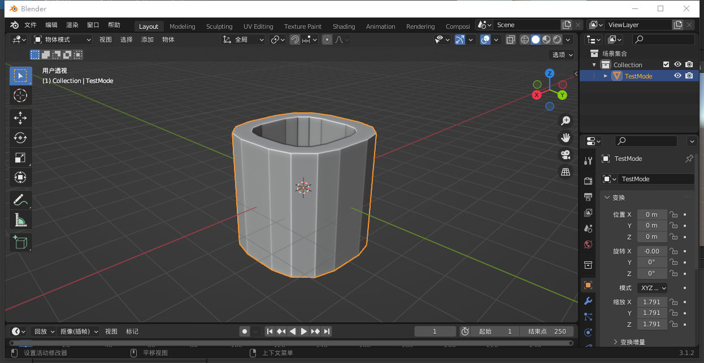

## 前言
碰撞体组件定义了物体的物理性状，Unity中有一系列基本碰撞体，我们可以使用它们组合成任意形状，但除了基本碰撞体之外，Untiy还提供了诸如网格(Mesh)、车轮(Wheel)、地形(Terrain)等碰撞器，它们分别用于轮胎功能的实现、复杂网格的碰撞、地理环境的碰撞，今天就简要介绍一下网格碰撞器的简单使用。

//@[TOC](目录)

> 前排提醒：本文仅代表个人观点，以供交流学习，若有不同意见请评论留言，笔者一定好好学习，天天向上。
> 阅读此文章时，若有不理解的地方，推荐观看本文列出的参考资料来对照阅读。

> 阅读本篇前，请先了解“刚体和碰撞体”相关知识。

**Unity版本[2019.4.10f1] 梦小天幼 & 禁止转载**

---

## 一、网格(Mesh)碰撞器
一般情况下，使用基本碰撞体如正方体、圆柱体等的组合，足够模拟出百分之99的形状了，但是在游戏中，有些比较重要的角色或场景物体，需要特别精细的碰撞，这个时候使用网格碰撞体来构建物体的碰撞便是不二之选了。网格碰撞体的本质就是引用网格来计算碰撞。
> 这里说明一下网格(Mesh)和模型(Model)的区别：
> 网格：包含定义了3D对象形状的顶点信息，也就是模型的形状
> 模型：材质+动画+纹理+着色器+网格 = 模型
> 这里说的不够严谨，但我词穷了，烦请谅解。

下面我们实际操作一下，一个模型从创建到导入到Unity并添加网格碰撞器的整个过程

### 1.模型导入到Unity中并作为网格碰撞器使用

这里我们选用Blender3.1来制作模型，首先打开Blender，然后经过.....的操作，我们就创建好了这样的一个简单模型，并设置了一个简单的材质，然后导出为FBX格式，直接拖到Unity的Assets中

我们可以看到，导入后的FBX文件有了两个子文件，MM1和TestMode，它们分别是材质和网格，当它们俩组合到一起，就可以叫做模型。我们再把导入的模型资源拖到场景中。

我们可以看到，初次导入的模型资源只有基本的Transfrom、Mesh Filter、Mesh Renderer组件，还没有Collider，所以我们为它加上Mesh Collider

此刻就大功告成了，下面简要说一下剩余参数的作用。

### 2.Mesh Collider参数

#### 1.Convex
这里官方的解释是选中后将使Mesh Collider与其他的Mesh Collider发生碰撞，说实话我没看明白啥意思。

下面我用两张图解释一下，第一张未勾选Convex,第二张勾选Convex

> 相信这里大家应该能看出差别了，未勾选则表示这个模型按照网格计算碰撞，勾选了则表示Unity会自动将网格凹凸不平的部分填平。
> 勾选肯定节省资源的，且勾选之后Is Trigger选项也能使用了，但是你勾选这个倒不如用圆柱体碰撞器来模拟碰撞了，个人看情况使用吧。

### 2.Cooking Options
物理引擎以何种方式处理这个网格（给出了六个选项）
- None 禁用所有选项
- Everything 启用所有选项
- Cook for Faster Simulation 更快的模拟
- Enable Mesh Cleaning 启用网格清理
- Weld Colocated Vertices 合并具有相同位置的顶点
- Use Fast Midphase 使用更快速的算法

> 默认是多选了后四项,说实话，我并不是很懂这些（好吧是一窍不通），不多说了，免得误人子弟。

### 3.Physic Material
这个选项用于模拟物体表面的物理材质，对于地面而言，比如冰面、木板、水泥板这些。对于物体本身而言，比如物理自身的弹性，物理自身的平滑度之类的，都会直接影响到物理模拟的效果。
物理材质相关的可以看我“详解刚体与碰撞器”文章中的2.3节，我已经写的很明白了，这里不多赘述。

### 4.Mesh
引用需要用于碰撞的网格，不多解释了，1.1说的很清楚了

---

## 二、总结和参考资料
### 1.总结
- 本来我想着用一篇把网格、车轮和地形都说完，但是接触车轮之后才发现东西太多太多了，所以决定分成三篇来讲，所以这篇就稍微短了一点点。
- 需要注意的点：
    - 网格：包含定义了3D对象形状的顶点信息
    - 模型：材质+动画+纹理+着色器+网格 = 模型
    - Mesh Collider的Convex参数
        - 用于设置是否填补中空
- FBX导入Unity中，会有一个材质和网格，他俩组合起来，就叫模型（后续也开新坑讲讲各种格式导入Unity的操作）

### 2.参考资料
[1].Unity官方.[Unity网格碰撞体](https://docs.unity3d.com/cn/current/Manual/class-MeshCollider.html)
[2].枕流爱玩游戏&lzh0913hang[Unity3d 中MeshCollider组件下convex勾选有什么用?（百度知道）](https://zhidao.baidu.com/question/1994161000530362907.html)