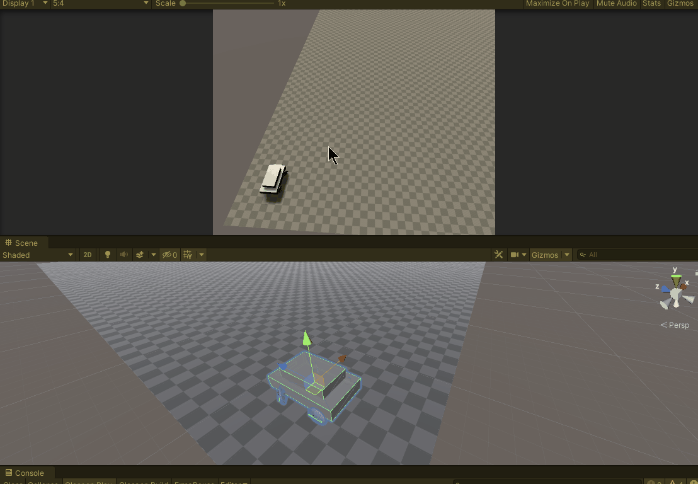
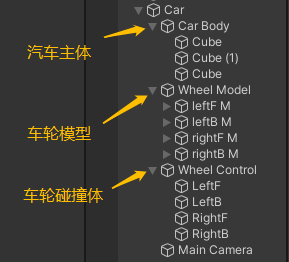
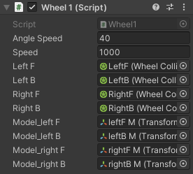
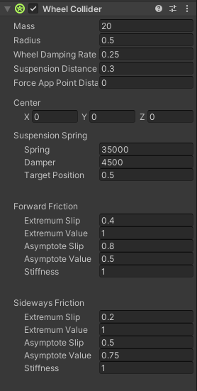
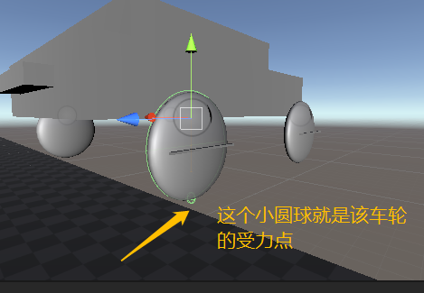
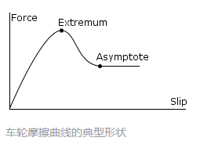
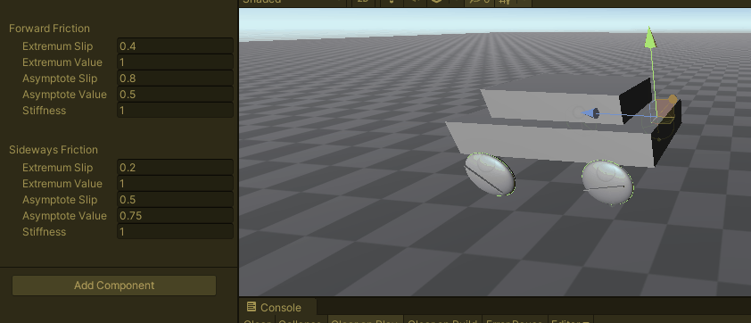
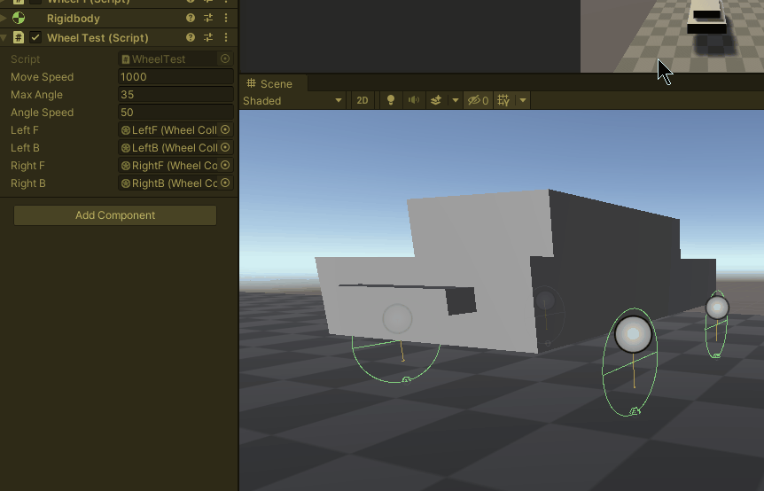

## 前言
碰撞体组件定义了物体的物理性状，Unity中有一系列基本碰撞体，我们可以使用它们组合成任意形状，但除了基本碰撞体之外，Untiy还提供了诸如车轮(Wheel)、网格(Mesh)、地形(Terrain)等碰撞器，比如Wheel Collider，就该碰撞器用以实现车辆模拟，它可以模型车辆的前进后退，刹车，转向，打滑等。今天就简要介绍一下该组件的使用。

//@[TOC](目录)

> 前排提醒：本文仅代表个人观点，以供交流学习，若有不同意见请评论留言，笔者一定好好学习，天天向上。
> 阅读此文章时，若有不理解的地方，推荐观看本文列出的参考资料来对照阅读。

> 阅读本篇前，请先了解“刚体和碰撞体”相关知识。

**Unity版本[2019.4.10f1] 梦小天幼 & 禁止转载**

---
## 一、先做一辆小汽车
车轮碰撞器顾名思义，肯定是用于模拟车轮的，你可以用它来模拟自行车、三轮车、小汽车、大货车，统统都可以！该碰撞体内置了碰撞检测、车轮物理组件和基于打滑的轮胎摩擦模型。是专为车轮而生的碰撞器！

### 1.如何实现？实现效果展示
So，先从使用车轮碰撞器做一辆车车开始，首先想想若使用传统方法做汽车，车轮应当如何实现？
> 用transform位移，然后每秒转几圈、拐弯时车轮和车体整体都要偏移，很难做出车轮拐弯车体不动的效果，这时候使用刚体来驱动或许效果会好一点，但是它的模拟力不能确定，还有悬挂，刹车，打滑等又要如何实现？所以如果我们用自己的想法来实现一辆小汽车，可能困难重重，但！Unity为我们提供了车轮碰撞器！它可以解决上述所有问题!

> 老规矩，先看实现效果，再细说实现流程。

通过这个动图，我们可以清楚的看到，小汽车可以前进后退，转弯，打滑。下面来说说详细的实现步骤

### 2.实现步骤
> 首先我们要认识到空物体的重要性，举个例子，那就相当于电脑中的文件夹，它没有什么实际的功能，但是它可以帮我们将一大堆资源合理摆放，我们要做一辆汽车，为了便于脚本控制和方便我们管理，所以首先我们要建立一个汽车的空物体，这是一个"总文件夹"，场景中和汽车相关的都放在这里。其次我们建立三个"子文件夹（三个空物体）"，分别存放汽车主体模型，汽车轮胎，汽车轮胎的车轮碰撞体。

> 你可能会疑惑？什么汽车轮胎和汽车轮胎的WheelCollider要分类存放，碰撞体组件不是依附在汽车轮胎模型上的吗？答案如下：

> **不必通过转动或滚动 WheelCollider 对象来控制汽车；附加了 WheelCollider 的对象应始终相对于汽车本身固定。但是，可能会需要车轮会旋转移动之类的动画操作。最好的方法是为 WheelCollider（依附于空物体）和车轮模型设置单独的对象**(引用自Unity官方文档，经过简要修改)

> 所以我们建立好三个空物体，存放汽车主体模型、车轮模型、碰撞体，车体模型用最基本的正方体堆一个就行，车轮模型使用圆球，压扁它当作车轮（为什么不用圆柱体，因为它的轴向不对，大家可以拿一个圆柱体试试看），碰撞体需要单独建四个空物体，然后为它们加上WheelCollider。So,结构图如下。


### 3.注意事项
> 写代码前，有几点需要注意的事项。（很重要！！！）

首先要在最上层的空物体上加上刚体组件，也就是"Car"，更改质量参数Mass，大概1500（普通小汽车的重量），其他不用改。这样做的目的是给车加上重量，以及让车具有物理特性。且！如果不给WheelCollider的父级或父父级加上刚体组件的话，WheelCollider是不会显示在Scene窗口中的。

其次，删除汽车车轮模型上的自带的碰撞体，因为WheelCollider本身就具有碰撞，所以车轮模型的作用就只是动画而已，其物理特性，完全由WheelCollider控制的。

最后，WheelCollider的位置和车轮模型的位置要一样，大致一样就行。因为它们分开是为了方便控制，但本身它们就应该在同一个位置，一个负责外形，一个负责物理实现。

最后的最后，若WheelCollider的半径太小，调整其Radius参数即可

### 4.代码实现
该脚本挂载到任何地方都行，建议挂载到Car总空物体上，截图和代码如下：


```CSharp
    private float angle;
    public float angleSpeed;
    public float moveSpeed;

    //注意这八个变量，四个是获取车轮碰撞器的，四个是获取车轮模型的
    public WheelCollider leftF;
    public WheelCollider leftB;
    public WheelCollider rightF;
    public WheelCollider rightB;

    public Transform model_leftF;
    public Transform model_leftB;
    public Transform model_rightF;
    public Transform model_rightB;

    void Update()
    {
        WheelsControl_Update();
    }

    //控制移动 转向
    void WheelsControl_Update()
    {
        //垂直轴和水平轴
        float h = Input.GetAxisRaw("Horizontal");
        float v = Input.GetAxisRaw("Vertical");

        //前轮角度，后轮驱动
        //steerAngle:转向角度，总是围绕自身Y轴，转向
        //motorTorque:电机转矩，驱动车轮
        angle = angleSpeed * h;
        leftF.steerAngle = angle;
        rightF.steerAngle = angle;

        leftB.motorTorque = v * moveSpeed;
        rightB.motorTorque = v * moveSpeed;

        //当车轮碰撞器位置角度改变，随之也变更车轮模型的位置角度
        WheelsModel_Update(model_leftF, leftF);
        WheelsModel_Update(model_leftB, leftB);
        WheelsModel_Update(model_rightF, rightF);
        WheelsModel_Update(model_rightB, rightB);
    }

    //控制车轮模型移动 转向
    void WheelsModel_Update(Transform t, WheelCollider wheel)
    {
        Vector3 pos = t.position;
        Quaternion rot = t.rotation;

        wheel.GetWorldPose(out pos, out rot);

        t.position = pos;
        t.rotation = rot;
    }
    
```
## 二、Wheel Collider组件参数介绍
现在你已经完成了一辆小汽车了，是不是成就感满满，然后呢我们就来详细说说该组件都有什么参数，看起来一大堆很唬人是吧，咱就挑些重点的说说，其他的先不涉及。


### 1.Mass质量 & Radius 半径
> 顾名思义，质量值一般就设置为单个轮胎重量就行，和现实世界不要差太多，半径就是半径，不多解释，自己调一调试一试。

### 2.Wheel Damping Rate
> 应用于车轮的阻尼值。阻尼是作用于运动物体的阻力，值越大，车越难打滑。

### 3.Suspension Distance
> 车轮悬挂的最大延伸距离，悬挂始终向下延伸穿过自身Y轴，就是悬挂高度，始终是垂直向下的。这个要看你做什么车，比如汽车，底盘低，默认值我觉得就OK，但是那种越野车就需要把该值改高一点了。设置为0，那么车本身的转向避震就会很生硬，像个方块一样。

### 4.Force App Point Distance
> 车轮的受力点，默认位于静止车轮的底部（如下图），一般无需改动。


### 5.Suspension Spring
设置悬挂系统相关参数：

1.Spring :
>值越大，悬架抵达目标位置就越快，就是悬架弹簧弹一个来回的时间的快慢

2.Damper :
>抑制悬架速度，这个参数和上一个是相辅相成的（应该是相爱相杀），若想要到达自己需要的悬架数据，需不断调整。

3.Target Position :
> 这个值就是在静止状态下的悬架展开程度(根据悬架距离Supension Distance计算)，也就是说悬架静止状态下的展开和压缩并不是有车体重量控制的，而是这个参数来控制的。默认0.5，符合正常的汽车悬架。值为1完全展开，为0完全压缩。

### 6.Forward Friction & Sideways Friction
> 根据名字应该就知道，这两组参数用于设置车轮的纵向（前进后退）和横向（转向）的摩擦特性。
> 该如何理解呢？

Extremum Slip ，Extremum Value
Asymptote Slip，Asymptote Value
上述四个值是坐标系的两个坐标，它们确定了一个滑动距离与摩擦力的关系曲线
（该图截取自Unity官方文档）

> Stiffnes :该值则整体调节摩擦曲线的倍数

> 若是上面不理解直接修改这个就可以，新手不建议动上面四个变量，因为在不懂的情况下修改会产生很奇怪的效果。

下图演示了仅修改车轮纵向的Stiffnes的值：


**通过在运行时改变该值用以模拟各种地面材质(注意，物理材质在车轮碰撞器上是无效的，所以需要通过修改该值来模拟各种地面)**

## 三、Wheel Collider API
学习WheelCollider的API可以让我们更好的对车轮进行控制，比如上面的做一个小汽车的案例，就使用了该碰撞器的两个变量，motorTorque和steerAngle。下面简要讲述一下这些API吧。
|变量|描述|单位|备注|
|:--:|:--:|:--:|:--:|
|motorTorque|轮轴上的电机扭矩|牛米|
|steerAngle|转向角度|度|
|breakTorque|制动扭矩|牛米|
|rpm|当前轮轴转速|每分钟/转|只读|
|forwardFriction|车轮前进方向上的摩擦|
|sidewaysFriction|车轮侧向上的摩擦|
|wheelDampingRate|车轮的阻尼率，必须大于零|

挑几个重点说说：
### 1.motorTorque
此参数用于调整车轮的转动，也就是传说中的前进与后退。比如你想要做一辆后驱车，就只应该设置后两个车轮受控。单位是牛米（N.m），是力的单位和距离的单位的乘积。
这里套用现实世界的知识，扭矩决定了发动机输出的力度，曲轴转速的变化、汽车的爬坡能力、起步速度及加速性。理论上，扭矩越大，起步速度就越快。(仅供理解，Unity中和现实世界还是不一样的)
该值设置过低会出现颠簸的情况。
> 对了！通过调整左右车轮的扭矩大小，应当可以模拟坦克转向！回头可以试试。

### 2.steerAngle
该值用以转向。以度为单位。一般来讲要模拟真实车辆，肯定不能直接设置该值多少度，这样太突兀了。比如设置当按下左方向键后2秒，角度才完全打完，这样模拟向左打方向盘。现实世界中车轮转向角度为30-40，各个车型略有不同。
下面简要模拟了一下：


```CSharp
    public float moveSpeed = 1500;
    public float maxAngle = 35;
    public float angleSpeed = 50;

    public WheelCollider leftF;
    public WheelCollider leftB;
    public WheelCollider rightF;
    public WheelCollider rightB;

    private void Update()
    {
        float v = Input.GetAxisRaw("Vertical");
        leftB.motorTorque = v * moveSpeed;
        rightB.motorTorque = v * moveSpeed;
        
        //左转向
        if (Input.GetKey(KeyCode.A))
        {
            //Debug.Log(leftF.steerAngle);
            leftF.steerAngle -= Time.deltaTime * angleSpeed;
            rightF.steerAngle -= Time.deltaTime * angleSpeed;
            if (leftF.steerAngle < (0-maxAngle) || rightF.steerAngle < (0-maxAngle))
            {
                //到最大值后就不能继续加角度了
                leftF.steerAngle = (0 - maxAngle);
                rightF.steerAngle = (0 - maxAngle);
            }
        }
        //右转向
        if (Input.GetKey(KeyCode.D))
        {
            leftF.steerAngle += Time.deltaTime * angleSpeed;
            rightF.steerAngle += Time.deltaTime * angleSpeed;
            if (leftF.steerAngle > maxAngle || rightF.steerAngle > maxAngle)
            {
                leftF.steerAngle = maxAngle;
                rightF.steerAngle = maxAngle;
            }
        }
        //松开转向后，方向打回
        if (Input.GetKeyUp(KeyCode.A) || Input.GetKeyUp(KeyCode.D))
            leftF.steerAngle = rightF.steerAngle = 0;
    }
```

### 3.breakTorque
制动扭矩，单位还是N.m，必须为正数，用于刹车。看下面的代码就理解了。
至于这个数量设置多少合适，个人认为比车辆扭矩大一点就可以了，自己调整着来吧，反正也没个定值。
```CSharp
        public float breakMove = 1000f;
        bool isBraking = Input.GetKey(KeyCode.Space);
        leftB.brakeTorque = isBraking ? breakMove : 0f;
        rightB.brakeTorque = isBraking ? breakMove : 0f;
```
### 4.rpm
该车轮每分钟的转速，该参数可以拿来计算汽车的速度。
> Rpm = wheel.rpm * (wheel.radius * 2 * Mathf.PI) * 60 / 1000);


## 五、总结和参考资料
### 1.总结
我们通过Unity提供的Wheel Collider用以模拟各种车辆，它们的前进后退，制动，转向，悬挂等功能。
- 通过motorTorque控制车辆扭矩
- 通过steerAngle控制车辆转向
- 通过breakTorque控制车辆制动

注意点：
- 碰撞器最上层空物体一定要加刚体组件
- 汽车轮胎模型自动的碰撞体记得删除
- 汽车轮胎模型和车轮碰撞体分别存放

车轮碰撞体参数：可设置该车轮的质量、半径、阻尼、悬挂、摩擦等特性。
### 2.参考资料
[1].天孤寒羽.[unity小案例教程第二期（汽车）BiliBili](https://www.bilibili.com/video/BV1xz4y1k7mM?spm_id_from=333.999.0.0)
[2].Unity官方.[Unity官方文档 车轮碰撞体](https://docs.unity.cn/cn/2020.3/Manual/class-WheelCollider.html)
[3].Unity官方.[Unity官方文档 WheelCollider API](https://docs.unity.cn/cn/2020.3/ScriptReference/WheelCollider.html)
[4].CoderZ1010.[Unity 【Wheel Collider】实现游戏中的车具控制(CSDN)](https://blog.csdn.net/qq_42139931/article/details/122880778)
[5].泰课在线.[unity wheelcollider轮子转动](https://www.taikr.com/article/536)
