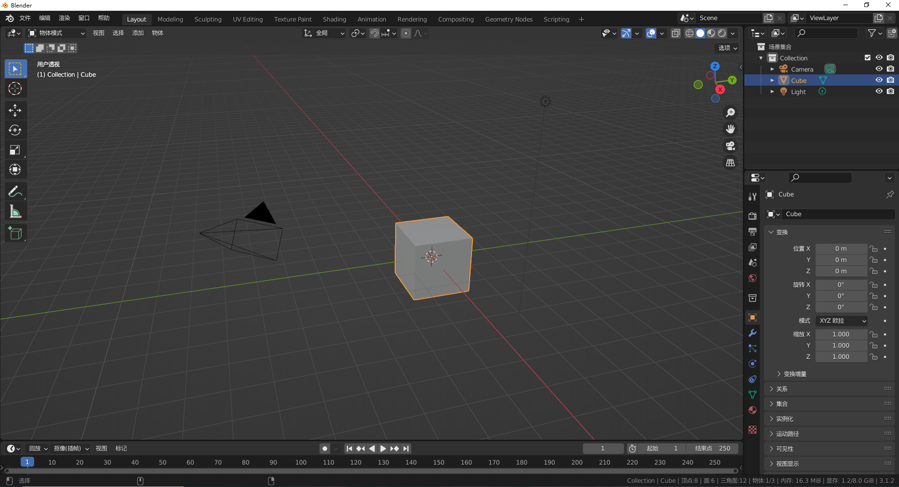

## 前言
三维模型可以表示任何现实世界中存在的物体，自然也可以表示任何游戏世界中存在的物体，比如地面，山川河流，花草树木，建筑，人物，都需要使用三维模型来表示。一般我们使用一些建模软件来建出游戏中需要的模型，然后导入到Unity中使用，本篇就来介绍介绍，一整个的3D模型制作导入流程以及需要注意的问题。

//@[TOC](目录)

> 前排提醒：本文仅代表个人观点，以供交流学习，若有不同意见请评论留言，笔者一定好好学习，天天向上。
> 阅读此文章时，若有不理解的地方，推荐观看本文列出的参考资料来对照阅读。

**Unity版本[2019.4.10f1] 梦小天幼 & 禁止转载**

---
## 一、3D模型相关介绍
三维模型不止用于游戏行业，还广泛应用于工业设计、建筑设计、三维动画等领域，并不是附属于游戏行业的存在，而是一个独立的体系。
### 1.什么是模型
很多人在第一次接触3D模型会遇到很多陌生的名词，如网格，纹理，材质，贴图等。通俗的讲：
**网格是模型的形状，贴图是一张贴到物体表面的图片，纹理是物体表面的纹路，材质是模拟物体对光的交互**
**材质 = 贴图+纹理**
**模型 = 网格+材质**
这样说还是不够严谨，关于贴图、材质、纹理这些概念，想要细讲还是要另开一篇再说吧。挖坑，准备22年5月底发。

### 2.Unity支持的模型格式
Unity支持很多通用格式以及主流建模软件的导出格式，下面我简要列出一张表格。

本来我写了一大堆，支持的格式，支持的软件，但是后来一想好多杂七杂八的格式，我听都没听过，新手也不会接触，所以你们就记住FBX格式就行了，大多常见的建模软件都支持导入导出，并且支持材质动画骨骼，你在3Dmax做好的动画导入到Unity就能直接使用，这是最常用的格式。

### 3.常见的建模软件
上面表格列出了四种，下面我简要介绍一下这四种。
- 3D Max:知名但臃肿且启动速度极慢的不得不用的软件。

- C4D:常用于影视、电商方面的设计。其他也有涉猎。

- Blender:开源！全能！永远滴神！

- Maya:主要用来做动画的，做动画这一块是业内顶级的！

---

## 二、Blender|FBX导入到Unity并使用
## 1.制作模型
> Blender界面如上，版本为3.1.2

> 假如我现在有一个需求，我需要做一个LowPlay风格的游戏，需要一颗LowPlay的树，现在> 我们制作好这样一颗树。制作过程省略，结果如下

> 下面我给这棵树赋予一个绿色材质，树干和树叶材质分别命名为trunk,leaf

> 然后将该模型合并，并将模型的中心点设置为模型底部
> （不合并会很麻烦，比如莫名其妙树干被移动了，树梢还在原地，倒不如合并为一个整体。至于什么时候合并什么时候不合并，可以参照现实世界，比如凳子你拿起来的时候是作为一个整体拿起来的，放到模型中，就可以合并为一个整体。比如桌子上的锅碗瓢盆与桌子本身，都是可以独立拿起的，那就不合并为整体。这个主要还是看游戏需求）

## 2.导出模型并正确设置参数
> 然后点击文件->导出->FBX，就会探出如下窗口

> 你需要注意上图特别标注出的几个选项。
> - 缩放:代表你的模型被缩放到多少倍再导出，如果一般你是按照现实世界的比例来建模的，那么导入到Unity就不会失真，所以默认为1即可。
> - 应用缩放：默认就可以
> - **前进：这个特别注意，如果导入到Unity中，则需要改成，Z向前**
> - **向上：导入到Unity中则需要改成Y向上**
如果你是需要导入到其他游戏引擎或建模软件，则需要理解这个游戏引擎的世界坐标系。比如Unity的坐标系是左手坐标系，Z前Y上X右。所以才需要更改坐标方向。

其他设置默认即可。

## 3.导入到Unity中并使用
> 当你点击下面的"导出FBX"按钮后，你就导出了一个FBX文件，然后将该文件直接拖入Assets即可完成导入(或从菜单项的Assets->Import New Asset导入)

> 导入后的模型文件结构如下，有两个材质球，一个网格，将tree整体拖入场景，即可使用

这时你可以清晰的看到该模型的XYZ轴和世界坐标是对其的，如若刚才没有设置，那么这个树肯定是以一种很奇怪的方式出现的。

---
## 三、3DMax|FBX导入到Unity并使用
再用3DMax以同样的步骤演示一下
## 1.制作并导出模型，以及设置参数
> 3DMax2019软件界面如下，模型也做好了，如下

> 当你导出时，会弹出该窗口，和上面说的blender一样，你只需要更改高级选项中的轴转化即可。但是3Dmax中默认就是Y轴向上，所以你完全不需要做任何更改，就能导出使用

## 2.导入到Unity中并使用
> 导入Unity还是拖拽即可，然后拖放入场景中，如下。哦，忘记给材质了，不过问题不大。

---

## 四、常见问题以及注意事项
关于3Dm模型导入到Unity中，你只需要注意以下几点：
- 当前格式是否支持导出你模型中的材质，动画，骨骼，比如你做好了一个带有材质的树，导出了OBJ格式，然后导入到Unity，这时你纳闷了，我材质哪去了？这时用FBX就不会产生这个问题。
- 导出设置时，当前的轴向是否为Z前，Y上，Z前Y上是Unity的世界坐标系，你导出必须要转换为这个坐标系，不然的话，放到Unity场景中，就可能会方向错乱。
- 导出设置时，注意你的模型尺寸是否按照真实世界建模，如果不是，记得调整缩放大小。
- 导出前，记得检查你的模型中心点是否在中心或在中心底部位置。

---

## 五、总结和参考资料
### 1.总结
无
### 2.参考资料
https://zhuanlan.zhihu.com/p/163380009
https://www.zhihu.com/question/25745472?ivk_sa=1024320u
http://news.sohu.com/a/503415464_121143937

