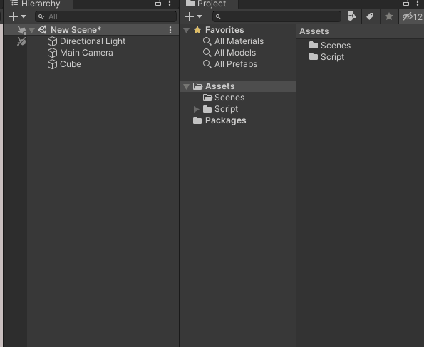
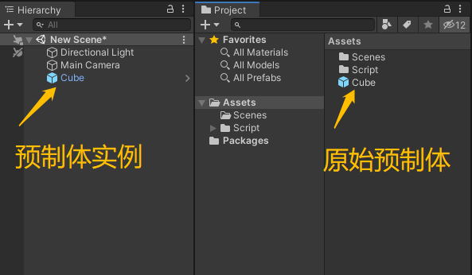
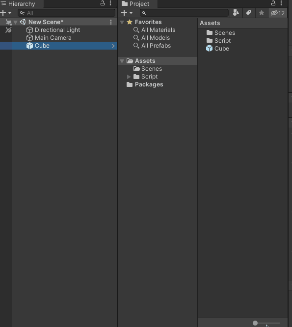
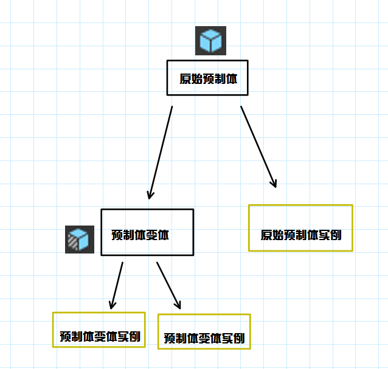
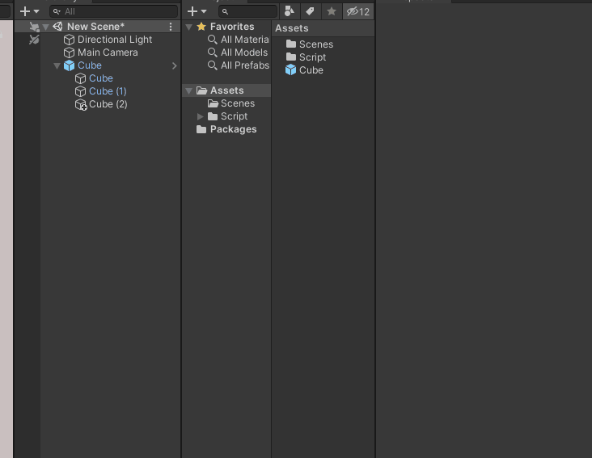
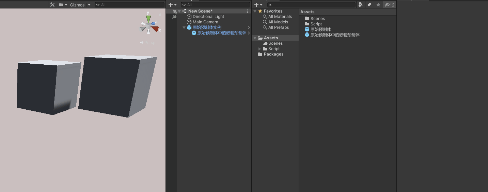
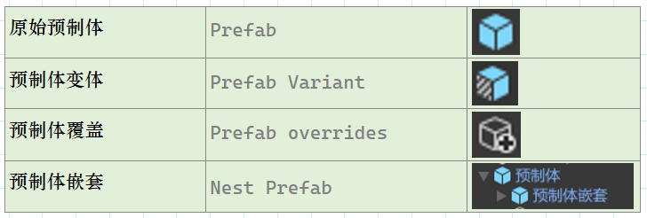

## 前言
在Unity中，预制体的作用是重复利用资源，比如游戏世界的花草树木、房屋建筑。这些资源都是重复出现的，我们可以将它做成预制体，方便重复利用。预制体也分原始预制体和变体，本篇我们就来说说它们的区别。

//@[TOC](目录)

> 前排提醒：本文仅代表个人观点，以供交流学习，若有不同意见请评论留言，笔者一定好好学习，天天向上。
> 阅读此文章时，若有不理解的地方，推荐观看本文列出的参考资料来对照阅读。

**Unity版本[2019.4.10f1] 梦小天幼 & 禁止转载**

---
## 一、如何制作一个预制体
> **预制体的作用就是为了重复利用资源，所以对于场景中重复使用的对象都尽可能的做成预制体再拖入游戏使用**

> 对于外部导入的模型资源，导入进来就是以一种预制体的形式存在的

> 凡是能够拖入Hierarchy面板的，都可以制成预制体，包括但不限于模型、UI、挂载脚本的空对象等。

#### 1.制作一个预制体
> 

#### 2.作用与区别
> 修改预制体实例不会影响原始预制体
> 
> 修改原始预制体会影响所有预制体实例
> 
> 
---
## 二、预制体变体

#### 1.制作预制体变体
> 预制体变体的图标和原始预制体的图标略有不同，请读者注意区分。

> 当你将一个已经是预制体的游戏对象再次拖入Assets窗口时，弹窗就会提示，想要创建另一个原始预制体还是想要创建该原始预制体的变体。我们选第二个选项，则预制体变体创建成功。
> 

#### 2.原始预制体VS预制体变体
> 预制体有几个分支概念，还请读者不要混淆
> 

> **这里可以用面向对象的概念来理解，原始预制体就是基类，原始预制体实例就是基类的实例对象，修改基类的实例对象跟基类没一毛钱关系，修改基类本身，会对所有基类实例产生影响。**

> **预制体变体就是原始预制体的派生类（是子类），子类也受到基类的影响，但也可以和基类有不同的地方，其不同的地方不受基类影响，子类也可以New实例，就叫做预制体变体实例。**
> 
---

## 三、预制体覆盖、同步
> 当你在Hierarchy窗口中修改了预制体，它是不会同步到其原始预制体的，因为Hierarchy的预制体都是预制体实例，那么如果将预制体实例同步到其原始预制体呢？
> 
> 从演示图中我们不难发现，如果当前预制体实例添加了一个新的Cube,则图片出现“+”号，这表示这个Cube新添加的，并不是原始预制体本身拥有的，这时候你有两种选择：
    > > 重置到原始预制体的模样
    > > 将当前修改内容同步到原始预制体
---
## 五、预制体嵌套
> 如果你已经对上述有了了解，预制体嵌套对你来说，应该不是难题，我们已经知道了原始预制体会对实例产生影响，那么又多个原始预制体组成的原始预制体是不是要更加灵活多变，你可以在不同预制体里调整任意的细节，最终对一个预制体实例产生影响。
> 
---
## 六、总结和参考资料
### 1.总结
> 到这里，如果你能灵活运用原始预制体、预制体变体、预制体嵌套、预制体实例，已经能玩出很多花样了，加油。（附表格一张）
> 
> 
### 2.参考资料
1.自己的勤劳智慧
2.官方API和文档资料
3.自己的聪明脑瓜

