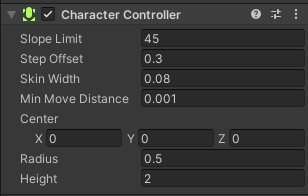

## 前言
如何让玩家所操纵的角色动起来，这在Unity中很容易实现，但是如何确保玩家所操作的角色不会产生一些非常违反物理常识的情况？而这就需要进行大量的检测，已确保玩家所操纵的角色正常。所幸Unity为我们提供了这样的一个组件——角色控制器(Character Controller)。下面将介绍该组件的基本参数以及使用方法。

//@[TOC](目录)

> 前排提醒：本文仅代表个人观点，以供交流学习，若有不同意见请评论留言，笔者一定好好学习，天天向上。

**Unity版本[2019.4.10f1] 梦小天幼 & 禁止转载**

>视频讲解：
**[详解Unity的XXX_BiLiBiLi](空地址！！！！！！！！！！！)**

---

## 一、Character Controller组件参数介绍
> 该组件继承自Collider，不受物理系统的影响，但可以发生碰撞。


|参数|描述|
|:--:|:--:|
|Slope Limit|可直接沿着向上移动的最大坡度|
|Step Offset|可直接跨越的最大障碍高度|
|Skin Width|皮肤厚度，值较大可减少抖动，较小可能导致角色卡住，一般设置为半径的10%|
|Min Move Distance|当角色的单次移动距离小于该值时，则被忽略，不生效。可用于减少抖动|
|Radius & Height|所控制角色的半径和高度|

#### 关于Skin Width
> 这个参数官方给的建议是设置为半径的10%，理由是防止角色卡住，但是这样会导致角色挨不着地面，所以这时候可以调整Center的Y轴值，即可使角色接触地面。

## 二、Character Controller API
>有关角色控制器的API 详见下表：

|变量/方法|描述|
|:--:|:--:|
|isGrounded|角色控制器是否接触地面|
|slopeLimit|坡度度数限制|
|stepOffset|可跨越台阶高度，单位米|
|detectCollisions|其他刚体和角色控制器是否能与本角色控制器相撞，默认为真|
|SimpleMove()|以一定速度来移动，移动时自动计算重力因素影响|
|Move()|更复杂的移动，不计算重力影响|

### 1.isGrounded
> 判断角色控制器是否接触地面
```CSharp
void Update()
{
    if (controller.isGrounded)
    {
        print("正在地面上...");
    }
}
```
### 2.SimpleMove
> 以一定速度来移动，Y轴速度被忽略，因为Y轴是被系统自动施加重力的，速度单位是米/秒。这就意味着，无需乘以Time.deltaTime。返回值为bool，当角色接触地面返回True，反之为False。只要你不做跳跃功能，我们就是好朋友。
```CSharp
    private void Update()
    {
        float v = Input.GetAxis("Vertical");
        float h = Input.GetAxis("Horizontal");

        Vector3 dir = Vector3.right * h + Vector3.forward * v;
        characterController.SimpleMove(speed * dir);
    }
```
### 3.Move
> 更复杂的移动方式，对一个角色拥有绝对的控制权，不会自动施加重力，需要自己写重力代码，如果需要做跳跃功能，必选这个，因为自由。
```CSharp
    public CharacterController characterController;
    //移动速度
    public float speed = 8.0f;
    //重力
    const float GRAVITY = 9.8f;
    //速度向量
    public Vector3 velocity = Vector3.zero;
    //跳跃高度
    public float jumpHeight = 1.2f;

    private void Update()
    {
        //移动更新函数
        Move_Update();
        //高度更新函数
        Height_Update();
        //Move方法
        characterController.Move(velocity * Time.deltaTime);
    }

    public void Move_Update()
    {
        float h = Input.GetAxis("Horizontal");
        float v = Input.GetAxis("Vertical");

        Vector3 dir = Vector3.right * h + Vector3.forward * v;
        velocity.x = dir.x * speed;
        velocity.z = dir.z * speed;
    }

    public void Height_Update()
    {
        
        if (characterController.isGrounded)
        {
            if (Input.GetButtonDown("Jump"))
            {   
                //v平方 = 2gh
                velocity.y = Mathf.Sqrt(2 * GRAVITY * jumpHeight);
            }   
                
            // 如果角色接触地面，则高度置零，这里设置-1而不是0，是因为有时候0无法起跳。
            if (velocity.y < -1)
                velocity.y = -1;
        }
        else
        {
            // 如果角色不在地面，则不断减去高度。
            //v=gt 自由落体运动
            velocity.y -= GRAVITY * Time.deltaTime;
        }
        
    }
```

### 4.SimpleMove和Move的区别
> - SimpleMove
>       * 不受Y轴速度影响，自带重力效果，无法实现跳跃功能
>       * 返回值为Bool，当角色接触地面返回True，反之为False。
> - Move
>       *  无重力效果，自行实现重力，可做跳跃功能
>       *  返回值（CollisionFlags对象），返回角色与物体碰撞的信息

---
## 三、总结和参考资料
### 1.总结
嗯对对对。
### 2.参考资料
[1].Unity官方.[Unity 官方手册 角色控制器](https://docs.unity.cn/cn/2022.1/Manual/class-CharacterController.html)
[2].百度.[百度百科 自由落体相关词条](https://baike.baidu.com/item/%E8%87%AA%E7%94%B1%E8%90%BD%E4%BD%93/4143)
