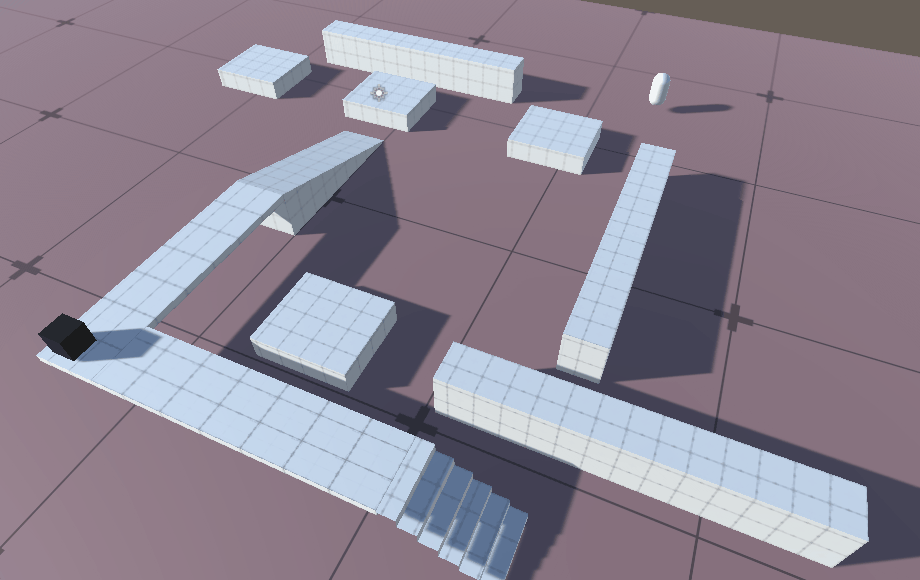

## 前言
在类RTS、RPG游戏中，都会提供自动寻路功能，当玩家下达指令后，NPC就会自动计算到达目标的路径，实现这种功能的方式有很多种，其中Unity本身也自带了一种导航寻路系统，该系统会将游戏场景中复杂的对象烘焙为网格信息，通过网格来计算NPC抵达目标的最短路径，该系统还支持动态寻路。接下来就详细讲讲NavMesh系统。

### 本系列提要
> Unity导航系统专题博客共分成三篇来讲解： 【本篇为第一篇】
> - 第一篇：如何快速上手使用
> - 第二篇：详解Nav Mesh Agent参数，详解如何添加动态障碍（Nav Mesh Obstacle），详解如何创建外链接（Off Mesh Link）
> - 第三篇：详解Navigation属性栏，包括AI寻路的区域与花费代价，路线网格烘焙相关参数，如何自动添加外链接

//@[TOC](目录)

> 前排提醒：本文仅代表个人观点，以供交流学习，若有不同意见请评论留言，笔者一定好好学习，天天向上。

**Unity版本[2019.4.10f1] 梦小天幼 & 禁止转载**

---


## 一、Nav Mesh导航系统概述

### 演示图



> 上图中，被黑色线条包裹的蓝色区域是可行走区域，在Unity中被称作**导航网格（Nav Mesh）**，没有特殊情况，AI只会在这些网格中寻路，如果目标出现在了网格之外，那么AI就会判定无法抵达，停留原地。上图中的AI叫做**导航网格代理(NavMesh Agent)**，它可以通过导航网格来推断抵达目标的最短路径，并且知道如何避开彼此。

> 所以想要做出一只不呆不傻的AI并且复原以上场景，我们需要注意三点：
> - 1.如何构建导航网格
> - 2.如何给一个圆柱体添加上导航网格代理
> - 3.如何做一个目标，让AI去寻找它
> 
> 这就是我们这篇博客要讲的内容...

### 1.如何构建导航网格
在Unity中，为了减轻游戏运行中的计算量，很多数据都会进行预先计算处理，比如光照就是将光照信息预先计算到贴图上，从而节省了计算量。导航网格也是如此，对于游戏地图来说，很多路线都是固定不动的，所以完全可以预先计算好信息，供游戏调用。

> **首先**我们创建一张地图，随意摆放几个Cube(这些Cube就充当游戏中静态障碍物作用)
> 
> **其次**我们选中所有的Cube和地面（地面也要勾选哦！），然后为其勾选上**Navigation Static**选项（点击Static 的倒三角），这样我们所有的Cube就会被Unity计算在内了
> 
> **然后**我们找到[ **Window - AI - Navigation** ]选项，就可以打开侧边属性栏
> 
> **最后**我们找到**Bake**选项卡，选择烘焙，等待几秒，即可计算完成。
> 
> **需要注意的是，如果你想显示计算好的导航网格，你必须切换到Navigation属性栏才可以，还有就是，如果你不小心挪动了某个方块的位置，必须要重新计算。因为导航网格已经定型了**
> 

### 2.如何添加导航网格代理
我们已经创建了导航网格，下面就添加一个AI，让其畅游其中吧。Unity的导航网格代理是以组件形式存在的，这就意味着我们只需要为某个物体添加一个组件，修改一些参数，就可以创建出一只寻路AI啦。

> **1** 再次在Unity世界中创建一个物体（可以是圆柱体，正方体，自己能分清即可），然后为其添加**Nav Mesh Agent**组件，然后就可以了，有关组件的详细参数会在下一篇中讲解。
> 

### 3.如何添加目标，并让AI寻找它
现在，我们已经拥有了可供行走的路径，可供寻路的AI，只差一个目标了。这里就需要通过代码来告知AI目标，让其开始寻路。

> 所以首先需要创建一个脚本，并添加到寻路AI身上（也就是之前创建的圆柱体主角）。
> 脚本内容也很简单，如下：
```CSharp
using UnityEngine;
using UnityEngine.AI; //必备，别忘记添加

public class PlayerMove : MonoBehaviour
{
    public NavMeshAgent nav; //获取导航网格代理组件，通过此组件来告知AI目标
    public Transform target; //目标的位置

    private void Update()
    {
        nav.SetDestination(target.position); //每帧更新目标位置
    }
}
```
> 然后创建一个目标（可以是一个空物体或者方块，圆球），拖拽到脚本变量上，NavMeshAgent组件也别忘记拖拽！
> 


##### 然后就开始游戏吧！


---

## 二、总结和参考资料
### 1.总结
本篇属于入门篇，没啥总结的。
### 2.参考资料
[1].Unity官方.[Unity中的导航系统](https://docs.unity3d.com/cn/2020.2/Manual/nav-NavigationSystem.html)
