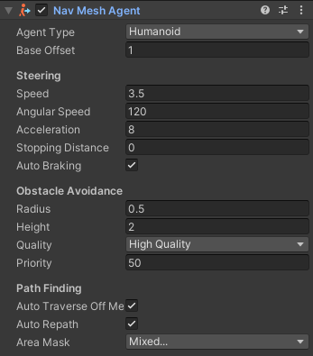

## 前言
上一篇简单讲述了Nav Mesh导航系统的使用，并且做出了一个小案例，本篇我们会更加深入，更加系统去讲解，包括NavMeshAgent组件、NavMeshObstacle组件、OffMeshLink组件等，以及相关参数。

### 本系列提要
> Unity导航系统专题博客共分成三篇来讲解： 【本篇为第二篇】
> - 第一篇（[点击直达](https://blog.csdn.net/weixin_43147385/article/details/126580688?spm=1001.2014.3001.5501)）：如何快速上手使用
> - 第二篇（[点击直达*暂空](空地址)）：详解Nav Mesh Agent参数，详解如何添加动态障碍（Nav Mesh Obstacle），详解如何创建外链接（Off Mesh Link）
> - 第三篇（[点击直达*暂空](空地址)）：详解Navigation属性栏，包括AI寻路的区域与花费代价，路线网格烘焙相关参数，如何自动添加外链接

//@[TOC](目录)

> 前排提醒：本文仅代表个人观点，以供交流学习，若有不同意见请评论留言，笔者一定好好学习，天天向上。

**Unity版本[2019.4.10f1] 梦小天幼 & 禁止转载**
> 视频讲解：
**[详解Unity的XXX_BiLiBiLi](空地址)**

---
## 本篇内容概述

> 上期我们已经讲解了关于导航网格的概念，它本质上就是一种预处理，至于为什么会处理成网格状，这与寻路算法相关，暂不讲解。而网格代理呢，就是寻路AI。这期我们接触两个新概念，一个是网格障碍物（NavMesh Obstacle），一个是网格外连接(Off-Mesh Link)。

## 一、Nav Mesh Agent | 导航网格代理
如果想要一个角色学会自动寻路，就必须要先添加一个导航网格代理组件，以下是该组件的详细参数讲解（不理解的可以先看上一篇，先学基础再深入）

|参数|描述|
|:--:|:--:|
|Agent Type|可将AI的宽高，可跨越台阶高度，坡度等数据作为一个类型保存起来，方便不同类型的寻路AI选择不同类型，具体可在Navigation属性栏的Agents修改，下一篇会做详解，！注意寻路AI的宽高和下面的宽高不同，具体下篇解释！|
|Base Offset|碰撞圆柱体相对于变换轴心点的偏移|

### Steering | 操纵、转向相关属性
|参数|描述|
|:--:|:--:|
|Speed|当前AI的最大移动速度（米/每秒）
|Angular Speed|当前AI的最大旋转速度（度/每秒）
|Acceleration|当前AI的最大加速度
|Stopping Distance|抵达目标时，应距离目标多少米之外，0米就是完全重合
|Auto Braking|若启用，则AI将会在马上抵达目标时减速

### Obstacle Avoidance | 障碍回避相关属性
|参数|描述|
|:--:|:--:|
|Radius|当前AI半径，用于计算与障碍物或其他AI之间的碰撞
|Height|当前AI通过头顶障碍物时所需的高度间隙
|Quality|障碍躲避质量，如果存在大量寻路AI，则可以通过降低障碍躲避质量来节省 CPU 时间。如果将其设置为无，AI之间会忽略碰撞，相互重叠
|Priority|执行避障时，当前AI将忽略优先级(Priority)较低的AI。该值应在 0–99 范围内，其中**较低的数字表示较高的优先级**

### Path Finding | 路径选择相关属性
|参数|描述|
|:--:|:--:|
|Auto Traverse OffMesh Link|设置为true可自动遍历网格外链接 (Off-Mesh Link)。如果要使用动画或某种特定方式遍历网格外链接，则应关闭此功能。|
|Auto Repath|启用此属性后，代理将在到达部分路径末尾时尝试再次寻路。当没有到达目标的路径时，将生成一条部分路径通向与目标最近的可达位置。|
|Area Mask|当前AI在寻路时,可以走哪条路以及禁止走哪条路，都可以通过此项来设置，详细演示会在第三篇的AI寻路的区域与花费代价部分讲解|

---
## 二、Nav Mesh Obstacle | 导航网格障碍物
游戏中不可能只有静态障碍物，一定存在着动态障碍物，比如一些机关类游戏里的滚木等等。又或者马路上行驶的汽车，对于寻路AI来说，都可以称作是动态障碍物。内容概述部分提供的例图里也展示了动态障碍物，那么如何在游戏中制作这样的障碍物呢，这就需要用到NavMesh Obstacle组件了。
### 概述
> 寻路AI之所以会绕开障碍物走，是因为当障碍物的高度或者坡度足够大（这里AI可跨越的高度和坡度是可以自定义的），大到AI无法跨越时，其烘焙时，就会在导航网格上雕出一个孔洞。
> 
> 上期也已经讲过，蓝色区域外的，AI是无法识别的，所以会绕开。
> 而NavMesh Obstacle组件则可以在游戏运行中，去动态烘焙导航网格，所以AI也会避让。

### NavMesh Obstacle 组件参数

|参数|描述|
|:--:|:--:|
|Carve|勾选复选框后，才会在游戏中动态计算当前障碍物，不勾选，就相当于不启用
|Move Threshold|当障碍物的移动距离超过Move Threshold设置的值时，Unity会将其视为移动状态。使用此属性可设置该阈值距离来更新移动的雕孔。
|Time To Stationary|将障碍物视为静止状态所需等候的时间（以秒为单位）
|Carve Only Stationary|启用此属性，只有在静止状态才会雕刻孔洞，不启用则是实时的雕刻孔洞，更加适合快速移动的障碍物
---

## 三、Off Mesh Link | 导航网格外链接
该组件专用于处理寻路AI无法跨越又无法绕道的障碍，或者是某些路线的捷径。例如**跳过围栏要比走一大圈要快捷方便**，当然AI的抄近道行为是由开发者来定义的，AI能做到的只是判定两者哪一个所花费的代价更大而已。

### 简单应用
> 下图两个示例就是该组件的应用场景
> 
> 
> **首先**创建两个空物体(也可以是其他对象，只要有transform组件即可)，并把它摆放到你想要AI跨越的位置，然后选中其中一个空物体，添加Off Mesh Link组件。
> 
> **然后**将两个空物体拖到该组件的Start和End的位置，就可以了。

### Off Mesh Link 组件参数
|参数|描述|
|:--:|:--:|
|Start|描述网格外链接起始位置的对象
|End|描述网格外链接结束位置的对象
|Cost Override|如果值为正，则在计算处理路径请求的路径成本时使用该值。否则，使用默认成本（此游戏对象所属区域的成本）。如果Cost Override设置为值 3.0，则在网格外链接上移动的成本将是在默认导航网格区域上移动相同距离的成本的三倍。
|Bi-Directional|如果启用此属性，则可以双向遍历，否则，只能按照从Start到End的方向遍历链接。
|Activated|寻路AI是否使用该链接，默认为真，为假则禁用该链接。
|Auto Update Positions|如果启用此属性，当端点动态移动时（运行时移动端点位置），网格外链接将重新连接到导航网格。如果禁用，即使移动了端点，链接也将保持在其起始位置。
|Navigation Area|描述该链接的导航区域类型，通过此值，可以让AI自行判断此路是否可行。这个属性会在第三篇做详细讲解。

---
## 四、总结和参考资料
### 1.总结
* 导航网格：一种数据结构，预先进行烘焙计算，供寻路AI使用
* Nav Mesh Agent 导航网格代理组件，也就是寻路AI组件
* Nav Mesh Obstacle 导航网格障碍物组件，动态障碍物，可运行中烘焙计算
* Off Mesh Link 导航网格外链接组件，来链接无法行走的路
### 2.参考资料
[1].Unity官方.[Unity中的导航系统](https://docs.unity3d.com/cn/2020.2/Manual/nav-NavigationSystem.html)
[2].Unity官方.[Unity中的导航网格代理](https://docs.unity3d.com/cn/2020.2/Manual/class-NavMeshAgent.html)
[3].Unity官方.[Unity中的导航网格障碍物](https://docs.unity3d.com/cn/2020.2/Manual/class-NavMeshObstacle.html)
[4].Unity官方.[Unity中的导航外链接](https://docs.unity3d.com/cn/2020.2/Manual/class-OffMeshLink.html)
