## 前言
上两篇已经讲解了有关Nav Mesh的大部分内容了，比如寻路AI的设置，动态障碍物，外链接的设置等等，本章将讲述Navigation属性栏的全部内容，包括AI寻路的区域与花费部分，烘焙的设置参数，等等。

### 本系列提要
> Unity导航系统专题博客共分成三篇来讲解： 【本篇为第二篇】
> - 第一篇（[点击直达](https://blog.csdn.net/weixin_43147385/article/details/126580688?spm=1001.2014.3001.5501)）：如何快速上手使用
> - 第二篇（[点击直达*暂空](空地址)）：详解Nav Mesh Agent参数，详解如何添加动态障碍（Nav Mesh Obstacle），详解如何创建外链接（Off Mesh Link）
> - 第三篇（[点击直达*暂空](空地址)）：详解Navigation属性栏，包括AI寻路的区域与花费代价，导航网格烘焙相关参数，如何自动添加外链接等等

//@[TOC](目录)

> 前排提醒：本文仅代表个人观点，以供交流学习，若有不同意见请评论留言，笔者一定好好学习，天天向上。

**Unity版本[2019.4.10f1] 梦小天幼 & 禁止转载**
> 视频讲解：
**[详解Unity的XXX_BiLiBiLi](空地址)**

---
## 一、Agents | 该参数本版本不生效，请参阅新版NavMesh

**该参数本版本不生效，感兴趣可以看一下讲解，详情请参阅新版NavMesh，新版地址：https://github.com/Unity-Technologies/NavMeshComponents

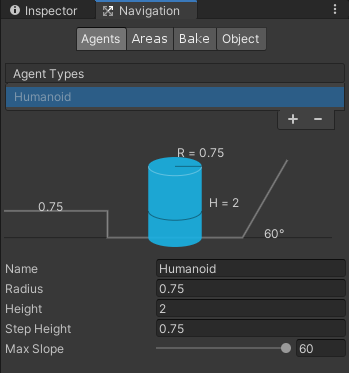

> 我们可以回顾一下第二篇讲的Nav Mesh Agent组件，其中有一个Agent Type参数，它和Agents选项卡这里的是同一种意思。只不过这边提供创建类型，修改类型，那边可以选择类型。
> 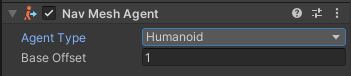

### 1.相关参数
|参数|描述|
|:--:|:--:|
|Name|当前类型名字
|Radius|当前AI半径
|Height|当前AI高度
|Step Height|当前AI可跨越的最高台阶
|Max Slope|当前AI可攀爬的最高坡度

**这些的作用在于，当你不同的寻路AI选择了不同的类型时，AI就可以根据本身类型来选择不同的道路，比如说前面有个很窄的巷子，<u>半径很小的AI就可以通过，半径很大的只能绕路</u>，注意！这里的半径不是指NavMeshAgent组件里面的半径（该半径只负责不同AI之间的间距，也就是碰撞），而是特指上图中的半径。**

再次声明，上述作用仅在新版生效。

---
## 二、Areas | 区域与花费的代价

### 1.作用概述
**区域与代价花费这一块，主要是定义了寻路AI穿越某些区域的难度，比如平原上有一条河，过河还是绕路，AI将根据两者的成本进行衡量，最终选择较低的那一条路。而这个成本的定义是由开发者决定的。**

**在NavMesh Agent还有一个Area Mask参数，忘记的可以回看一下上一篇博客，该参数作用则在于当前AI在寻路时,可以走哪条路以及禁止走哪条路（可多选，多选的情况下AI就会多方对比，选出代价最少的路），还是平原上有一条河，如果开发者定义了该AI禁止涉水，那么无论代价有多大，AI都会选择绕路。**

### 2.区域的选择
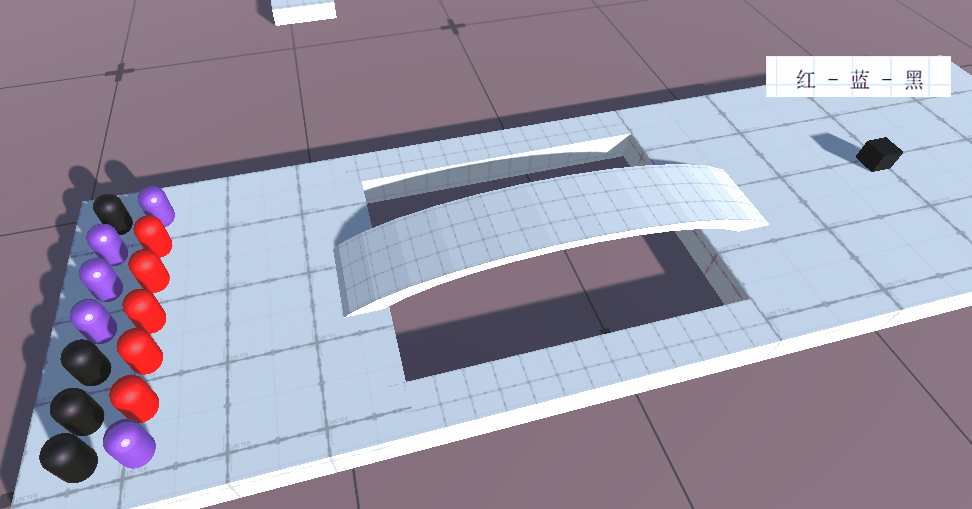

> 如图所示，当指定某些AI只能走某些路时，就会呈现这种情况，各走各路。下面说一下具体设置方式。

> **首先**我们需要知道具体的区域设置界面
> 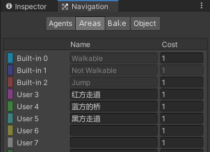
> 我们可以看到有三个区域是灰色的，代表这是内置的，不能修改，所有被烘焙的场景默认为Walkable（可行走的），后面有个数字Cost，这代表该区域行走的代价，如果AI有两个选择，那么它将会衡量两者，1是默认数字，2则代表着走这条路的代价是2倍距离，3则是3倍。

> **其次**我们可以在Object选项卡的Navigation Area下拉框这里选择对象的区域类型，选中你想要修改区域类型的对象（比如是一座桥），然后点击下拉框，选择其中一个区域类型，这样这座桥的区域类型就被修改了，修改完成之后，**一定要记得重新烘焙一下！**
> 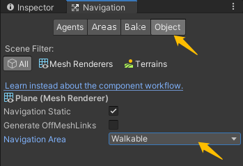

> **最后**我们在NavMesh Agent组件的Area Mask参数这里选择当前AI只能走哪条路，比如给红方限定走Walkable、红方的路，这样红方就只能通过最左边的桥来抵达目标了。
> 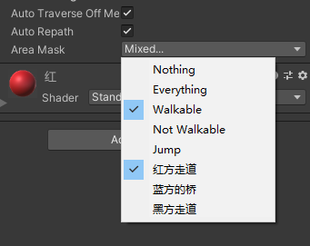

> #### 内置类型说明
> Walkable 是一种可行走的通用区域类型。
> Not Walkable 是一种禁止导航的通用区域类型。如果希望将某个对象标记为障碍物，但不将导航网格置于其上，则可使用该类型。
> Jump 是分配给所有自动生成的网格外链接的区域类型。

### 3.花费的代价
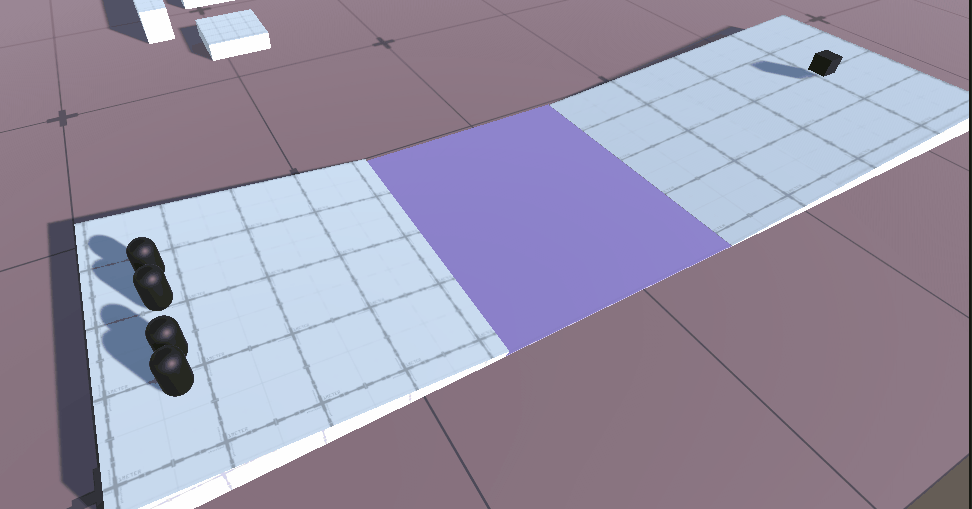

> 如图所示，黑色AI可以行走任何道路，但蓝色河流的代价是3（3代表河流这段距离对于AI来说是3倍的代价，肯定要比绕路长的多），所以黑色AI选择了绕路行驶。
---
## 三、Bake | 导航网格的烘焙参数详解

### 1.提要
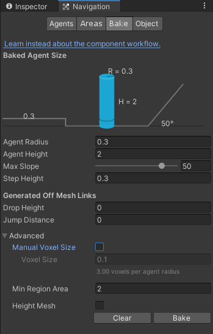

> 这里的参数主要是控制导航网格的烘焙（废话），比如Max Slope，它用于控制当某个斜坡的坡度高于50度时，它将不被生成导航网格。甭管AI上不上的去，这里直接从根本条件否决了导航网格的生成。
> **所以，Bake是只根据这些参数来计算出一条可行的路径，也就是导航网格，至于AI如何选择，和这里没关系，这里只负责，根据这些条件，来生成可行路径（导航网格）**

> 不理解的打开引擎，一个个参数修改着试试看，就理解了。

### 2.参数说明
|参数|描述|
|:--:|:--:|
|Agent Radius|假定AI的半径，具体自己试试看，不知道该怎么解释QAQ
|Agent Height|假定AI的高度，比如AI高2米，其中有个桥洞，1.9米，那么桥洞位置将不被生成导航网格
|Max Slope|假定AI最大爬坡坡度，高于该坡度的斜坡不生成导航网格
|Step Height|假定AI最高可跨越的台阶高度，高于该台阶将不生成导航网格连接面
|Manual Voxel Size|是否手动输入值来控制烘焙精细度
|Voxel Size|精细度，牵扯内容过多，咱也不会，不多讲，具体请参阅：https://docs.unity3d.com/cn/2020.2/Manual/nav-AdvancedSettings.html
|Min Region Area|剔除未连接的小型导航网格区域。表面积小于该值的导航网格区域将被移除。
|Height Mesh|下面单独讲

#### Height Mesh参数
由于导航网格是可行走空间的近似形状，因此在构建导航网格时会使某些特征**扁平化**（例如，楼梯可能在导航网格中显示为斜坡）。
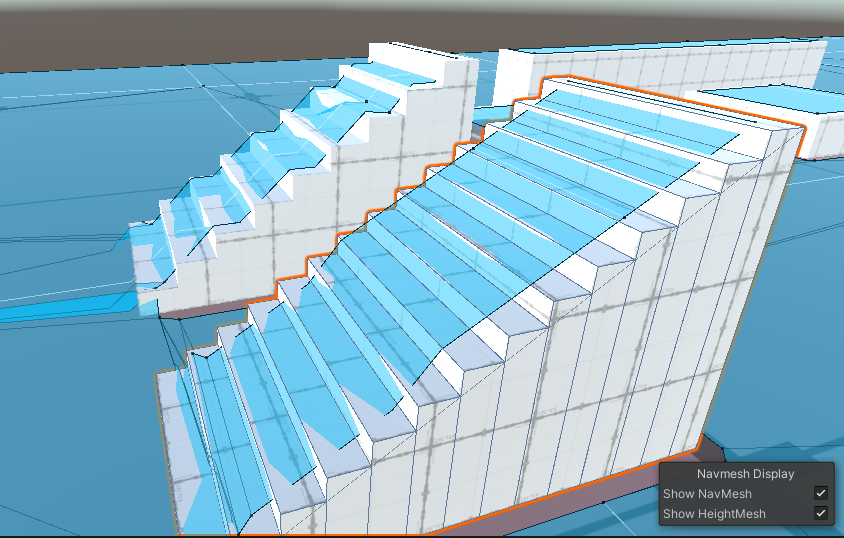

如果游戏需要更加准确，则应在烘焙导航网格时启用Height Mesh构建。请注意，构建高度网格将在运行时占用内存和处理资源，并需要稍微更长一点的时间来烘焙导航网格。（注意勾选 Show HeightMesh）
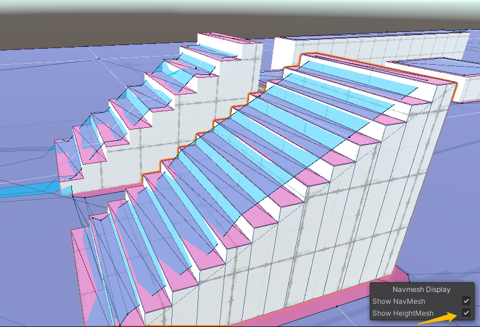

---
## 四、Object | 设置导航网格的外链接、区域
这里的内容不多，主要分成两段，一个是自动设置外链接，还有一个区域设置。
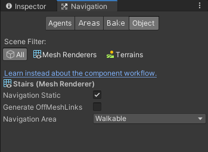

### 1.自动设置外链接 | Generate OffMeshLinks
> 该参数用于自动设置导航网格的外链接，只有勾选了此选项才会自动设置，且与Bake选项卡中的两个参数相关。
> 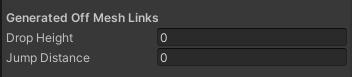
> Drop Height：自动生成的最大高度限制（0则禁用生成）
> Jump Distance：自动生成外链接的最远距离限制（0则禁用生成）
> 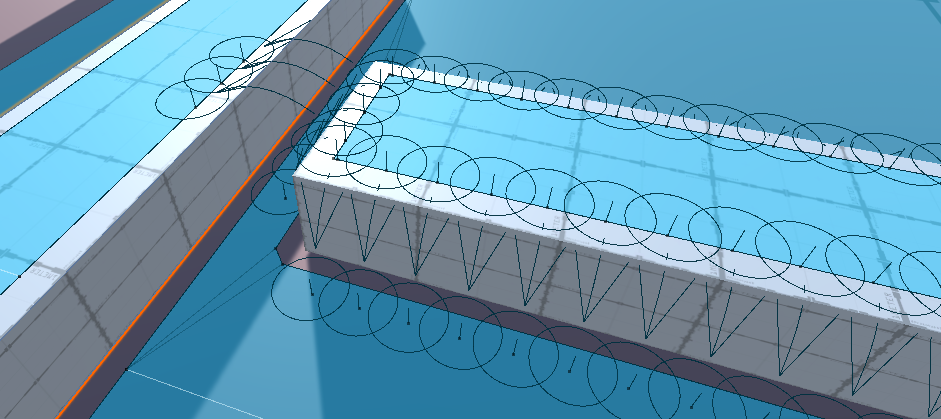

**这个和Off Mesh Link网格外链接组件差不多，只不过这个是自动生成，更加方便，但也更加难以控制，各位读者按需使用即可**

### 2.区域设置
有关Navigation Area参数，请参阅本篇第二章【Areas | 区域与花费的代价】第二小节内容。

---
## 五、总结和参考资料

### 1.总结
* Agents管理控制寻路AI的类型数据，当前版本无效
* Areas用于管理AI寻路的区域与代价
  * 可通过NavMesh Agent的Area Mask参数，来控制当前AI寻路区域
  * 可通过Object的Navigation Area参数，来控制当前区域的区域类型
  * 通过Cost参数来控制区域代价，3则代表3倍距离
* Bake控制导航网格的烘焙，通过预先设置的条件来控制
  * 烘焙的对象必须是Navigation Static，否则AI将无视该对象
  * 一旦做出任意修改，就必须重新烘焙一遍
  * 只对静态生效，若想要实现动态烘焙请使用NavMesh Obstacle组件
* Object控制当前选择对象
  * 是否是静态Navigation
  * 是否可自动生成外链接
  * 区域类型
### 2.参考资料
[1].Unity官方.[导航系统的内部工作原理](https://docs.unity3d.com/cn/2020.2/Manual/nav-InnerWorkings.html)
[2].Unity官方.[高级导航网格烘焙设置](https://docs.unity3d.com/cn/2020.2/Manual/nav-AdvancedSettings.html)
[3].Unity官方.[导航区域和成本](https://docs.unity3d.com/cn/2020.2/Manual/nav-AreasAndCosts.html)
[4].Unity官方.[自动构建网格外链接](https://docs.unity3d.com/cn/2020.2/Manual/nav-BuildingOffMeshLinksAutomatically.html)
[5].Joe_Game.[Unity之网格导航](https://www.jianshu.com/p/70da4f9461ae/)
[6].无法停止奔跑的马.[Unity导航网格自动寻路系列——哔哩哔哩](https://www.bilibili.com/video/BV1Wi4y1475Y?spm_id_from=333.880.my_history.page.click)
