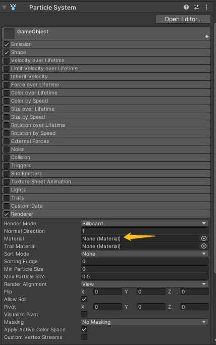

## 前言
游戏中很多炫酷效果的背后都离不开粒子系统，比如击中、爆炸、火焰、崩塌、喷射、烟雾等等。Unity也我们提供了强大的粒子系统，模块化的设计，上百个参数供我们调节使用，足以创造出非常震撼的效果了，本篇我们就来讲讲Unit的粒子系统Particle System。本篇为第一篇，主要讲解Unity的粒子系统方案选择、粒子系统的结构、概述、模块介绍等内容。

//@[TOC](目录)

### 本系列提要
> Unity粒子系统专题博客共分成十二篇来讲解： 【本篇为第一篇】
> - 第一篇（[点击直达*暂空](空地址)）：粒子系统概述
> - 第二篇（[点击直达*暂空](空地址)）：主模块
> - 第三篇（[点击直达*暂空](空地址)）：Emission、Shape模块
> - 第四篇（[点击直达*暂空](空地址)）：Renderer、Custom Data模块
> - 第五篇（[点击直达*暂空](空地址)）：Noise模块
> - 第六篇（[点击直达*暂空](空地址)）：生命周期相关模块
> - 第七篇（[点击直达*暂空](空地址)）：Collision、Triggers模块
> - 第八篇（[点击直达*暂空](空地址)）：Inherit Velocity、Sub Emitters模块
> - 第九篇（[点击直达*暂空](空地址)）：Texture Sheet Animation模块
> - 第十篇（[点击直达*暂空](空地址)）：Light、Trails模块
> - 第十一篇（[点击直达*暂空](空地址)）：粒子系统力场（Force Field）组件和External Forces模块
> - 第十二篇（[点击直达*暂空](空地址)）：案例与应用

预计国庆节前更新完毕。更新完毕后上面的指路链接才会统一修改。

> 前排提醒：本文仅代表个人观点，以供交流学习，若有不同意见请评论留言，笔者一定好好学习，天天向上。

**Unity版本[2019.4.10f1] 梦小天幼 & 禁止转载**
> 视频讲解：
**[视频：暂无视频](空地址)**

---
## 一、两种粒子系统方案选择
Unity在创作粒子系统时提供了两种解决方案，一种是**内置粒子系统（Particle System）**，一般粒子系统就是指内置粒子系统，还有一种是**Visual Effect Graph粒子系统**，你可以将其理解为更加高级的粒子系统，可创作出更加绚丽的视觉特效。下图中简述了两种粒子系统优劣之处。

>本系列博客我们主要学习内置的粒子系统，有关VFX的内容后续有时间也会写的，本篇以后说到粒子系统就是特指内置粒子系统。

对于小型效果诸如击中特效，火焰特效等使用内置粒子系统即可，对于更加绚丽，需要粒子数量更多的，诸如雨雪天气，大爆炸之类的可酌情使用VFX，一句话，根据需求来决定。

---
## 二、粒子系统结构概述
粒子系统是作为**组件**存在的，如果我们想要创建一个粒子特效，请按照以下步骤：
> 1.创建一个空物体
> 2.在空物体的Inspector窗口点击Add Component
> 3.搜索Particle System并添加

粒子系统组件拥有非常多的属性可供开发者调节，为了方便起见，Unity将它们分类，一类即代表一个模块，我们可以对每个模块单独的禁用或启用。

> Unity默认启用了Emission、Shape、Renderer模块，因为这些模块是发射粒子的基础模块，就像每个物体对象必须拥有一个Transform组件一样，不勾选这些模块粒子系统就无法发射了。
> 

图中标注的主模块是粒子系统中最基础的属性。

**如果要展开或者折叠模块，请单击模块名称，若要启用/禁用某个模块，请勾选/取消勾选某个模块前的复选框。**

*每个模块的属性的讲解是我们本系列的重点，本篇为先导篇，并不涉及模块的讲解。*

---

## 三、粒子系统模块概述

---

## 四、Scene视图中的Particle Effect面板
当你成功创建一个粒子时，你会发现你的Scene视图变成了这样的。

左侧是我们刚刚创建的粒子，右侧是预览粒子的一些控制项（**修改这些数值只会影响Scene窗口下的粒子显示效果，并不会影响实际粒子运行效果**）

Particle Effect参数
> **Pause** 暂停播放 | **Restart** 重新播放 | **Stop** 停止播放
> 
> **Playback Speed** 播放速度
> 
> **Playback Time** 粒子开始播放的累计时间，Restart重新播放可重置该值
> 
> **Particles** 当前存在的粒子数量
> 
> **Speed Range** 暂无解释*****************************
> 
> **Simulate Layers** 一般情况下，Scene场景中只会播放你选中的粒子特效，如果你想要让场景中所有的粒子特效或者个别粒子特效播放，就需要选择相应的层级，或者是Everything（全都播放）
> 
> **Resimulate** 若启用，粒子系统会立即将属性更改立刻应用于已生成的粒子；若禁用，仅将属性更改应用于新生成的粒子。（仅在Scene窗口预览模式下生效）
> 
> **Show Bounds** 显示包围体积
> 
> **Show Only Selected** 隐藏所有未选中的粒子特效 （该属性实测不生效，不知道为啥）

## 五、如果粒子是紫色的该怎么调整？| 粒子材质丢失
> 由于Unity版本问题，有的版本创建粒子时，并不会将默认粒子材质赋予粒子，这就导致粒子看起来是紫色的，解决办法也很简单，控制粒子材质的模块是Renderer，我们会在第三篇讲述，如果材质丢失了这里可以先提前设置一下。

---

## 六、总结和参考资料
### 1.总结
无总结

### 2.参考资料
[1].Unity官方.[官方手册-粒子系统模块-Main module](https://docs.unity3d.com/cn/current/Manual/PartSysMainModule.html)
[2].菜鸟MAY.[2018.1粒子系统概述](https://www.docin.com/p-2294560193.html)
