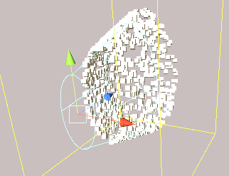

## 前言
上一篇我们简要讲述了粒子系统是什么，如何添加，以及基本模块的介绍，以及对于曲线和颜色编辑器的讲解。从本篇开始，我们将按照模块结构讲解下去，本篇主要讲粒子系统的主模块，该模块主要是控制粒子的初始状态和全局属性的，以下是关于该模块的介绍，请大家指正。

//@[TOC](目录)

### 本系列提要
> Unity粒子系统专题博客共分成十二篇来讲解： 【本篇为第一篇】
> - 第一篇（[点击直达*暂空](空地址)）：粒子系统概述
> - 第二篇（[点击直达*暂空](空地址)）：主模块
> - 第三篇（[点击直达*暂空](空地址)）：Emission、Shape模块
> - 第四篇（[点击直达*暂空](空地址)）：Renderer、Custom Data模块
> - 第五篇（[点击直达*暂空](空地址)）：Noise模块
> - 第六篇（[点击直达*暂空](空地址)）：生命周期相关模块
> - 第七篇（[点击直达*暂空](空地址)）：Collision、Triggers模块
> - 第八篇（[点击直达*暂空](空地址)）：Inherit Velocity、Sub Emitters模块
> - 第九篇（[点击直达*暂空](空地址)）：Texture Sheet Animation模块
> - 第十篇（[点击直达*暂空](空地址)）：Light、Trails模块
> - 第十一篇（[点击直达*暂空](空地址)）：粒子系统力场（Force Field）组件和External Forces模块
> - 第十二篇（[点击直达*暂空](空地址)）：案例与应用

预计国庆节前更新完毕。更新完毕后上面的指路链接才会统一修改。

> 前排提醒：本文仅代表个人观点，以供交流学习，若有不同意见请评论留言，笔者一定好好学习，天天向上。

**Unity版本[2019.4.10f1] 梦小天幼 & 禁止转载**
> 视频讲解：
**[视频：暂无视频](空地址)**

---
## 一、粒子系统主模块

### 1.阅读前注意事项
> **注1：由于参数过多且个别参数难以理解，所以本篇的所有参数都作为四级目录存在，方便读者定位查阅**

### 2.参考图

### 3.参数讲解

#### Duration
> 粒子系统运行的时间长度（秒）

#### Looping
> 若启用此属性，系统将重复播放粒子，也就是开启循环模式（无论是Scene窗口还是运行时）

#### Prewarm
> 若启用此属性，则粒子系统会在播放前进行预加载，比如漫天星河有3000颗粒子，但按照粒子发射速率，估计要好多秒，勾选此项，一旦播放就会达到预设置的Max Particles（下面有这个属性的介绍）

#### Start Delay
> 粒子系统发射前将延迟播放一段时间（秒）

#### Start Lifetime
> 每个粒子的初始生命周期（秒），指粒子被创建出来到自动销毁的这段时间

#### Start Speed
> 每个粒子的初始速度

#### 3D Start Size
> 若要分别控制每个轴的大小，请启用该属性

#### Start Size
> 每个粒子的初始大小，按照给定值等比缩放，若要单独控制三个轴请启用3D Start Size

#### 3D Start Rotation
> 若要分别控制每个轴的旋转角度，请启用该属性

#### Start Rotation
> 每个粒子的初始旋转角度，按照给定值等比缩放，若要单独控制三个轴请启用3D Start Rotation

#### Flip Rotation
> 使**一些粒子**以相反的方向旋转，数值在0-1之间，数值越大，翻转越多

*这里不要懵，这个属性和上一个Start Rotation是一对，如果上一个属性有值，比如45，那么下面这个属性就是让一些粒子反转度数为-45，如果这里的值是0.1，那就是让10%的粒子反转，如果值为1，则是全部反转*

#### Start Color
> 每个粒子的初始颜色

#### Gravity Modifier
> 缩放物理系统的重力值，值为零会关闭重力，想要让粒子受到物理系统的重力影响，将值设为1即可

#### Simulation Space
> 当前粒子系统的参照坐标，一共三个选项，世界、局部、自定义

*自定义坐标可选择一个物体，将参照这个物体的坐标作为参照*

#### Simulation Speed
> 调整粒子系统的更新速度

*把粒子特效比作一个视频，值为0.3就是按照0.3倍速播放，值为1则是原速播放*

#### Delta Time
> 在 Scaled 和 Unscaled 之间进行选择，其中的 Scaled 使用 Time Scale 值，而 Unscaled 将忽略该值。

#### Scaling Mode
> 选择如何使用transform中的缩放
> 1.Hierarchy 粒子跟随父级进行缩放
> 2.Local 忽略父级缩放
> 3.Shape 整体缩放是按照当前粒子的发射Shape来缩放的，且不影响粒子本身缩放，选Local则会影响粒子本身缩放
> 
> 
> 这里缩放了整体，但粒子本身并没有变扁

#### Play On Awake
> 若启用该属性，则粒子被创建时就开始播放

#### Emitter Velocity
> 发射器速率，使用哪种组件方法来计算速度（.translate  .velocity）
> Rigidbody
> Transform

#### Max Particles
> 系统同时允许的最多粒子数,如果到达该值，则移除生命周期最长的粒子（活得最久的）

#### Auto Random Seed
> 若启用该属性，则每次初始化发射粒子，粒子各自位置不一样。也就是随机。

#### Random Seed
> 若禁用Auto Random Seed，则该值生效，该值用于创建唯一的可重复的粒子效果。

*比如拿到我的世界随机种子，就可以生成一个一模一样的世界，该值如果不变，则粒子初始位置永远一致*

#### Stop Action
> 当所有粒子的生命周期都结束时，系统自动执行下列某个操作
> 1.Disable 禁用当前对象
> 2.Destroy 销毁当前对象
> 3.CallBack 将 OnParticleSystemStopped 回调函数发送给附加到游戏对象的任何脚本
> 注：若Looping处于激活状态，则该属性不生效（因为你都循环了，我就没法结束了）

#### Culling Mode
> 当粒子特效不在摄像机范围内时是否暂停粒子系统模拟
> 1.Automatic 自动模式（如果是单次播放则不暂停，如果是循环（Looping）播放则暂停模拟）
> 2.Pause And Catch-up 暂停但是没有完全暂停（暂停模拟，但当再次注视时则演算出它应该在的位置）
> 3.Pause 暂停模拟
> 4.Always Simulate 总是模拟

#### Ring Buffer Mode
> 粒子不会在它们的生命周期结束时死亡，而是会一直存活到最大粒子缓冲区（Max Particles）满，届时新的粒子将取代旧的粒子。
> 1.Disabled 禁用该模式
> 2.Pause Until Replaced 暂停直到替换
> 3.Loop Until Replaced 循环直到替换（Particle lifetimes may loop between a fade-in and fade-out time, in order to use curves for the entire time they are alive.  Values are in the 0-1 range / 粒子的生命周期可能在渐入渐出时间之间循环，以便在它们活着的整个时间内使用曲线。取值范围是0 ~ 1 / 这里不理解，贴出原文，你们自己理解吧）

---

## 二、总结和参考资料
### 1.总结
无总结

### 2.参考资料
[1].Unity官方.[官方手册-粒子系统模块-Main module](https://docs.unity3d.com/cn/current/Manual/PartSysMainModule.html)
[2].菜鸟MAY.[2018.1粒子系统概述](https://www.docin.com/p-2294560193.html)
