## 前言
上一篇我们详细讲解了有关主模块的全部内容，已经对粒子系统的基本运作有了足够的了解，本篇就来讲一下被粒子系统默认启用的Emission、Shape、Renderer模块又在粒子系统中扮演着怎么样的作用吧。

@[TOC](目录)

### 本系列提要
> Unity粒子系统专题博客共分成十二篇来讲解： 【本篇为第一篇】
> - 第一篇（[点击直达*暂空](空地址)）：粒子系统概述
> - 第二篇（[点击直达*暂空](空地址)）：主模块
> - 第三篇（[点击直达*暂空](空地址)）：Emission、Shape模块
> - 第四篇（[点击直达*暂空](空地址)）：Renderer、Custom Data模块
> - 第五篇（[点击直达*暂空](空地址)）：Noise模块
> - 第六篇（[点击直达*暂空](空地址)）：生命周期相关模块
> - 第七篇（[点击直达*暂空](空地址)）：Collision、Triggers模块
> - 第八篇（[点击直达*暂空](空地址)）：Inherit Velocity、Sub Emitters模块
> - 第九篇（[点击直达*暂空](空地址)）：Texture Sheet Animation模块
> - 第十篇（[点击直达*暂空](空地址)）：Light、Trails模块
> - 第十一篇（[点击直达*暂空](空地址)）：粒子系统力场（Force Field）组件和External Forces模块
> - 第十二篇（[点击直达*暂空](空地址)）：案例与应用

预计国庆节前更新完毕。更新完毕后上面的指路链接才会统一修改。：

> 前排提醒：本文仅代表个人观点，以供交流学习，若有不同意见请评论留言，笔者一定好好学习，天天向上。

**Unity版本[2019.4.10f1] 梦小天幼 & 禁止转载**
> 视频讲解：
**[视频：暂无视频](空地址)**

---
## 一、Emission模块
> 该模块主要用于控制粒子每秒的发射数量、波次、间隔等。
> 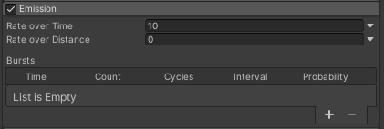

### 1.Rate over Time & Rate over Distance
Rate over Time：每个时间单位发射的粒子数量（秒）
Rate over Distance：每个移动距离单位发射的粒子数量（米）

> 第一个很容易理解，每秒钟发射多少粒子；第二个参数是每个移动距离单位发射的粒子数量，举个例子：假如该值设为3，把粒子比作汽车，汽车向前移动10米，那么就向外发射30个粒子，也就是每移动一米，就发射3颗粒子。

> **这两个值不相互冲突，假如10秒内汽车（粒子系统）移动了20米，那么就要发射（10×参数1） + （20×参数2）个粒子数，也就是各自计算各自所发射的粒子数**

### 2.Bursts
> 该参数主要用于粒子爆发的参数设置、比如爆炸、或间歇性的粒子喷射之类的效果
> **注：该参数和上述两个参数依旧相互不冲突，各管各的**

下面是演示效果以及参数设置

- 该粒子每波发射30个，波次间隔1秒，无限发射

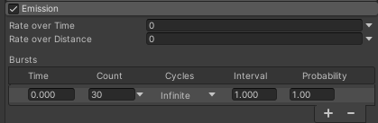
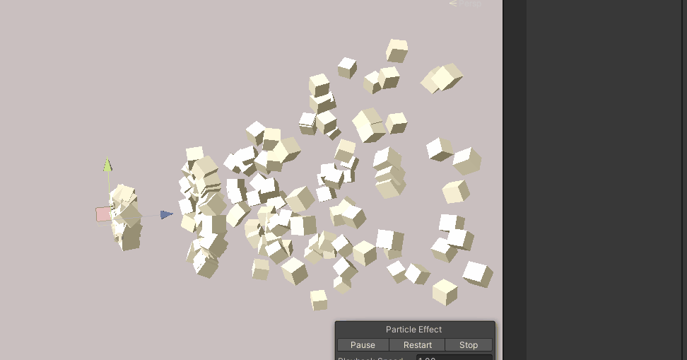

|参数|描述|
|:--:|:--:|
|Time|设置发射爆发粒子的时间
|Count|设置发射的粒子数
|Cycles|设置发射波次，可自定义波次，也可选择无限波次
|Interval|设置每个爆发周期的间隔时间
|Probability|设置每个爆发周期生成粒子的可能性

解释Probability: 如果Count设置为30.该值设置1,那么每波必定发射30个粒子，如果设置为0，那么不会产生一个粒子。具体也不是相乘的关系，而是一个随机的设置，只能说越接近1也就越接近Count设置的值。

---

## 二、Shape模块

### 模块概述
> 该模块用于定义粒子的发射体积的形状，以及发射的方向。
> 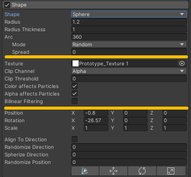
> 该模块我们分成3个部分来说明，上图我用线段做了区分，分成了3个参数部分。
> 第一部分是定义**发射体积相关的**；第二部分是**图形遮罩相关的**；第三部分是**位置旋转缩放与方向相关的**；

> **注意**：粒子系统内置了许多不一样的体积，比如圆球、半圆、圆环、锥体等，这些体积的设置方式也不相同，但主要是第一部分的参数不一样，第二部分和第三部分都是相同的，所以第一部分分开讲述。

### 第一部分
第一个Shape参数，可以选择Unity内置的多种体积
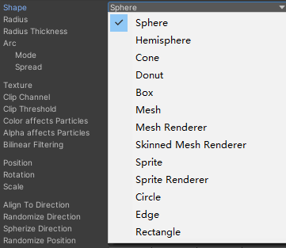

> 1.**主要**有Sphere(球体)、Hemisphere(半球)、Cone(锥体)、Donut(圆环体)、Box(正方体)这些预设体积发射器
> 2.**还有**Mesh\Mesh Renderer\Skinned Mesh Renderer、Sprite\Sprite Renderer这些依据网格或精灵图来作为发射器的预设选项
> 3.**以及**Circle(圆圈)、Edge(边)、Rectangle(矩形)这些2D发射器

#### 1.Sphere&Hemisphere
> 球体与半球参数一致，放一起讲解
> 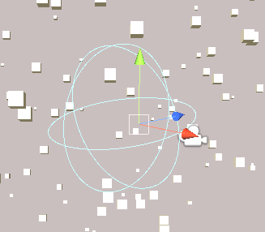
> 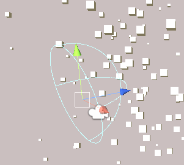

|参数|描述|
|:--:|:--:|
|Radius|球体或半球的半径
|Radius Thickness|球体或半球的内壁半径，1实心，0空心
|Arc|设置球体的弧度，默认360是一个球体，如果设置为180,就成了半球了（该属性如果不明白，一定要上手调节一下，瞬间就懂了）
|Arc - Mode|产生粒子的顺序模式，Random随机、Loop循环、Ping-Pong循环折返、Burst Spread模式（此模式若有不解，请看小标题5.Mesh的演示）
|Arc - Spread|只在弧线特定角度产生粒子，0则禁用

#### 2.Cone
> 锥体
> 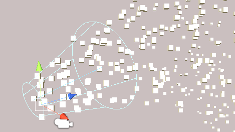

|参数|描述|
|:--:|:--:|
|Angle|锥体顶部开合角度，0-90范围
|Radius|球体或半球的半径
|Radius Thickness|内壁半径，1实心，0空心
|Arc|设置锥体的弧度
|Arc - Mode|产生粒子的顺序模式，Random随机、Loop循环、Ping-Pong循环折返、Burst Spread
|Arc - Spread|只在弧线特定角度产生粒子，0则禁用
|Emit from|从哪里开始发射粒子  Base从底部开始、Volume从体积开始
|Length|锥体长度，当Emit from设置为Volume时生效

#### 3.Donut
> 圆环体
> 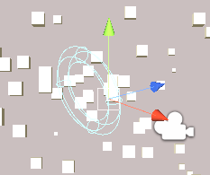

|参数|描述|
|:--:|:--:|
|Radius|球体或半球的半径
|Donut Radius|外圆环的粗细程度
|Radius Thickness|内壁半径，1实心，0空心
|Arc|设置弧度
|Arc - Mode|产生粒子的顺序模式，Random随机、Loop循环、Ping-Pong循环折返、Burst Spread
|Arc - Spread|只在弧线特定角度产生粒子，0则禁用

#### 4.Box
> 正方体
> 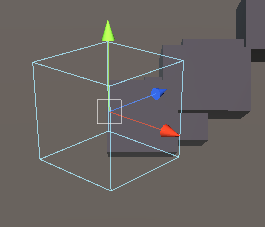

|参数|描述|
|:--:|:--:|
|Emit from|从哪里开始发射粒子  Volume 从体积发射、Shell 从外边缘发射、Edge从边缘发射
|Box Thickness|当设置为Shell或Edge时，控制体积厚度，从0到1

#### 5.Mesh
> 网格发射器
> 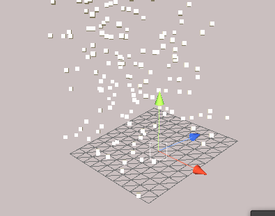

|参数|描述|
|:--:|:--:|
|Type|指定从何处发射粒子，Vertex顶点处、Edge边缘处、Triangle三角面
|Type - Mode|产生粒子的顺序模式（下有动态图演示）
|Mesh|网格来源
|Single Material|指定是否从特定子网格（由材质索引号标识）发射粒子
|Use Mesh Colors|使用网格顶点颜色调整粒子颜色，或者，如果顶点颜色不存在，则使用材质中的着色器颜色属性“Color“或”TintColor”
|Normal Offset|在距离网格表面多远处发射粒子（在表面法线的方向上）

> 关于Type - Mode顺序模式的动态演示，随机模式、循环模式、循环折返模式
>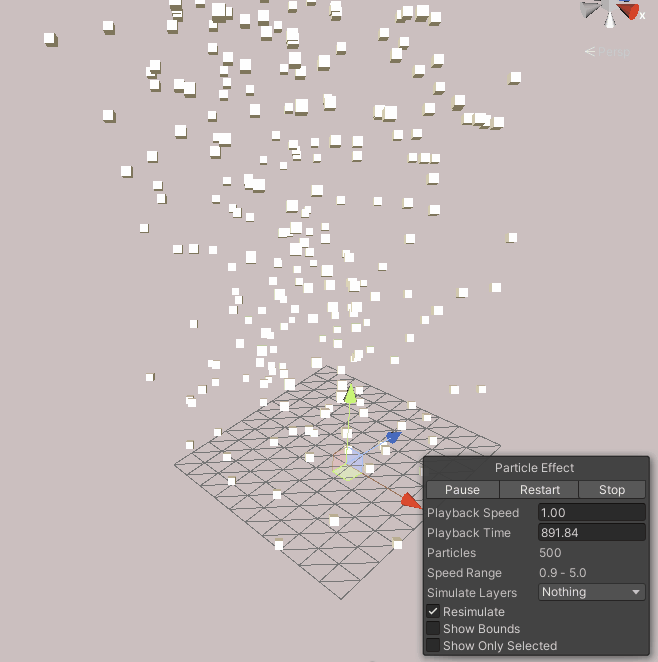
>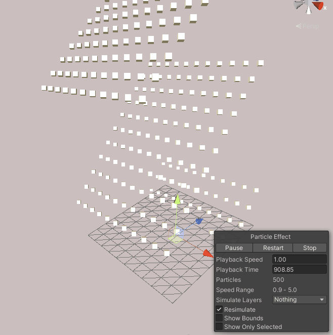
>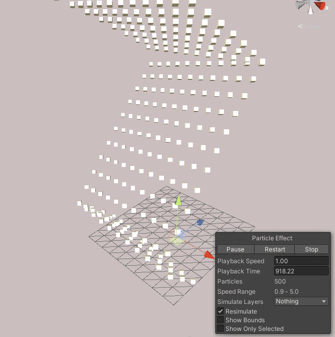

**往后的发射器就大同小异了，没必要单独讲解了，后面直接开始第二部分参数的讲解**

### 第二部分
> 这一部分的参数主要用于设置纹理对粒子的影响，比如通过纹理贴图的颜色信息来影响粒子的发射，粒子本身的颜色等等
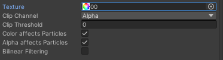

|参数|描述|
|:--:|:--:|
|Texture|在发射粒子形状表面贴上图片纹理，相当于套层壳，如果这里没有设置值，就不会出现下列的属性。
|Clip Channel|裁剪通道，有RGBA四个通道，可以选择用哪个通道来操作
|Clip Threshold|裁剪阈值，取值0-1，0代表全通过
|Color affects Particles|粒子受到纹理颜色影响而改变颜色
|Alpha affects Particles|粒子受到纹理透明度的影响而改变透明度
|Bilinear Filtering|双线过滤，对像素比较少的纹理进行优化

> **注意** ：如果不理解这一系列操作，请允许我类比一个小栗子就理解了。

我们假设粒子形状现在是一个锥桶，粒子要从桶底生成，这个纹理贴图就是一块五颜六色的湿抹布，紧紧的、刚刚好的、中肯的、合理的贴在了桶底上，严丝合缝，滴水不漏。

Color affects Particles属性用于，哪一滴水（粒子）通过了湿抹布的哪一个位置，这滴水就要被湿抹布上面的颜色所沾染，从而变色。

Alpha affects Particles属性同理，只不过变化的是透明度。

Clip Channel属性则是和Clip Threshold密切相关的，我们假设湿抹布只有三种颜色，红绿蓝，对应RGB，如果我们选择R，也就是红色，那么只有红色的水滴（预先设置为红色的粒子）才能通过湿抹布，而通过的概率，也就是阈值，就是由Clip Threshold来设置的。
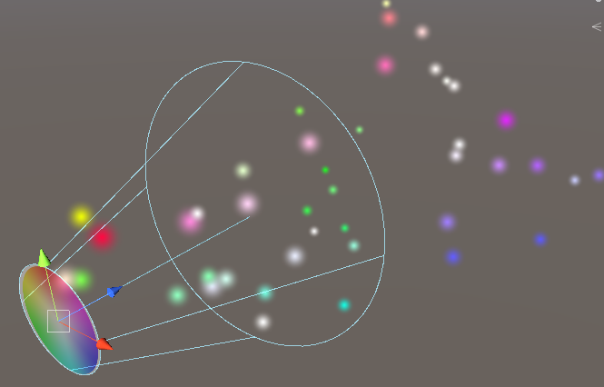
如果还不理解，那就去看我粒子系统相关的视频教程吧，会讲的更加详细。

### 第三部分
> 好啦，第三部分就比较简单了，用于设置粒子发射器的位置，可以说是和Transform拥有着同样的功能。
> 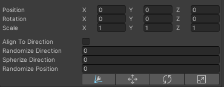

这里的pos\rot\scl是和transform完全相同的，唯一有区别的就在于，如果你的主模块的Scaling Mode属性设置为了Local，那么通过Transform组件来缩放粒子系统会导致粒子本身被缩放，如果用Shape模块内的Scale属性就完全不会出现这种情况。或者说把Scaling Mode属性设置为Shape也行。所以是通过transform组件还是通过Shape模块来调整当前粒子系统的位置大小旋转，就看自己的心情了，需注意，两个不要一起调节，会乱套。

|参数|描述|
|:--:|:--:|
|Align To Direction|根据初始行进方向定向粒子，也就是粒子固定朝着初始方向行进。无干扰情况下。
|Randomize Direction|将粒子方向随机朝向某处，设置为0，无效，为1，粒子方向完全随机
|Spherize Direction|将粒子方向朝球面方向混合，从它们的变换中心向外行进。设置为 0 时，此设置不起作用。设置为 1 时，粒子方向从中心向外（与 Shape 设置为 Sphere 时的行为相同）
|Randomize Position|距离原有发射点的位置进行随机化，0无效，1完全生效

> **最后**还有四个按钮，可视化操纵用的，和Scene窗口上面的工具栏按钮一模一样，但有意思的是，通过这四个按钮操作的数据，是修改的Shape模块中的pos,rot,scl属性。
> 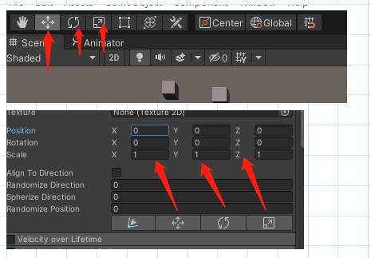

---

## 二、总结和参考资料
### 1.总结
无总结
### 2.参考资料
[1].Unity官方.[官方手册-粒子系统模块-Emission模块](https://docs.unity3d.com/cn/2022.2/Manual/PartSysEmissionModule.html)
[2].Unity官方.[官方手册-粒子系统模块-Shape模块](https://docs.unity3d.com/cn/2022.2/Manual/PartSysShapeModule.html)
[3].Calabash_Boy.[Unity的粒子系统(二)](http://events.jianshu.io/p/85e1fa4fcff7)