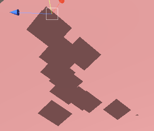

## 前言
上一篇我们主要讲解了Shape形状模块，以及Emission发射模块，这是粒子系统中最为重要的两个模块，学会了它们我们足以做出惊艳的效果，比如霰弹枪的发射，蘑菇蛋的冲击波等等。本篇讲的内容依旧重要，它可以让做出的效果更加绚丽，也就是与材质光照渲染相关的Renderer模块、再附加一个Custom Data自定义数据模块。

@[TOC](目录)

### 本系列提要
> Unity粒子系统专题博客共分成十二篇来讲解： 【本篇为第四篇】
> - 第一篇（[点击直达*暂空](空地址)）：粒子系统概述
> - 第二篇（[点击直达*暂空](空地址)）：主模块
> - 第三篇（[点击直达*暂空](空地址)）：Emission、Shape模块
> - 第四篇（[点击直达*暂空](空地址)）：Renderer、Custom Data模块
> - 第五篇（[点击直达*暂空](空地址)）：Noise模块
> - 第六篇（[点击直达*暂空](空地址)）：生命周期相关模块
> - 第七篇（[点击直达*暂空](空地址)）：Collision、Triggers模块
> - 第八篇（[点击直达*暂空](空地址)）：Inherit Velocity、Sub Emitters模块
> - 第九篇（[点击直达*暂空](空地址)）：Texture Sheet Animation模块
> - 第十篇（[点击直达*暂空](空地址)）：Light、Trails模块
> - 第十一篇（[点击直达*暂空](空地址)）：粒子系统力场（Force Field）组件和External Forces模块
> - 第十二篇（[点击直达*暂空](空地址)）：案例与应用

预计国庆节前更新完毕。更新完毕后上面的指路链接才会统一修改。

> 前排提醒：本文仅代表个人观点，以供交流学习，若有不同意见请评论留言，笔者一定好好学习，天天向上。

**Unity版本[2019.4.10f1] 梦小天幼 & 禁止转载**
> 视频讲解：
**[视频：暂无视频](空地址)**

---
## 一、Renderer模块
> 该模块决定了粒子的图像或网格如何被其他粒子变换、着色和过度绘制。（说人话：如何变得更好看），Unity会默认启用该模块。
> 

### 1.渲染模式讲解
该模块的第一个属性Render Mode，共有六个选项分别是：（Unity通过该选项来控制粒子如何被图像或网格渲染）
- Billboard 公告牌
- Strectched Billboard 拉伸公告牌
- Horizontal Billboard 水平公告牌
- Vertical Billboard 垂直公告牌
- Mesh 网格
- None 虚无

前四个的粒子都是2D形式，也就是图片，而选择第五个Mesh，则会让你通过选择网格来确定粒子的3D形式。None选项无视即可。如下图（第一张为2D粒子，第二张为3D粒子形式）

下面我们来详细说明一下，前四种的区别：
**Billboard**：粒子朝向渲染对齐方向（默认朝向摄像机），也就是无论如何移动，粒子都是面向玩家摄像机的。

**Stretched Billboard**：保证朝向的情况下（粒子依旧面对相机），对粒子进行特殊拉伸，但可以调节更多的参数。该选项更多用于营造速度感。比如下雨之类的。

通过摄像机移动拉伸粒子
通过粒子速度来决定粒子拉伸程度
通过速度方向比例拉伸粒子，一般调节这个和上一个参数（这里解释随便看看，没啥意义，自己动手调就明白啥意思了）

**Horizontal Billboard**：水平设置粒子。如魔法阵，水平于地面

**Vertical Billboard**：垂直设置粒子。如。。。。不知道举啥例子。。

### 2.属性讲解
|参数|描述|
|:--:|:--:|
|Normal Direction|法线方向，指定如何计算图片的照明，值1按照扁平四边形计算照明，值0按照球形进行照片。
|Material|选择图片或Mesh的材质
|Trail Material|拖尾材质，比如流星的尾焰,启用Trail模块该属性生效

<table>
<tr>
  <td><b>Sort Mode</b></td>
  <td>排序模式，Unity使用粒子系统绘制和叠加粒子的顺序</td>
</tr>
<tr>
  <td>By Distance</td>
  <td>按照粒子距活动摄像机的距离</td>
</tr>
<tr>
  <td>Oldest in Front</td>
  <td>生命周期最长的先被渲染</td>
</tr>
<tr>
  <td>Youngest in Front</td>
  <td>生命周期最短的先被渲染</td>
</tr>
</table>

|参数|描述|
|:--:|:--:|
|Sorting Fudge|粒子系统与粒子系统之间的渲染次序。值越小，优先级越高。
|Min Particle Size|单个粒子的最小粒度，占据视口多少，Mesh渲染模式不可用
|Max Particle Size|单个粒子的最大粒度，占据视口多少，Mesh渲染模式不可用
|*** | 
|**Render Alignment**|渲染对齐方向
|Render Alignment - View|面向摄像机
|Render Alignment - World|与世界轴对齐
|Render Alignment - Local|与挂载游戏对象的transform组件对齐
|Render Alignment - Facing|面向由活动摄像机的游戏对象的tansform组件定义的直接位置
|Render Alignment - Velocity|与其速度矢量方向相同
|***|
|Flip|使一些粒子水平/垂直翻转，值越大，翻转次数越多
|Allow Roll|控制面向摄像机的粒子是否可以围绕摄像机的Z轴旋转
|Pivot|修改旋转粒子的中心轴心点，此值是粒子大小的乘数
|Visualize Pivot|在“Scene窗口”中预览每个粒子枢轴点
|***|
|**Masking**|设置粒子与Sprite遮罩交互时的行为方式
|Masking - No Masking|默认选项，粒子系统不与场景中任何Sprite遮罩交互
|Masking - Visible Inside Masking|粒子在Sprite遮罩内部可见
|Masking - Visible Outside Masking|粒子在Sprite遮罩外部可见
|***|
|Apply Active Color Space|应用活动色彩空间，在线性色彩空间中渲染时，系统会在将粒子颜色上传到 GPU 之前，先从伽马空间转换粒子颜色。
|Custom Vertex Streams|自定义顶点流，涉及到东西太多，详情参阅：https://docs.unity3d.com/2022.2/Documentation/Manual/PartSysVertexStreams.html
|***|
|**Cast Shadows**|是否启用阴影
|Off|禁用此粒子系统的阴影
|On|启用
|Two Sided|双面投射阴影，允许从粒子任意一侧投射阴影
|Shadows Only|仅阴影可见，粒子不可见
|***|
|Receive Shadows|规定阴影是否可以投射到粒子上，只有不透明材质才可以接受阴影
|Shadow Bias|阴影偏移
|***|
|**Motion Vectors**|设定是否使用运动矢量跟踪此粒子系统的变换组件从一帧到下一帧的每像素屏幕空间运动
|Camera Motion Only|仅使用相机移动来跟踪运动
|Per Object Motion|使用特定过程跟踪此渲染器的运动
|Force No Motion|不跟踪
|***|
|Sorting Layer ID|此渲染器排序图层的名称
|Order In Layer|此渲染器在排序图层中的顺序
|Light Probes|光照探针，基于探头的照明插值模式，光照探针属于光照系统，详情参阅：https://docs.unity3d.com/2022.2/Documentation/Manual/LightProbes.html
|Reflection Probes|反射探针，详情参阅：https://docs.unity3d.com/2022.2/Documentation/Manual/ReflectionProbes.html

该模块涉及到的知识点太多了，读者挑几个能看懂的记住即可。记得实践结合，由于篇幅限制，很多属性没有放上例图来讲解。若有疑问可在评论区提出，一起交流学习。

---

## 二、Custom Data模块
> Custom Data 模块允许您在 Editor 中定义要附加到粒子的自定义数据格式。
> 

自定义数据可以有两种形式，Vector和Color

该模块和Renderer模块的Custom Vertex Streams作用差不多

有关如何发送自定义数据到着色器，请参阅：https://docs.unity3d.com/cn/2022.2/Manual/PartSysVertexStreams.html

---

## 三、总结和参考资料
### 1.总结
无总结
### 2.参考资料
[1].Unity官方.[官方手册-粒子系统模块-Renderer模块](https://docs.unity3d.com/cn/2022.2/Manual/PartSysRendererModule.html)
[2].Unity官方.[官方手册-粒子系统模块-Custom Data模块](https://docs.unity3d.com/cn/2022.2/Manual/PartSysCustomDataModule.html)
[3].bYsdTd.[Billboards 技术在Unity 中的几种使用方法](https://www.jianshu.com/p/2cc3be1e968d)
[4].BeaverJoe.[粒子系统实际案例中的碰撞与交互(Bilibili)](https://www.bilibili.com/video/BV1fy4y1i7ZH/?spm_id_from=333.999.0.0&vd_source=33522e0d245b96223d45e6d0419c7ff7)
[5].iwiniwin.[Unity遮罩之Mask、RectMask2D与Sprite Mask适用场景分析](https://www.cnblogs.com/iwiniwin/p/15191362.html)