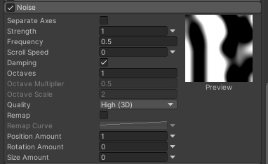
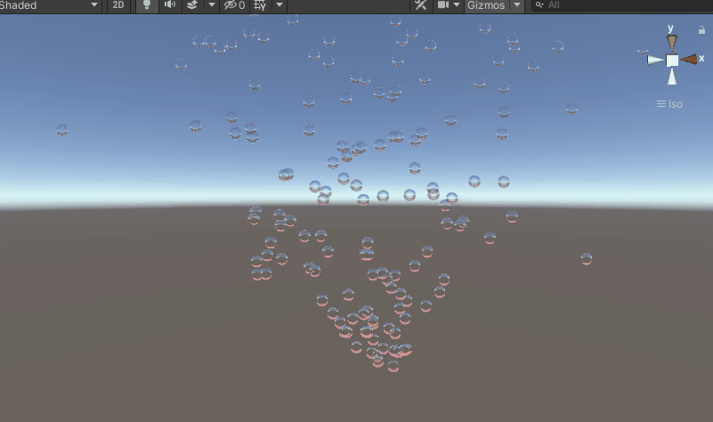

## 前言
通过前几篇的学习，我们已经知道了粒子系统的几大基础模块的设置，有了这些模块的知识，我们足以做出惊艳的效果了。今天我们再学一个新的模块，叫做Noise模块，中文译为噪波、噪声、湍流模块等。这个模块的主要功能是让粒子随机化，有了随机化我们就可以模拟更自然的效果。如泡泡的空气中飘荡、一团苍蝇在嗡嗡乱撞，又或者是雪花飘飘、尘土飞扬等场景。下面我就来讲解一下何为Noise。
@[TOC](目录)

### 本系列提要
> Unity粒子系统专题博客共分成十二篇来讲解： 【本篇为第五篇】
> - 第一篇（[点击直达*暂空](空地址)）：粒子系统概述
> - 第二篇（[点击直达*暂空](空地址)）：主模块
> - 第三篇（[点击直达*暂空](空地址)）：Emission、Shape模块
> - 第四篇（[点击直达*暂空](空地址)）：Renderer、Custom Data模块
> - 第五篇（[点击直达*暂空](空地址)）：Noise模块
> - 第六篇（[点击直达*暂空](空地址)）：生命周期相关模块
> - 第七篇（[点击直达*暂空](空地址)）：Collision、Triggers模块
> - 第八篇（[点击直达*暂空](空地址)）：Inherit Velocity、Sub Emitters模块
> - 第九篇（[点击直达*暂空](空地址)）：Texture Sheet Animation模块
> - 第十篇（[点击直达*暂空](空地址)）：Light、Trails模块
> - 第十一篇（[点击直达*暂空](空地址)）：粒子系统力场（Force Field）组件和External Forces模块
> - 第十二篇（[点击直达*暂空](空地址)）：案例与应用

预计国庆节前更新完毕。更新完毕后上面的指路链接才会统一修改。

> 前排提醒：本文仅代表个人观点，以供交流学习，若有不同意见请评论留言，笔者一定好好学习，天天向上。

**Unity版本[2019.4.10f1] 梦小天幼 & 禁止转载**
> 视频讲解：
**[视频：暂无视频](空地址)**

---
## 一、Noise模块讲解
> 此模块为粒子添加湍流。
> 

|参数|作用|值描述|
|:--:|:--:|:--:|
|Separate Axes|分离轴，在每个轴向上独立控制|
|Strength|强度，控制粒子的波动强度|值越高，粒子波动起伏程度越大
|Frequency|频率，控制粒子改变行进方向的频率以及方向变化的突然程度|值越低，越平稳柔和，值越高，越尖锐快速
|Scroll Speed|噪声图的滚动速度|值越高，粒子越不稳定（位移、缩放、角度）
|Damping|阻尼|若启用，则强度与频率成正比

**解释**：
关于Separate Axes，如果你想让粒子不局限于原地打转，而是朝着某方向跌跌撞撞，建议打开此设置，并把其中某个轴设置的比其他轴大一点

关于强度与频率，如果想做类似于吹泡泡的运动轨迹，可以将强度拉高，频率降低，产生更加柔和的，飘飘的感觉，同时配合主模块的Simulation Speed属性，将整体速度降低。

关于Scroll Speed，值越大，噪声图滚动幅度越大，我们可以在组件右侧看到预览图，这个属性是为了给粒子增加更多不可预测性，动态的去不断更改粒子运动轨迹，使其每次都不一致

---

|参数|作用|值描述|
|:--:|:--:|:--:|
|Octaves|通过重叠噪声图来产生最终噪声|默认值为1，即仅一层噪声图，若大于1则下列两个属性生效
|Octave Multiplier|每个附加的噪声层，按此比例降低强度|默认0.5
|Octave Scale|每个附加的噪声层，按此乘数调整频率|默认2
|Quality|低质量可显著降低性能成本，但也失去了丰富度|默认High(3D)

**关于重叠噪声图**：通过叠加噪声图，并且每层噪声图通过一定比例降低强度，调整频率，可以更加丰富粒子移动的细节效果，可模拟出更加细微的随机效果。比如。。。比如不出来。

---

|参数|作用
|:--:|:--:|
|Remap|将最终噪声值重新映射到不同的范围
|Position Amount|控制噪声对粒子位置影响程度的乘数
|Rotation Amount|控制噪声对粒子旋转影响程度的乘数(度/秒)
|Size Amount|控制噪声对粒子大小影响程度的乘数

---

## 二、Noise模块小案例

### 吹泡泡

### 操作参数
主模块的Simulation Speed调整至 0.2（降速）
Emission模块的Rate Over Time 调整至 20（每秒钟粒子发射数量）
Shape模块的Position.X调整至 -90（向上发射）
Noise模块的Separate Axes打开
Noise模块的Strength.x为5，y为10，z为5
Noise模块的Frequency调整至 0.2（泡泡波动频率）
Renderer模块的Renderer Mode设置为Billboard
Renderer模块的Material设置一个泡泡材质球（如果没有这种材质球，将Mode改为Mesh，用圆球网格代替也可）

## 三、总结和参考资料
### 1.总结
无总结
### 2.参考资料
[1].Unity官方.[官方手册-粒子系统模块-Noise模块](https://docs.unity3d.com/cn/2022.2/Manual/PartSysNoiseModule.html)