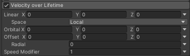
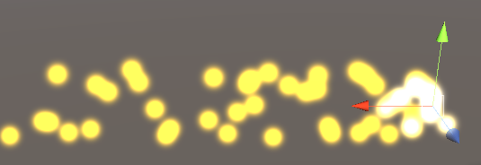

## 前言
今天写粒子系统的第六篇文章，讲到这，一些主要模块其实已经讲完了，剩下的就是一些无关紧要或者更加高级的模块了，比如涉及到物理碰撞模块的，涉及到光照系统模块的等等。今天先把剩余无关紧要的模块给讲了，涉及到9个模块，虽然看起来很唬人，但是这些模块很多只有一两个属性。这一堆模块主要用于控制粒子在发射出去之后的速度，方向，大小，颜色等等的变化。下面就开始吧*V*

@[TOC](目录)

### 本系列提要
> Unity粒子系统专题博客共分成十二篇来讲解： 【本篇为第六篇】
> - 第一篇（[点击直达*暂空](空地址)）：粒子系统概述
> - 第二篇（[点击直达*暂空](空地址)）：主模块
> - 第三篇（[点击直达*暂空](空地址)）：Emission、Shape模块
> - 第四篇（[点击直达*暂空](空地址)）：Renderer、Custom Data模块
> - 第五篇（[点击直达*暂空](空地址)）：Noise模块
> - 第六篇（[点击直达*暂空](空地址)）：生命周期相关模块
> - 第七篇（[点击直达*暂空](空地址)）：Collision、Triggers模块
> - 第八篇（[点击直达*暂空](空地址)）：Inherit Velocity、Sub Emitters模块
> - 第九篇（[点击直达*暂空](空地址)）：Texture Sheet Animation模块
> - 第十篇（[点击直达*暂空](空地址)）：Light、Trails模块
> - 第十一篇（[点击直达*暂空](空地址)）：粒子系统力场（Force Field）组件和External Forces模块
> - 第十二篇（[点击直达*暂空](空地址)）：案例与应用

预计国庆节前更新完毕。更新完毕后上面的指路链接才会统一修改。

> 前排提醒：本文仅代表个人观点，以供交流学习，若有不同意见请评论留言，笔者一定好好学习，天天向上。

**Unity版本[2019.4.10f1] 梦小天幼 & 禁止转载**
> 视频讲解：
**[视频：暂无视频](空地址)**

---
## 一、Velocity over Lifetime
> 控制粒子在其生命周期内的速度
> 

**Linear X,Y,Z** 粒子在X、Y和Z轴的线性速度

**Space** 指定线性速度参照的坐标空间 | Local、World(仅对Linear生效)

**Orbital X,Y,Z** 粒子绕某个轴旋转的轨道速度

**Offset X,Y,Z** 粒子所绕旋转轴的偏移量

**Radial** 粒子远离/朝向中心位置的径向速度

**Speed Modifier** 对上述参数乘以一个量值

**模块说明:** 对于上述参数的合理应用可以做出很炫的效果，比如漩涡，轮回圈，螺纹，螺旋攻击波等，主要是修改Linear用以指定方向，修改Orbital用于使粒子绕着某轴向旋转。记得在主模块把初始速度设为0，这样更加方便参数计算修改。

下图是一个螺旋形状的粒子。

---

## 二、Limit Velocity over Lifetime
> 控制粒子的速度在其生命周期内如何降低
> 

**Separate Axes** 按照XYZ轴来分别设置限速值

**Speed**	粒子在其生命周期内的最大速度限制，若超过该值，则通过Dampen对速度降低

**Space**	参照局部空间还是世界空间，启用Separate Axes时，此选项生效

**Dampen**	当粒子速度超过速度限制时，会通过Dampen以一定比例衰减速度直到达到Speed设定的值

**Drag**  对粒子速度施加线性阻力（模拟空气阻力），作用于全局的，不受上面参数影响

**Multiply by Size** 启用此属性后，较大的粒子会更大程度上受到阻力系数的影响

**Multiply by Velocity** 启用此属性后，较快的粒子会更大程度上受到阻力系数的影响

**模块说明：** 该模块本质上和Velocity over Lifetime是相对的，一个是控制速度，一个是限制速度。很少有在一起使用的场景。该模块的主要使用场景是爆炸（粒子初始速度很高，然后逐渐减弱到一个均值下落速度）、子弹、炮弹等等

下图是一个爆炸演示粒子，用到了Emission的波次，Shape的发射形状和方向，主模块的初始化设置，以及当前模块在生命周期内的速度限制（可能不是很明显...）

---

## 三、Force over Lifetime
> 力对粒子在生命周期内的影响
> 

**X,Y,Z** 按照XYZ轴施加力到每个粒子上

**Space** 参照坐标系

**Randomize** 使用 Two Constants 或 Two Curves 模式时，该属性生效；
此属性会导致在每个帧上在定义的范围内选择新的作用力方向，因此会产生更动荡、更不稳定的运动。

---

## 四、Color over Lifetime
> 生命周期内颜色对粒子的影响
> 

**Color** 用于设置粒子在其生命周期内的颜色

点击颜色部分会弹出一个颜色编辑窗口，在这里可以编辑颜色，长条代表粒子颜色在其生命周期内的变化

---

## 五、Color by Speed
> 让粒子的颜色随着速度的变化而变化
> 

**Color** 颜色渐变

**Speed Range** 将颜色渐变映射到速度范围的上限和下限

Speed Range的数值0代表白色，1代表绿色，根据上图这个数据，那么粒子的颜色就是刚发射是白色，然后变成绿色（为了方便理解，建议把主模块的StartSpeed设为0）

---

## 六、Size over Lifetime
> 控制粒子在其生命周期内的大小
> 

**Separate Axes** 是否在每个轴向独立控制

**Size** 通过一条曲线来定义粒子在其生命周期内的大小

这个模块更好理解，就一个参数，粒子的大小会按照曲线在其生命周期内的变化而变化，比如下图，粒子从出生到消亡，Size是越来越小。

曲线设置如下（X轴将粒子生命周期归一化为1,Y轴将粒子的Size归一化为1）

---

## 七、Size by Speed
> 让粒子的速度随着速度的变化而变化
> 

**Separate Axes** 是否在每个轴向独立控制

**Size** 通过一条曲线来定义粒子大小如何随着速度变化而变化

**Speed Range** 速度范围的上限和下限

不多解释，整篇文章没啥难理解的参数。

---

## 八、Rotation over Lifetime
> 控制粒子在其生命周期内的旋转
> 

**Separate Axes** 是否在每个轴向独立控制

**Angular Velocity** 旋转角速度

四个选项来控制，一般使用曲线来控制，**注意**，曲线的值来自预先设置的常量，比如上图中的45

---

## 九、Rotation by Speed
> 让粒子的角度随着速度的变化而变化
> 

**Separate Axes** 是否在每个轴向独立控制

**Angular Velocity** 旋转角速度，根据速度区间设置

**Speed Range** 速度范围的上限和下限，只有在Angular Velocity选择了曲线或双曲线时该参数才能使用，因为角速度要是动态的该模块才有意义。

不多解释。

---

## 十、总结和参考资料
### 1.总结
无总结
### 2.参考资料
[1].Unity官方.[官方手册-粒子系统](https://docs.unity3d.com/cn/2022.2/Manual/ParticleSystemModules.html)