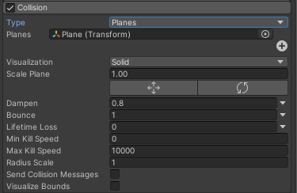
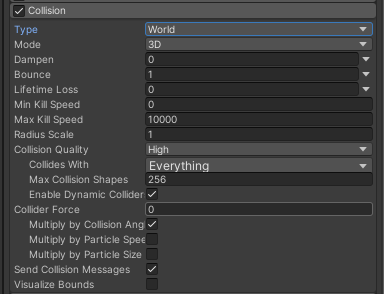
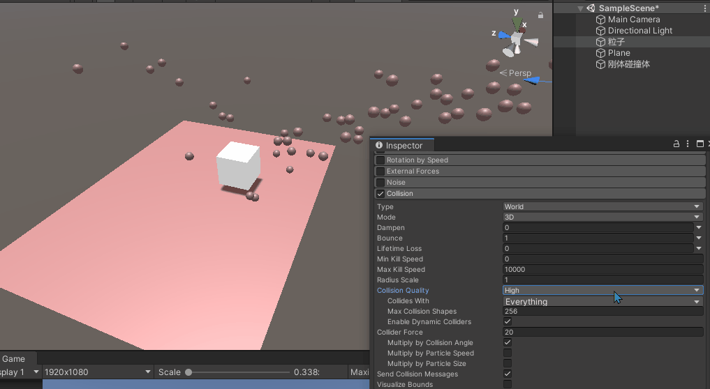
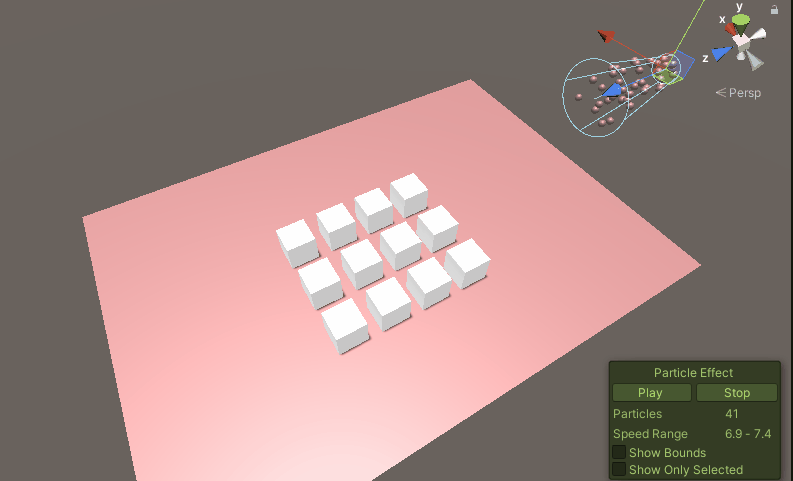
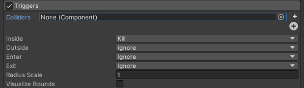
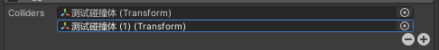
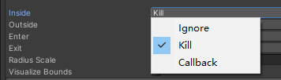
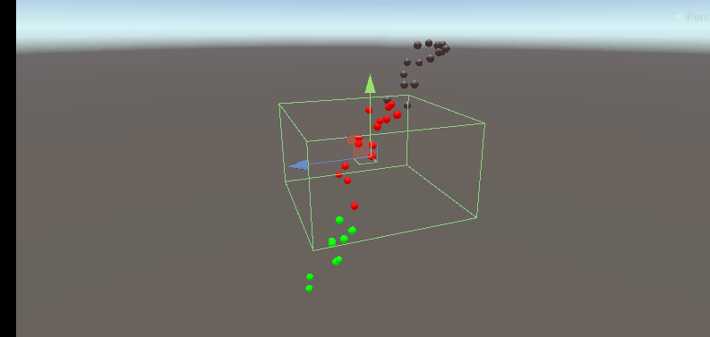

## 前言
本篇来讲一讲Collision和Triggers模块，这两个模块主要用于粒子系统与物理世界的交互，一个是碰撞器，另一个是触发器。有了这两个模块我们又可以做出更炫酷的粒子效果啦！


@[TOC](目录)

### 本系列提要
> Unity粒子系统专题博客共分成十二篇来讲解： 【本篇为第七篇】
> - 第一篇（[点击直达*暂空](空地址)）：粒子系统概述
> - 第二篇（[点击直达*暂空](空地址)）：主模块
> - 第三篇（[点击直达*暂空](空地址)）：Emission、Shape模块
> - 第四篇（[点击直达*暂空](空地址)）：Renderer、Custom Data模块
> - 第五篇（[点击直达*暂空](空地址)）：Noise模块
> - 第六篇（[点击直达*暂空](空地址)）：生命周期相关模块
> - 第七篇（[点击直达*暂空](空地址)）：Collision、Triggers模块
> - 第八篇（[点击直达*暂空](空地址)）：Inherit Velocity、Sub Emitters模块
> - 第九篇（[点击直达*暂空](空地址)）：Texture Sheet Animation模块
> - 第十篇（[点击直达*暂空](空地址)）：Light、Trails模块
> - 第十一篇（[点击直达*暂空](空地址)）：粒子系统力场（Force Field）组件和External Forces模块
> - 第十二篇（[点击直达*暂空](空地址)）：案例与应用

预计国庆节前更新完毕。更新完毕后上面的指路链接才会统一修改。

> 前排提醒：本文仅代表个人观点，以供交流学习，若有不同意见请评论留言，笔者一定好好学习，天天向上。

**Unity版本[2019.4.10f1] 梦小天幼 & 禁止转载**
> 视频讲解：
**[视频：暂无视频](空地址)*

---
## 一、Collision
> 控制粒子如何与场景中的游戏对象发生碰撞

该模块分为两种模式，分别是Planes和World，通过这两种模式可以设置粒子是与平面碰撞还是与世界中的所有物体碰撞。

### 1.Planes


|参数|作用|
|:-:  | :-:|
|Type|碰撞模块的两种模式，Planes、World|
|Planes|通过获取游戏对象的Transform来沿着XZ轴生成一个无限大的平面，Y轴为其平面法向|
|Visualization|控制平面的可视化是网格还是平面
|Scale Plane|控制平面的可视化的大小，**注意**：实际碰撞平面是无限大的，该选项仅供开发者在Scene窗口参考使用
|---------|--------------|
|Dampen|粒子碰撞后损失的速度比例
|Bounce|粒子碰撞后从表面反弹的速度比例
|Lifetime Loss|粒子碰撞后损失的总生命周期比例
|Min Kill Speed|碰撞后运动速度低于此速度的粒子将从系统中予以移除
|Max Kill Speed|碰撞后运动速度高于此速度的粒子将从系统中予以移除
|---------|--------------|
|Radius Scale|允许调整粒子碰撞球体的半径，使其更贴近粒子图形的可视边缘
|Send Collision Messages|如果启用此属性，则可从脚本中通过 OnParticleCollision 函数检测粒子碰撞
|Visualize Bounds|在 Scene 视图中将每个粒子的碰撞边界渲染为线框形状

**题外话：** Planes肯定要比World模式节省计算量，但Planes仅能对平面产生一个碰撞，适用于简易房间，地板等场景（注意，Planes是可叠加的，并不是只能设置一块，Planes选项下有一个“加号”按钮）


### 2.World


|参数|作用|
|:-:  | :-:|
|Type|碰撞模块的两种模式，Planes、World|
|Mode|碰撞模式，3D或者2D（只讲3D的情况）|
|---------|--------------|
|Dampen|粒子碰撞后损失的速度比例
|Bounce|粒子碰撞后从表面反弹的速度比例
|Lifetime Loss|粒子碰撞后损失的总生命周期比例
|Min Kill Speed|碰撞后运动速度低于此速度的粒子将从系统中予以移除
|Max Kill Speed|碰撞后运动速度高于此速度的粒子将从系统中予以移除
|Radius Scale|允许调整粒子碰撞球体的半径，使其更贴近粒子图形的可视边缘
|---------|--------------|
|Collision Quality|碰撞质量
|Collision Quality - High|碰撞始终使用物理系统来检测碰撞结果。此设置是最耗费资源但也是最准确的选项
|Collision Quality - Medium|对先前碰撞进行缓存，之后如果有重复则调用此部分缓存，没有再查询物理系统，此设置仅适用于从不移动的静态碰撞体
|Collision Quality - Low|对先前碰撞进行缓存，之后如果有重复则调用此部分缓存，没有再查询物理系统，比Medium查询物理系统次数更低，此设置仅适用于从不移动的静态碰撞体
|Collides With|选择粒子与之碰撞的层
|Max Collision Shapes|粒子碰撞可包括的碰撞形状(Mesh)的个数，且地形优先；默认为256，也就是说粒子可与256个不同的Mesh碰撞，再多一个就不生效了
|Enable Dynamic Collider|粒子是否响应与刚体碰撞体的碰撞|
|---------|--------------|
|Collider Force|粒子碰撞后，对**刚体碰撞体**施加作用力
|Multiply By Collision Angle|向碰撞体施力时，根据粒子与碰撞体之间的碰撞角度来缩放力的强度。掠射角将比正面碰撞产生更小的力
|Multiply By Particle Speed|向碰撞体施力时，根据粒子的速度来缩放力的强度。快速移动的粒子会比较慢的粒子产生更大的力
|Multiply By Particle Size|向碰撞体施力时，根据粒子的大小来缩放力的强度。较大的粒子会比较小的粒子产生更大的力
|---------|--------------|
|Send Collision Messages|如果启用此属性，则可从脚本中通过 OnParticleCollision 函数检测粒子碰撞
|Visualize Bounds|在 Scene 视图中将每个粒子的碰撞边界渲染为线框形状

#### Collision Quality测试
图中白色方块是一个刚体碰撞体，地面是一个静态碰撞体，当为High时，粒子响应一切碰撞，当设置为Medium时，粒子忽略刚体碰撞体，仅响应静态碰撞体。


#### Collider Force测试
Collider Force参数设置为1000，十二个方块都是刚体碰撞体。所以粒子可以对场景世界中的刚体产生推动力。


---
## 二、Triggers
> 控制粒子与场景中碰撞体的触发
> 

### 1.Colliders
需要指定**Colliders**列表的参数，该属性用于确定**粒子将与哪些碰撞体发生触发事件**；可通过加号或者减号来增删**碰撞体**列表。

上图表示，粒子系统将与测试碰撞体和测试碰撞体(1)发生触发事件

### 2.触发事件
触发事件有四种，Inside\Outside\Enter\Exit


> Inside：粒子在碰撞体的边界内
> Outside：粒子在碰撞体的边界外
> Enter：粒子进入碰撞体的边界
> Exit：粒子退出碰撞体的边界

**每**种触发事件都有对应的选项，来指定该事件如何被触发：

> Callback：允许您在 OnParticleTrigger() 回调函数中访问粒子
> Kill：销毁粒子；无法使用回调
> Ignore：忽略粒子；无法使用回调

### 3.API调用案例
当你设置触发事件的方式为Callback时，就代表系统会自动调用回调函数。
> 你可以使用
> **ParticlePhysics.GetTriggerParticles(触发事件类型，返回粒子列表List)**
> 函数来获取触发事件的粒子列表


下图，当粒子穿越预先设置的碰撞器，会触发事件，通过代码获取触发Enter和Exit事件的粒子list，然后循环迭代改变其颜色。


``` C Shapr
public class Test : MonoBehaviour
{
    ParticleSystem ps;

    List<ParticleSystem.Particle> enter = new List<ParticleSystem.Particle>();
    List<ParticleSystem.Particle> exit = new List<ParticleSystem.Particle>();

    void Start()
    {
        //获取粒子系统组件
        ps = GetComponent<ParticleSystem>();
    }

    void OnParticleTrigger()
    {
        //获取触发响应事件的粒子列表，并返回给预先定义的List
        int numEnter = ps.GetTriggerParticles(ParticleSystemTriggerEventType.Enter, enter);
        int numExit = ps.GetTriggerParticles(ParticleSystemTriggerEventType.Exit, exit);

        //将进入触发区的粒子变个颜色
        for (int i = 0; i < numEnter; i++)
        {
            ParticleSystem.Particle p = enter[i];
            p.startColor = new Color32(255, 0, 0, 255);
            enter[i] = p;
        }

        //再给变一个颜色
        for (int i = 0; i < numExit; i++)
        {
            ParticleSystem.Particle p = exit[i];
            p.startColor = new Color32(0, 255, 0, 255);
            exit[i] = p;
        }

        //将修改后的粒子重新分配回粒子系统
        ps.SetTriggerParticles(ParticleSystemTriggerEventType.Enter, enter);
        ps.SetTriggerParticles(ParticleSystemTriggerEventType.Exit, exit);
    }
}

```


### 4.其他参数
**Radius Scale** 调整粒子碰撞体边界，默认为1。
**Visualize Bounds** 在 Scene 视图中将每个粒子的碰撞边界渲染为线框形状

---


## 三、总结和参考资料
### 1.总结
无总结
### 2.参考资料
[1].Unity官方.[官方手册-粒子系统-Collision](https://docs.unity3d.com/cn/2022.2/Manual/PartSysCollisionModule.html)
[2].Unity官方.[官方手册-粒子系统-Triggers](https://docs.unity3d.com/cn/2022.2/Manual/PartSysTriggersModule.html)
[3].梦小天幼.[详解Unity中的刚体和碰撞体组件](https://blog.csdn.net/weixin_43147385/article/details/124042051?spm=1001.2014.3001.5501)

