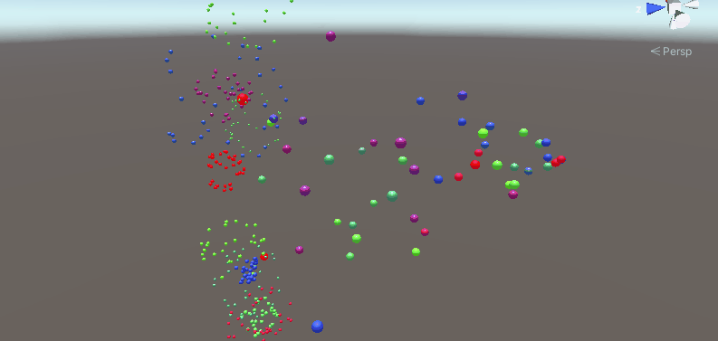

## 前言
书接上回，咱们继续讲粒子系统，本篇该说Inherit Velocity和Sub Emitters这两个模块，依旧是重量级选手，特别是Sub Emitters这个模块，有了它，我们的粒子效果可以做的更具延展性，比如炸药爆裂开来后，其碎屑可以继续爆炸。就要运用到这个Sub Emitters模块，话不多说，正式开始吧。

@[TOC](目录)

### 本系列提要
> Unity粒子系统专题博客共分成十二篇来讲解： 【本篇为第八篇】
> - 第一篇（[点击直达*暂空](空地址)）：粒子系统概述
> - 第二篇（[点击直达*暂空](空地址)）：主模块
> - 第三篇（[点击直达*暂空](空地址)）：Emission、Shape模块
> - 第四篇（[点击直达*暂空](空地址)）：Renderer、Custom Data模块
> - 第五篇（[点击直达*暂空](空地址)）：Noise模块
> - 第六篇（[点击直达*暂空](空地址)）：生命周期相关模块
> - 第七篇（[点击直达*暂空](空地址)）：Collision、Triggers模块
> - 第八篇（[点击直达*暂空](空地址)）：Inherit Velocity、Sub Emitters模块
> - 第九篇（[点击直达*暂空](空地址)）：Texture Sheet Animation模块
> - 第十篇（[点击直达*暂空](空地址)）：Light、Trails模块
> - 第十一篇（[点击直达*暂空](空地址)）：粒子系统力场（Force Field）组件和External Forces模块
> - 第十二篇（[点击直达*暂空](空地址)）：案例与应用

预计国庆节前更新完毕。更新完毕后上面的指路链接才会统一修改。

> 前排提醒：本文仅代表个人观点，以供交流学习，若有不同意见请评论留言，笔者一定好好学习，天天向上。

**Unity版本[2019.4.10f1] 梦小天幼 & 禁止转载**
> 视频讲解：
**[视频：暂无视频](空地址)*

---
## 一、Inherit Velocity
> 控制粒子的速度如何随时间推移而受到其父对象移动的影响
> 
### 参数
**Mode** 指定如何将发射器速度应用于粒子
 - **Current** 发射器的当前速度将应用于每一帧上的所有粒子。例如，如果发射器减速，所有粒子也将减速
 - **Initial** 每个粒子出生时将施加一次发射器的速度。粒子出生后对发射器速度的任何改变都不会影响该粒子

**Multiplier** 粒子应该继承速度的比例

### **应用场景演示**
模拟一辆蒸汽火车，按照现实世界物理规则，火车行进过程中，喷出的蒸汽应该随着火车向前运动一段时间后才会停止

* 首先是没有启用Inherit Velocity模块，可以明显看到蒸汽粒子原地上升，并没有随着火车向前运动

---

* 其次是启用了Inherit Velocity模块，并将Mode选项设置为Initial，Multiplier设置为0.5；这次演示就比较符合物理规范了，但是演示的结果并不太好，这个后续可以继续调节的。

---

* 最后是启用了Inherit Velocity模块，并将Mode选项设置为Current，Multiplier设置为0.5；该模式与上面的模式的区别，还是比较明显的。

---

## 二、Sub Emitters
> 在粒子生命周期的阶段创建附加粒子发射器
> 

如上图所示，该模块是由一个个子发射器配置项组成的，注释如下图

### 触发时机
- Birth 粒子被创建时触发
- Collision 粒子与对象发生碰撞时触发
- Death 粒子销毁时触发
- Trigger 粒子与触发碰撞体相互作用时触发
- Manual 仅在通过脚本进行请求时触发（ParticleSystem.TriggerSubEmitter）

**演示**（当粒子销毁时(Death)，触发Sub Emitters设置的子粒子，百分百被触发，效果如下）

### 可被继承的属性
- Nothing 不继承任何属性
- Everything 继承下述的一切
- Color 继承颜色
- Size 大小
- Rotation 旋转
- Lifetime 生命周期
- Duration 持续时间

这里子发射器继承了父粒子的颜色，呈现出如下效果

**演示**

---

## 三、总结和参考资料
### 1.总结
无总结
### 2.参考资料
[1].Unity官方.[官方手册-粒子系统-Inherit Velocity](https://docs.unity3d.com/cn/2022.2/Manual/PartSysInheritVelocity.html)
[2].Unity官方.[官方手册-粒子系统-Sub Emitters](https://docs.unity3d.com/cn/2022.2/Manual/PartSysSubEmitModule.html)

