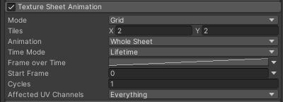
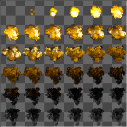
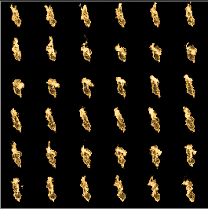
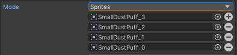
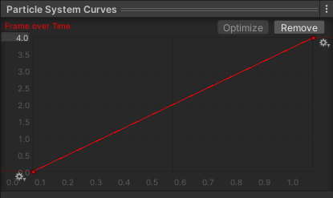
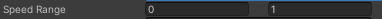
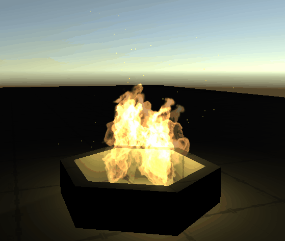

## 前言
今天讲Texture Sheet Animation模块，先前我们已经讲了很多很多模块，通过上述模块可以实现很酷的效果，但是缺了一点真实感。比如说爆炸特效，仅指望单独的粒子来模拟真实的爆炸效果是不现实的，必须要有素材辅助。就像是复杂模型必须要有纹理贴图一样，复杂的粒子效果也要有纹理辅助，且可以是动态纹理（纹理序列）。

@[TOC](目录)

### 本系列提要
> Unity粒子系统专题博客共分成十二篇来讲解： 【本篇为第九篇】
> - 第一篇（[点击直达*暂空](空地址)）：粒子系统概述
> - 第二篇（[点击直达*暂空](空地址)）：主模块
> - 第三篇（[点击直达*暂空](空地址)）：Emission、Shape模块
> - 第四篇（[点击直达*暂空](空地址)）：Renderer、Custom Data模块
> - 第五篇（[点击直达*暂空](空地址)）：Noise模块
> - 第六篇（[点击直达*暂空](空地址)）：生命周期相关模块
> - 第七篇（[点击直达*暂空](空地址)）：Collision、Triggers模块
> - 第八篇（[点击直达*暂空](空地址)）：Inherit Velocity、Sub Emitters模块
> - 第九篇（[点击直达*暂空](空地址)）：Texture Sheet Animation模块
> - 第十篇（[点击直达*暂空](空地址)）：Light、Trails模块
> - 第十一篇（[点击直达*暂空](空地址)）：粒子系统力场（Force Field）组件和External Forces模块
> - 第十二篇（[点击直达*暂空](空地址)）：案例与应用

预计国庆节前更新完毕。更新完毕后上面的指路链接才会统一修改。

> 前排提醒：本文仅代表个人观点，以供交流学习，若有不同意见请评论留言，笔者一定好好学习，天天向上。

**Unity版本[2019.4.10f1] 梦小天幼 & 禁止转载**
> 视频讲解：
**[视频：暂无视频](空地址)*

---
## 一、Texture Sheet Animation
> 将一组纹理视为动画进行控制播放
> 

### 1.播放模式 Mode
**Mode** 选择动画播放模式，Grid、Sprites

#### Grid模式 
> 将粒子材质分割成多张图片控制播放，比如下面示例的纹理图，通过**Tiles**属性控制XY轴方向分别切割几份
  - **Tiles:** 纹理如何被切割
  - **Animation:** 指定动画帧如何被播放
    - Whole Sheet: 整页是一个动画序列，从左到右，从上到下对整张图片进行动画处理
      - 
    - Single Row:每一行代表一个单独的动画序列，单行从左到右产生动画效果
      - 
      - Row Mode 行模式 （如上图，每一行都可以作为一个单独的动画序列来播放，这种纹理就很适合使用行模式，而不是整页作为一个动画来播放）
        - Custom 选指定的一行来播放
        - Random 随机选取一行
        - Mesh Index 根据分配给粒子的网格索引 (Mesh Index) 选择某行，当你想确保特定网格的粒子也使用相同的纹理时，这个选项比较有用

#### Sprites模式 
> 将渐变效果的纹理图转为精灵图并分割成多份，然后添加到当前模块，粒子系统便会根据这些精灵图来控制播放动画效果
> 

---

### 2.帧采样模式

**Time Mode** 选择粒子系统对动画中的帧进行采样的方式

 * **Lifetime :** 在粒子的整个生命周期内使用动画曲线对帧进行采样
   * Frame Over Time：横轴是粒子生命周期，纵轴是精灵图索引（随着生命周期依次播放）
    * 

 * **Speed :** 基于粒子速度的采样帧。速度范围指定帧选择的最小和最大速度范围
   * Speed Range: 通过动画将定义范围内的速度重新映射为0-1值。
   * 
  
 * **FPS :** 根据指定的每秒帧数值对帧进行采样
   * FPS : 指定每秒帧数

---

### 3.其他参数

|属性|作用|
|:-|:-|
|Start Frame|从第几帧开始
|Cycles|帧动画序列在粒子生命周期内重复的次数
|Affected UV Channels|指定哪些UV通道将被动画化

---

## 二、案例演示

> 思路：通过本篇学到的Texture Sheet Animation模块，其实就足以做出效果了，但是还需要加上一些辅助模块，以求达到最好的效果（当然这个效果也很拉。。。）

> 1.火星是又单独加了一个粒子系统，改了颜色，加了Noise模块，简要修改了一下参数即可
> 2.火焰本身的光源则是使用了Light模块，Ratio设置为0.5即可，随着火焰粒子的消亡与新生，就可以做出这种忽明忽暗的效果
> 3.火焰粒子加了Color Over LifeTime模块，并没有改动太多，只是在粒子生命周期开始和结束部分加了透明，做到渐显渐隐的效果，更加柔和不突兀
> 4.火焰粒子也使用了Noise模块，不需要位置做变动，在生命周期内变动一下大小和轻微的旋转即可
> 5.最后是主模块和发射器以及Shape模块的设置，初始速度设0，初始大小来一个随机，粒子生命周期设置5-10即可，然后Rate Over Time设置2，每秒发射两个粒子足以，太多看着太满，不真实，Shape没啥设置的，发射粒子的方向朝向天空即可。
> 
> 要是看不懂，请去看本系列的其他几篇有关讲解（。＾▽＾）

---
## 三、总结和参考资料
### 1.总结
无总结
### 2.参考资料
[1].Unity官方.[官方手册-粒子系统-Texture Sheet Animation module](https://docs.unity3d.com/2021.3/Documentation/Manual/PartSysTexSheetAnimModule.html)
[2].GAMES Webinar-王希.[游戏引擎中的粒子和声效系统 | GAMES104-现代游戏引擎：从入门到实践](https://www.bilibili.com/video/BV1bU4y1R7x5/?spm_id_from=333.1007.top_right_bar_window_history.content.click&vd_source=33522e0d245b96223d45e6d0419c7ff7)

