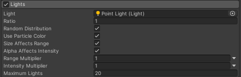
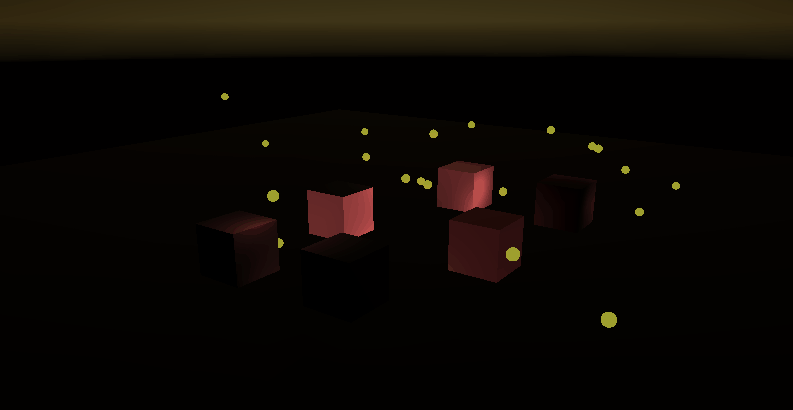
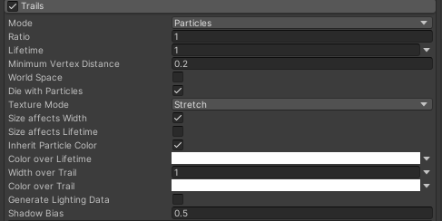
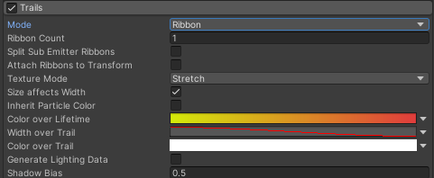
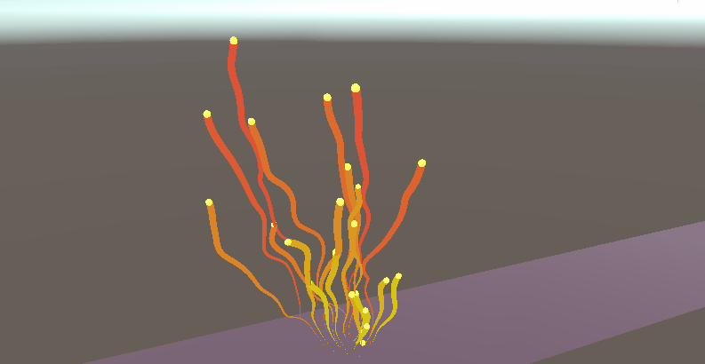
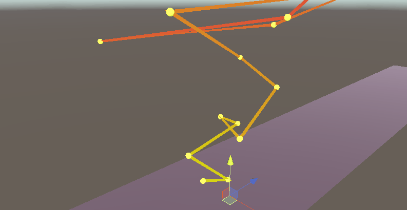
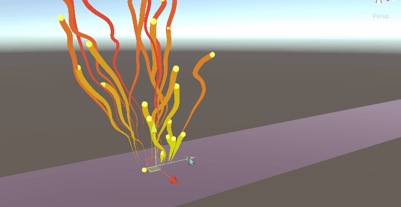

## 前言
第十篇，我们讲Light模块和Trails模块，这两个模块不像前几篇所讲的模块一样基本都是对粒子的运行逻辑变化产生影响的，而是对粒子的呈现效果产生影响。比如爆炸粒子不能只有爆炸，还要有光亮，被炸飞的碎屑往往还带有烟尘的尾迹；等等上述模块累加在一起，都是为了让粒子呈现出更真实，更自然，更炫酷...的效果...

@[TOC](目录)

### 本系列提要
> Unity粒子系统专题博客共分成十二篇来讲解： 【本篇为十篇】
> - 第一篇（[点击直达*暂空](空地址)）：粒子系统概述
> - 第二篇（[点击直达*暂空](空地址)）：主模块
> - 第三篇（[点击直达*暂空](空地址)）：Emission、Shape模块
> - 第四篇（[点击直达*暂空](空地址)）：Renderer、Custom Data模块
> - 第五篇（[点击直达*暂空](空地址)）：Noise模块
> - 第六篇（[点击直达*暂空](空地址)）：生命周期相关模块
> - 第七篇（[点击直达*暂空](空地址)）：Collision、Triggers模块
> - 第八篇（[点击直达*暂空](空地址)）：Inherit Velocity、Sub Emitters模块
> - 第九篇（[点击直达*暂空](空地址)）：Texture Sheet Animation模块
> - 第十篇（[点击直达*暂空](空地址)）：Light、Trails模块
> - 第十一篇（[点击直达*暂空](空地址)）：粒子系统力场（Force Field）组件和External Forces模块
> - 第十二篇（[点击直达*暂空](空地址)）：案例与应用

预计国庆节前更新完毕。更新完毕后上面的指路链接才会统一修改。

> 前排提醒：本文仅代表个人观点，以供交流学习，若有不同意见请评论留言，笔者一定好好学习，天天向上。

**Unity版本[2019.4.10f1] 梦小天幼 & 禁止转载**
> 视频讲解：
**[视频：暂无视频](空地址)*

---
## 一、Lights
> 将实时光照添加到粒子上
> 

### 属性

|属性|作用|
|:-:|:-:|
|Light|获取一个光照Prefab来描述单个粒子的光照|
|Ratio|粒子是否接受光照的比率，介于0-1之间|
|Random Distribution|**true**则按Ratio值随机分配光照（0.5代表一半的概率），**false**则按Ratio值定期分配光照（0.5代表隔一个粒子才被分配光照）|
|Use Particle Color|光照颜色（Color）是否受到粒子本身颜色的影响|
|Size Affects Range|光照范围（Range）是否受到粒子本身大小的影响|
|Alpha Affects Intensity|光照强度（Intensity）是否受到粒子本身Alpha值的影响|
|Range Multiplier|使用曲线在粒子的生命周期内将一个自定义乘数应用于光照范围，光照范围随着时间变化|
|Intensity Multiplier|使用曲线在粒子的生命周期内将一个自定义乘数应用于光照强度，光照强度随着时间变化|
|Maximum Lights|最大光照限制，防止突然创建了大量光照而死机|

### 演示
Lights模块主要用于为粒子效果快速添加实时光照，注意，粒子本身使用了自发光材质，但粒子对环境的照亮，则是使用Lights模块添加的实时光照效果

---
## 二、Trails
> 将尾迹效果添加到粒子上
> 
> 

### 属性

|属性|作用|
|:-:|:-|
|Mode|粒子生成轨迹的模式：**Particle**、**Ribbon**|
||Particle：根据粒子自身路径渲染尾迹|
||Ribbon：将所有粒子相连接|
|---||
|Ribbon Count|Ribbon模式，选择几条线段来连接所有粒子（默认一条线连接所有粒子）|
|Split Sub Emitter Ribbons|Ribbon模式，子发射器上使用时，父粒子将连接所有相关的子粒子|
|Attach Ribbons to Transform|Ribbon模式，当粒子系统使用世界坐标空间时，勾选此选项，线段会自动连接到世界原点|
|---|
|Ratio|被渲染尾迹粒子的概率，一个介于0-1的值|
|Lifetime|粒子尾迹的生命周期|
|Minimum Vertex Distance|添加两个顶点之间的最小距离（这么解释不太准确，但可以这样理解，值越小，尾迹顶点越多，越丝滑）|
|World Space|ture则尾迹顶点忽略粒子系统的任何移动，false则尾迹顶点跟随粒子移动，详情看下面例图演示|
|Die With Particles|尾迹是否随着粒子的死亡而消失，若不是，则剩余尾迹会根据自身剩余的生命周期自然消失|
|---||
|Texture Mode|纹理模式(就是设置尾迹材质纹理如何映射到尾迹上)|
||Stretch:沿线的整个长度映射纹理一次|
||Tile:基于线长度（采用世界单位）沿线重复纹理|
||DistributePerSegment:沿线的整个长度映射纹理一次（假设所有顶点均匀分布）
||RepeatPerSegment:沿线重复纹理（按每个线细分段一次的比率重复）|
|---||
|Size Affects Width|尾迹宽度是否受到粒子大小的影响|
|Size Affects Lifetime|尾迹生命周期是否受到粒子大小的影响|
|Inherit Particle Color|尾迹颜色是否受到粒子颜色的影响|
|Color over Lifetime|控制尾迹颜色随着生命周期的变化而变化|
|Width over Trail|控制尾迹宽度相对于其长度的曲线|
|Color over Trail|控制尾迹颜色相对于其长度的颜色条|
|Generate Lighting Data|如果启用此属性，Unity 在构建线几何体时包含法线和切线。这样，线几何体就可以使用采用了场景光照的材质（俺不清楚这个属性，别问俺）|
|Shadow Bias|阴影偏差|

### 演示

#### Particle、Ribbon模式的演示

#### 勾选World Space的演示

---

## 三、总结和参考资料
### 1.总结
无总结
### 2.参考资料
[1].Unity官方.[官方手册-粒子系统-Light模块](https://docs.unity3d.com/2021.3/Documentation/Manual/PartSysLightsModule.html)
[2].Unity官方.[官方手册-粒子系统-Trails模块](https://docs.unity3d.com/2021.3/Documentation/Manual/PartSysTrailsModule.html)

