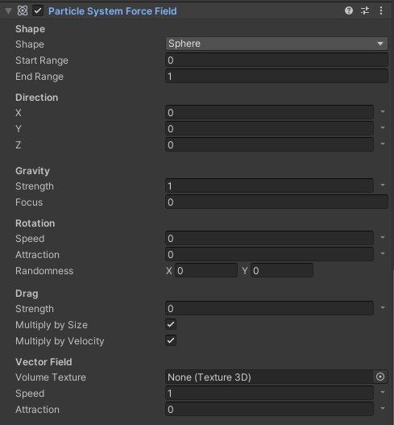

## 前言
今天讲最后一个模块——External Forces，该模块需要和Force Field组件配合使用，作用是模拟物理的力对粒子的影响。至此，Unity内置粒子系统的最后一块物理砖补齐，理论上来讲我们已经可以通过粒子系统来模拟世间万物了。废话不多说，进入正题。

@[TOC](目录)

### 本系列提要
> Unity粒子系统专题博客共分成十二篇来讲解： 【本篇为第十一篇】
> - 第一篇（[点击直达*暂空](空地址)）：粒子系统概述
> - 第二篇（[点击直达*暂空](空地址)）：主模块
> - 第三篇（[点击直达*暂空](空地址)）：Emission、Shape模块
> - 第四篇（[点击直达*暂空](空地址)）：Renderer、Custom Data模块
> - 第五篇（[点击直达*暂空](空地址)）：Noise模块
> - 第六篇（[点击直达*暂空](空地址)）：生命周期相关模块
> - 第七篇（[点击直达*暂空](空地址)）：Collision、Triggers模块
> - 第八篇（[点击直达*暂空](空地址)）：Inherit Velocity、Sub Emitters模块
> - 第九篇（[点击直达*暂空](空地址)）：Texture Sheet Animation模块
> - 第十篇（[点击直达*暂空](空地址)）：Light、Trails模块
> - 第十一篇（[点击直达*暂空](空地址)）：粒子系统力场（Force Field）组件和External Forces模块
> - 第十二篇（[点击直达*暂空](空地址)）：案例与应用

预计国庆节前更新完毕。更新完毕后上面的指路链接才会统一修改。

> 前排提醒：本文仅代表个人观点，以供交流学习，若有不同意见请评论留言，笔者一定好好学习，天天向上。

**Unity版本[2019.4.10f1] 梦小天幼 & 禁止转载**
> 视频讲解：
**[视频：暂无视频](空地址)*

---
## 一、External Forces
> 控制**粒子系统力场 Force Field**对粒子的影响
> 

**Multiplier** 施加到该粒子系统上的力的乘数，1全施加，0不施加
**Influence Filter** 选择通过何种方式控制力场对粒子的影响
- Layer Mask(通过层的方式选择力场对哪一层生效)
- List(通过力场List来确定，哪些力场对当前粒子系统生效)
- Layer Mask And List(我全都要！)

---
## 二、Force Field
> 粒子系统力场，对粒子施加各种类型的力
> 

### 1.力场的形状

|Shape|形状|
|:-|:-|
|Shape|力场区域的形状；圆、半圆、圆柱、盒|
|Start Range|设置力场形状内部从何处开始|
|End Range|设置力场形状外部从何处结束|
|Direction XYZ|设置线性力以应用于沿 x 轴、y 轴和 z 轴的粒子,值越高，力越大|

**Start Range和End Range**
> 这俩选项用于控制力场区域，单位是米，如下图，Shape为Box,设置了Start为1，End为3
> 

### 2.力场吸引力

|Gravity|引力|
|:-|:-|
|Strength|设置引力中心点对粒子的吸引力，值越高，强度越大|
|Focus|设置引力中心点，值为0则是形状中心处，值为1则是形状外边缘|
**引力**
> 

### 3.力场的涡流

|Rotation|旋转涡流|
|:-|:-|
|Speed|设置粒子围绕涡流的速度，值越高，速度越快|
|Attraction|设置粒子被拖入涡流的强度，值为1则是最大吸引力，值为0则是不应用任何吸引力|
|Randomness|设置形状的随机轴以推动粒子四处移动。值为 1 表示最大随机性，值为 0 则不应用随机性|
**涡流运动**
> 将Attraction设置为1，然后把Speed设置为10
> 粒子向上发射，然后被卷入力场涡流重
> 

### 4.力场拖拽

|Drag||
|:-|:-|
|Strength|设置拖曳效果的强度，以减慢粒子的速度。值越高，强度越大|
|Multiply by Size|是否根据粒子的大小调整拖拽的强度|
|Multiply by Velocity|是否根据粒子的速度调整拖拽的强度|

**拖拽强度的演示**
> Gravity强度为1，Drag的强度为0
> 
> Gravity强度为1，Drag的强度为10
> 

### 5.矢量场（不会）
矢量场是预先计算好的力场，Unity无法直接制作，需要用到插件或去其他软件制作..俺不会，就不演示了，下面给出了参考文章

Unity矢量场的制作，参考这篇：https://www.bilibili.com/read/cv2695515?from=search&spm_id_from=333.337.0.0

|Vector Field||
|:-|:-|
|Volume Texture|选择矢量场|
|Speed|设置乘数的速度以应用于通过矢量场的粒子。值越高，速度越快|
|Attraction|设置 Unity 将粒子拖动到矢量场运动中的强度。值越高，吸引力越大|

---
## 三、总结和参考资料
### 1.总结
无总结
### 2.参考资料
[1].Unity官方.[官方手册-Force Field组件](https://docs.unity3d.com/2022.2/Documentation/Manual/class-ParticleSystemForceField.html)
[2].pdxL2.[MMD联动Unity学习笔记 Vol.15 制作矢量场](https://www.bilibili.com/read/cv2695515?from=search&spm_id_from=333.337.0.0)
