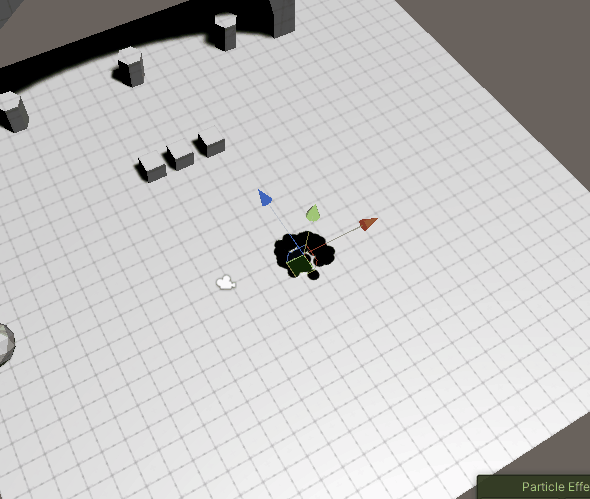

## 前言
终于来到了最后一篇，粒子系统宣告终结！这十来篇博客删删改改写了半个多月，真是离谱。今天该讲案例与粒子系统的应用，那么我们就进入正题吧！

@[TOC](目录)

### 本系列提要
> Unity粒子系统专题博客共分成十二篇来讲解： 【本篇为第十二篇 | 终篇】
> - 第一篇（[点击直达](https://blog.csdn.net/weixin_43147385/article/details/126931216?spm=1001.2014.3001.5502)）：粒子系统概述
> - 第二篇（[点击直达](https://blog.csdn.net/weixin_43147385/article/details/126933063?spm=1001.2014.3001.5502)）：主模块
> - 第三篇（[点击直达](https://blog.csdn.net/weixin_43147385/article/details/126943578?spm=1001.2014.3001.5502)）：Emission、Shape模块
> - 第四篇（[点击直达](https://blog.csdn.net/weixin_43147385/article/details/126969238?spm=1001.2014.3001.5502)）：Renderer、Custom Data模块
> - 第五篇（[点击直达](https://blog.csdn.net/weixin_43147385/article/details/126981643?spm=1001.2014.3001.5502)）：Noise模块
> - 第六篇（[点击直达](https://blog.csdn.net/weixin_43147385/article/details/127059613?spm=1001.2014.3001.5502)）：生命周期相关模块
> - 第七篇（[点击直达](https://blog.csdn.net/weixin_43147385/article/details/127077607?spm=1001.2014.3001.5502)）：Collision、Triggers模块
> - 第八篇（[点击直达](https://blog.csdn.net/weixin_43147385/article/details/127097772?spm=1001.2014.3001.5502)）：Inherit Velocity、Sub Emitters模块
> - 第九篇（[点击直达](https://blog.csdn.net/weixin_43147385/article/details/127146694?spm=1001.2014.3001.5502)）：Texture Sheet Animation模块
> - 第十篇（[点击直达](https://blog.csdn.net/weixin_43147385/article/details/127146742?spm=1001.2014.3001.5502)）：Light、Trails模块
> - 第十一篇（[点击直达](https://blog.csdn.net/weixin_43147385/article/details/127146784?spm=1001.2014.3001.5502)）：粒子系统力场（Force Field）组件和External Forces模块
> - 第十二篇（[点击直达](https://blog.csdn.net/weixin_43147385/article/details/127146784?spm=1001.2014.3001.5502)）：案例与应用

预计国庆节前更新完毕。更新完毕后上面的指路链接才会统一修改。

> 前排提醒：本文仅代表个人观点，以供交流学习，若有不同意见请评论留言，笔者一定好好学习，天天向上。

**Unity版本[2019.4.10f1] 梦小天幼 & 禁止转载**
> 视频讲解：
**[视频：暂无视频](空地址)*

---
## 一、如何做出效果
> Unity的粒子系统已经把很多很多参数暴露给设计师了，凭借这些参数足以调出任何你想要的效果，学习粒子系统的第一步是了解参数，我们前面花了十一篇的内容已经详细的把所有参数介绍了一遍，那么第二步就是学会调整这些参数，学会组合使用这些模块，学会把粒子系统与粒子系统组合到一起，呈现出各种效果。

> 对于调整参数，Unity一般会给一个参数四种选项，分别是
> - Constant 固定的值（在粒子生命周期内不会改变）
> - Curve 曲线（调整值与生命周期的比率关系，通过曲线来调整）
> - Random Between Two Constants 两个值之间随机
> - Random Between Two Curves 两个曲线之间随机

> 以及颜色方面的调整项
> - Color 固定的颜色
> - Gradient 随着粒子生命周期的渐变颜色（通过Gradient Editor调整）
> - Random Between Two Colors 两个固定颜色随机选一个
> - Random Between Two Gradients 两个渐变颜色随机选一个

> 对于粒子系统之间的组合
> - 如果我们想做出很多炫酷的效果，单靠一个粒子系统是无法完成的必须多个粒子系统相互组合，比如火焰是一个粒子系统、烟雾是一个粒子系统、火星是一个粒子系统，它们以父子关系组合到一起就形成了一个逼真的火焰特效。
> - 模块之间的组合使用也要恰到好处，不要滥用模块，避免导致不可控的效果产生，以及性能消耗。

> 如何做出效果
> 多参考大神作品合集，然后自己思考拆解它的特效，看看可以拆分成那些部分，然后单独是实现并且合理组合到一起，没必要局限于游戏方面的特效，也可以多看看影视方面的特效，粒子系统的参数以及概念其实都是通用的，放到AE里面也适用，只不过又换了一个软件，换了一种表现方式罢了。
> 如果想要特效更加华丽，免不了要使用材质贴图，Shader，后处理Pos，以及结合粒子系统的API，这些读者自行探索，不过多说明（咱也不太懂，别误导了大家...ψ(._. )>）

---
## 二、案例演示
> 欢迎来到特效案例篇，本篇的案例只讲思路以及关键参数设置，不会手把手教你一个个设置参数，如果对粒子系统的参数有任何困惑，可以去复习前十一篇；本篇一共展示六个案例，都是自己瞎琢磨的，读者们看个乐，顺便实践一番，大可不必较真哦。

> 为了方便读者实践，案例中大部分只是使用了默认素材（Unity内置的），只有前两个案例使用了外来素材，而且是非常非常简单的外来素材。就一个黑色圆球，自己顺便瞎画的hhh

### 1.地蛇蔓延
> 
> 
> 这个特效仔细分析一下，用到了Noise模块，模拟蜿蜒曲折前进；Trail模块，模拟尾迹，逐渐变小的尾迹；Color Over Lifetime模块，渐隐渐显的效果，更加自然；以及Emission\Shape\Renderer这三个默认开启的模块。
> 主模块调整一下合适的生命周期，大小
> 首先是Emission的设置，Rate Over Time设置0即可，因为很明显他是按波发射，且只发射了一波，设置Bursts即可，数量随意。
> Shape设置，先不要关注尾迹，只论头部，粒子是向外扩散，Circle很符合这个效果，Radius设置较小的一个值，模拟从原点向外逐渐扩散
> Renderer模块主要注意的是，把Render Mode换成Horizontal Billboard，用以贴合地面，但尾迹无法贴合地面，只是从空中看效果较好，侧面看，就不行了，暂时无法解决，留给读者解决吧hhh
> Noise和Trail不多说，自己看着调整即可。

### 2.六芒星
> 
> 
> 这个特效看起来也挺好玩，自己琢磨了好久，属于是瞎琢磨出来的，其核心在于Trail模块的Ribbon模式，这是最重要的一点。
> 我们先忽略连线部分，只看粒子，可以发现粒子是围绕这一个圆逐渐被发射出来然后扩散的，这依旧符合Shape模块的Circle形状，依次发射则是把发射模块从默认的Random改成了Loop，且把Emission的Rate Over Time改一个很小的值，比如5，这样就形成了每秒绕着圆发射5个粒子的效果。
> 然后就是重点的Trail，来实现连线部分，上一个案例是每一个粒子都有尾迹，而这个案例则是多个粒子连起来形成线段，也就是Ribbon模式，且把Ribbon Count设置为2（设置为1就是一条线贯穿始终，就无法形成这种效果），就可以了，其他细枝末节不多赘述。

### 3.星光世界
> 
> 
> 这个特效就很简单了，默认的粒子材质，给了一个随机颜色，随机大小，随机摆动，即可。
> 主模块的Start Color设置成Gradient模式，给点随机颜色值，Start Speed设0，后期用Noise使他们飘动，无需初始速度
> Shape模块设置Box，就在盒子内生成星光世界
> 用上Color Over Lifetime 和 Size over Lifetime模块渐显渐隐和变化大小
> Noise模块给上随机摆动，Frequency0.5，Scroll Speed0.1,仅供参考

### 4.飞溅火花
> 
> 
> 这个特效倒是实用一点，可以应用到很多很多地方，用到了Collision模块
> 先说Emission,多给一点，200左右
> 然后是主模块，因为材质用的默认粒子材质，所以这里可以改Start Color，改的更像火花，然后把3D Start Size勾选上，火花粒子如果要模拟速度感，需要细长一点，没必要加上拖尾，自身长度拉长就足够（拉长自身长度也可以用Renderer的Stretched Billboard）
> 形状模块几乎不需要改，仅仅把默认锥桶的发射端改到最小，让其从一个点发射，也就是Radius属性
> Collision模块用Local即可，追求更好的效果用World也行，把LifeTime Loss调整为0.5，火花撞到障碍物慢慢就消失了，如果没撞到能活更长的时间
> 如果后续有需要可以加上灯光模块，更亮更炫酷，在发射端加上一个灯光即可

### 5.下雨啦！
> 
> 
> 下雨这个粒子效果实现起来也很简单，需要用到两个粒子特效组合到一起，一个是下雨，一个是雨水滴落四溅的效果
> 先说下雨部分，Shape模块设置Box模式，然后Scale拉长，想下多大范围就拉多大，然后旋转一下，使其朝向地面方向。
> 雨滴的速度感，在Renderer Mode设置为Stretched Billboard来模拟，把Length Scale设置3，就足够了
> 然后单独新建一个粒子特效，做一个四溅的效果，Emission部分，只需要波次发射，所以设置一个波次，发射数量5-10之间
> Shape用Circle，Radius设到最小值，这是粒子播放大概是粒子按照圆形四散的效果，但是不会上升，也就是贴近地面四散
> 要解决这个问题，就加上Force Over Lifetime模块，在生命周期内施加向上的力，营造四溅的效果
> 现在在下雨粒子特效中启用Sub Emitters模块，然后选择刚才做的四溅效果，触发调节设置为Trigger
> 最后，启用Triggers模块，触发Colliders设置为场景中的地面，大功告成。

### 6.放烟花啦！
> 
> 
> 看起来如何？效果还是不错的！快对烟花许愿吧，嘿嘿！
> 该特效使用两个特效组合而成，一个是上升的烟花，一个是爆裂的烟花，和上一个案例很相似
> 所以烟花上升的特效就不讲了，我只讲烟花爆裂的特效是如何实现的，请注意烟花上升的特效使用了光源，虽然不明显，且光源颜色是随着粒子变化的。
> 烟花爆裂还是用了Emission的波次，多给一点，效果会更炫酷，Shape用了Sphere，呈圆球型爆裂开来
> 加了Color over LifeTime模块，渐隐，不那么突兀
> 又加了一个Noise模块，Position Amount为0.5，更加随机化一点；Size Amount为0.5，营造一种闪烁的感觉。这个很重要!
> 最后主模块这边，把控好Start Lifetime和Start Speed的关系，自己慢慢调整即可。
> 最后的最后，如果想要超多烟花效果，记得把Max Particles上限设置高一点。
> 以上。

---
## 三、总结和参考资料
### 1.总结
本系列博客从2022年9.15开始动笔，删删改改直到10.3号才写完，真是历经了千辛万苦啊，虽然内容很简单，但想把它们用通俗化的语言表述出来真的太难了，每次写完之后，审阅一遍一看，感觉和抄官方文档没啥区别（好吧就是抄）

(ง •_•)ง
其实本来计划一周搞定的，太高估自己了吧hhhh

(oﾟvﾟ)ノ
感觉粒子系统这块，等到我退休都不可能忘记了，记得真的挺牢的hhhh

(。・∀・)ノ 886 下篇博客见~！

### 2.参考资料
[1].梦小天幼.[粒子系统Particle System (一)](https://blog.csdn.net/weixin_43147385/article/details/126931216?spm=1001.2014.3001.5502)
[2].梦小天幼.[粒子系统Particle System (二)](https://blog.csdn.net/weixin_43147385/article/details/126933063?spm=1001.2014.3001.5502)
[3].梦小天幼.[粒子系统Particle System (三)](https://blog.csdn.net/weixin_43147385/article/details/126943578?spm=1001.2014.3001.5502)
[4].梦小天幼.[粒子系统Particle System (四)](https://blog.csdn.net/weixin_43147385/article/details/126969238?spm=1001.2014.3001.5502)
[5].梦小天幼.[粒子系统Particle System (五)](https://blog.csdn.net/weixin_43147385/article/details/126981643?spm=1001.2014.3001.5502)
[6].梦小天幼.[粒子系统Particle System (六)](https://blog.csdn.net/weixin_43147385/article/details/127059613?spm=1001.2014.3001.5502)
[7].梦小天幼.[粒子系统Particle System (七)](https://blog.csdn.net/weixin_43147385/article/details/127077607?spm=1001.2014.3001.5502)
[8].梦小天幼.[粒子系统Particle System (八)](https://blog.csdn.net/weixin_43147385/article/details/127097772?spm=1001.2014.3001.5502)
[9].梦小天幼.[粒子系统Particle System (九)](https://blog.csdn.net/weixin_43147385/article/details/127146694?spm=1001.2014.3001.5502)
[10].梦小天幼.[粒子系统Particle System (十)](https://blog.csdn.net/weixin_43147385/article/details/127146742?spm=1001.2014.3001.5502)
[11].梦小天幼.[粒子系统Particle System (十一)](https://blog.csdn.net/weixin_43147385/article/details/127146784?spm=1001.2014.3001.5502)
[12].梦小天幼.[粒子系统Particle System (十二)](https://blog.csdn.net/weixin_43147385/article/details/126931216?spm=1001.2014.3001.5502)

