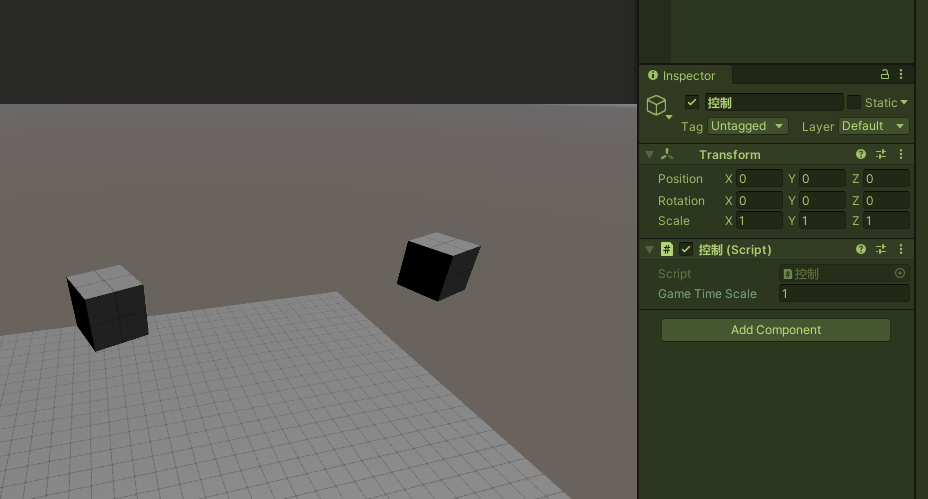

## 前言
在游戏世界中，时间无疑是最为重要的参数，它是游戏世界能否正常运转的关键。一旦它出错，轻则卡顿，重则游戏世界崩坏。在使用Unity引擎创造的世界中，Time类无疑是必须要掌握的一个类，它是控制时间的关键，是造物主最为重要的权柄，有了它，我们就可以肆意的玩弄我们所创造的游戏世界，一言万年。

很中二的前言hhh，但Time类真的非常重要，本篇主要讲解一下Time类的各个API，以及它们对Unity各项系统的影响。

@[TOC](目录)

**Unity版本[2019.4.10f1] 梦小天幼 & 禁止转载**

> 视频讲解：
**[暂无视频](空地址)**

---
## 一、Time类基础

### 1.Time类总览
> 大概浏览一遍即可，后续讲解到某个属性再翻回来看
> 
|变量|释义|
|:-|:-|
|**总时间**|---|
|Time.time|从游戏开始到现在所用的时间|
|Time.unscaledTime|从游戏开始到现在所用的时间(不受timeScale影响)|
|Time.fixedTime|从游戏开始到现在所用的时间|
|Time.fixedUnscaledTime|从游戏开始到现在所用的时间(不受timeScale影响)|
|Time.realtimeSinceStartup|游戏开始以来的实际时间|
|Time.timeSinceLevelLoad|自最后一个非添加场景（non-additive scene）完成加载以来的时间|
|**增量时间**|---|
|Time.deltaTime|帧间隔时间|
|Time.unscaledDeltaTime|帧间隔时间(不受timeScale影响)|
|Time.fixedDeltaTime|固定间隔帧时间|
|Time.fixedUnscaledDeltaTime|固定间隔帧时间(不受timeScale影响)|
|Time.smoothDeltaTime|经过平滑处理的Time.deltaTime|
|**其他**|---|
|Time.frameCount|总帧数|
|Time.timeScale|时间流逝尺度，1正常速度，2则2倍速|
|Time.inFixedTimeStep|在FixedUpdate()中调用返回true，否则返回false|
|Time.maximumDeltaTime|最大增量时间|
|Time.maximumParticleDeltaTime|粒子更新的最大增量时间|
|Time.captureDeltaTime|捕获增量时间|
|Time.captureFramerate|Time.captureDeltaTime的倒数|
|---|---|


### 2.何为Time.deltaTime
> 我们在学习Unity过程中，最先接触到的参数应该就是这个Time.deltaTime了，在Update中，我们的移动、旋转一般都要乘以一个Time.deltaTime，用以保证我们的速度是平均的、可控的。

因为Update是每帧调用一次，写在这个函数中的功能代码自然也是每帧调用一次，如果写死了，比如【transform.Translate(transform.forward)】，那么结果就是一秒执行了N次这句代码，移动速度就不可控了，这是就需要乘以一个Time.deltaTime。


Time.deltaTime简单来说，就是指 **“前后两帧的间隔时间”** ，So我们假设1秒钟内Update被调用了5次，那么帧间隔时间就是 1/5=0.2。

```C Sharp
    //如图所示，假设Update每秒执行5次，那么这段代码则表示一秒移动了5米，很显然这不是我们想要的
    void Update(){
        transform.Translate(transform.forward); 
    }

    //如图所示，假设Update每秒执行5次，而Time.deltaTime的值是0.2
    //那么每次Update移动的距离就是0.2，一共执行了五次，五次移动距离一起刚好1米
    void Update(){
        transform.Translate(transform.forward * Time.deltaTime); 
    }
```
> Update的执行次数是不固定的，用户电脑越强，它的1秒内执行次数越高，但是只要我们乘以了Time.deltaTime，就能保证它的移动速度是平均的。因为Time.deltaTime也是根据当前帧率计算出来的。


### 3.何为timeScale | 时间加速与减速
> Time.timeScale属性用于控制游戏世界的时间流速，默认为1，正常状态，如果设置为2，则是两倍速，以此类推。必须大于等于0且小于100。
>
> 

> Time.timeScale之所以能控制两个立方体的旋转速度，是因为两个立方体的旋转代码中用到了Time.deltaTime，如果我们将旋转角度写死，那么Time.timeScale任它有天大能耐也无法控制的。

```C Sharp
//正方体的自转代码
public class 自转 : MonoBehaviour
{
    public float speed;
    private void Update()
    {
        transform.Rotate(new Vector3(0, speed * Time.deltaTime, 0));
    }
}
```

这就意味着，timeScale并不是万能的，如果我们向让它去控制游戏世界中的一切，那么我们必须要按照Unity定下的规则办事，也就是在需要自己实现的运动功能代码部分乘以一个Time.deltaTime。

**那么这里又引出一个问题**，如果我不想被timeScale控制，但是我又要保证我的物体运动是平均可控的，怎么办？

那就引入一个新的属性 --- Time.unscaledDeltaTime

该属性和Time.deltaTime没什么区别，但是当timeScale变更时，Time.unscaledDeltaTime是不受影响的。

### 4.获取时间
> 对于获取时间这块，Unity为我们提供了很多选择，我直接把上面的表格复制下来了，我们可以看到，对于获取时间足足有6个选择。

|变量|释义|
|:-|:-|
|**总时间**|---|
|Time.time|从游戏开始到现在所用的时间|
|Time.unscaledTime|从游戏开始到现在所用的时间(不受timeScale影响)|
|Time.fixedTime|从游戏开始到现在所用的时间，固定更新|
|Time.fixedUnscaledTime|从游戏开始到现在所用的时间，固定更新(不受timeScale影响)|
|Time.realtimeSinceStartup|游戏开始以来的实际时间|
|Time.timeSinceLevelLoad|自最后一个非添加场景（non-additive scene）完成加载以来的时间|

最重要的就是Time.time啦，该属性会返回从游戏开始到现在所用的时间，以秒为单位，如果大家想要计算玩家从本次已经运行游戏多长时间了，就可以使用该属性来计算。

**但是请注意！** Time.time是受到Time.timeScale的影响的，如果你的游戏用到了Time.timeScale，那么这时就需要将受缩放影响的时间和不受缩放影响的时间区分开了，由此，Unity为我们提供了Time.unscaledTime。

> 
>
> 这样的话我们可以使用Time.time来计算游戏世界内的时间流逝，如果这个世界被时停了，那么时间也理应被时停，对吧？
> 
> 对于现实世界而言，我们使用Time.unscaledTime，毕竟该属性不受Time.timeScale影响。

除此之外，还有下面四个属性
> 
> 
> 其中Time.fixedUnscaledTime、Time.realtimeSinceStartup是和Time.unscaledTime一样，不受Time.Scae影响
> 而Time.fixedTime、Time.timeSinceLevelLoad是受到Time.Scale影响的。

**那么它们的不同之处在什么地方呢？**
> **受Scale影响**
> - Time.time 由Time.deltaTime累加更新
> - Time.fixedTime 由Time.fixedDeltaTime累加更新
> - Time.timeSinceLevelLoad 自最后一个非添加场景（non-additive scene）完成加载以来的时间
> 上述三个是保持同步的

> **不受Scale影响**
> - Time.unscaledTime 由Time.unscaledDeltaTime累加更新
> - Time.fixedUnscaledTime 由Time.fixedUnscaledDeltaTime累加更新
> - Time.realtimeSinceStartup 从系统计时器获取时间更新
> 上述三个也是保持同步的

> - 一旦timeScale为0，则fixedUnscaledTime停止更新，但timeScale一旦恢复为1，则fixedUnscaledTime与unscaledTime同步。

> - 一旦通过编辑器暂停游戏，timeScale、fixedUnscaledTime都会停止更新，但realtimeSinceStartup会继续更新，直到编辑器停止暂停，则三个参数同步。


### 5.Time.captureDeltaTime
> 该参数主要用于减慢游戏的帧率，保证Unity在帧与帧之间完成截图，更多的使用情况是完成一系列的截图，组成视频，从而达成录像的目的。

> 默认该值为0，如果不启用该值就直接开始截图，可能会出现卡顿的情况，也就是最终合成的视频可能无法保持恒定的帧速率，所以想要录制流畅的视频，务必使用它！


> 下面这张动态图展示了录制一组图片的整个过程，但是表现不是很明显，可以结合下面给出的源码看，这就是一个案例应用
> 

```C Sharp
using UnityEngine;
using UnityEngine.UI;
using System.Collections;

public class 截图 : MonoBehaviour
{
    //存放截图文件夹的名字
    public string folder = "Test截图";
    //截图需保持的帧率
    public int frameRate = 25;
    public Button startBtn;
    public Button stopBtn;
    public bool key = false;

    public void Update
    {
        if(key)
        {
            Shot();
        }
    }

    //点击开始按钮
    public void StartSS()
    {
        // 设置播放帧率
        Time.captureDeltaTime = 1.0f / frameRate;
        //创建文件夹
        System.IO.Directory.CreateDirectory(folder);
        key = true;
    }

    //点击结束按钮
    public void StopSS()
    {
        key = false;
        //结束录制后，记得将该值置零
        Time.captureDeltaTime = 0;
    }

    //录制函数
    public void Shot()
    {
        // 添加文件名到文件夹名称(格式为“0005.png”)
        //Test截图/0001.png
        string name = string.Format("{0}/{1:D04}.png", folder, Time.frameCount);

        // 捕获截图 PNG文件保存至XX路径
        ScreenCapture.CaptureScreenshot(name);
    }
}
```

### 6.关于timeAsDouble
上述列表中还有六个参数的双精度版本的参数我没有写入，因为这是2021LTS版新增的内容，因为比较简单，所以不作赘述。
详情参阅：https://docs.unity3d.com/cn/current/Manual/WhatsNew2021LTS.html

> Time.timeAsDouble引入了各种属性，使您可以在项目中使用双精度时间。这对于构建长时间运行的应用程序（如专用游戏服务器）的创作者特别有用。


---


## 二、Time与生命周期函数的循环
> 有关生命周期函数的调用顺序我之前出过一篇文章，详情请移步（https://blog.csdn.net/weixin_43147385/article/details/123928964?spm=1001.2014.3001.5502） 
> 接下来主要是讲TimeScale对生命周期函数的影响。

> 下图为生命周期函数调用关系图，供参考
> 


> 我们首先把循环流程图搬出来，供后续讲解参考（该图从Unity文档找的，我重新画了一下）
> 

### 1.Time.time和Time.UnscaledTime的时间为何不相同？
> 在timeScale总为1的情况下，按理说，time和UnscaledTime应该是相同的，除非timeScale不为1，它们才会就此不同。但实际上从系统运行一开始，这俩参数就不一致了。
> 

若想深究起原因，就不得不谈谈这两个参数都是依靠谁来进行更新的，如何进行更新的。

上面已经提过这个问题，time依靠deltaTime更新，UnscaledTime则依靠UnscaledDeltaTime更新。

它们对总时长累加一次，Update就更新一次，但是这个累加是有限制的，这个限制就是maximumDeltaTime，该参数默认为0.33。

但该参数的限制仅对deltaTime生效，仔细看上面给出的循环流程图，进行到第二步时就会判断deltaTime是否大于maximumDeltaTime，若大于，则直接返回maximumDeltaTime，若小于就进行下一步。

**所以差异就在这个地方**，当我在启动Unity时，它会卡顿两秒才成功启动，这两秒钟内是Unity内部在调用资源，但当我按下按钮一瞬间后，实际上time就已经开始计时了，只不过屏幕还没有刷新出来，而Unity在卡顿的时候，帧与帧之间的间隔时间会很大，导致deltaTime的值变得很大，但是maximumDeltaTime的存在就是为了防止这种事情发生，所以time被限制住了，而UnscaledTime则没有被限制住，所以实际上UnscaledTime才是真正的Unity从运行开始到现在的时间。

> 

### 2.timeScale为0时会影响哪个周期函数？
> 这里我们做一个小案例即可明了
> 

从上图中我们可以很清晰的看出，当timeScale为0时，FixedUpdate停止了刷新，而Update和LateUpdate则没有停。其原因我们可以在循环流程图中得到解答。
> 
每当deltaTime被添加到Time.time中时就会检查一次，fixedTime和time是否差距过大，如果不大就持续更新Update,如果差距大于fixedDeltaTime则累加一次fixedTime，然后更新一次FixedUpdate。

So,当timeScale为0时，deltaTime受此影响变为0，循环依旧运行，但time也一直在累加，但是一直都是加0，所以time与fixedTime的差距始终小于fixedDeltaTime，所以始终更新Update，而无法满足更新FixedUpdate的条件。


### 3.物理更新为什么要放到FixedUpdate中呢？
> 我们经常听别人说，物理相关的一定要放到FixedUpdate中，但是为什么这么写呢？

通过上一段我们已经了解，timeScale会影响FixedUpdate，其实答案已经很明了了。

我们假设有一架不停发射的机枪，架在主角必经之路，这时如果主角打开了设置界面，世界是不是需要暂停？需要等待主角关掉设置界面。那么这个时候机枪怎么办？

我们假设机枪代码如下：
```C Sharp
public class 机枪 : MonoBehaviour
{
    public GameObject bullet;
    public float force_ = 40;
    private void Update()
    {
        GameObject g;
        g = GameObject.Instantiate(bullet);
        g.AddComponent<Rigidbody>();
        g.GetComponent<Rigidbody>().AddForce(transform.forward * force_);
    }
}
```

这里使用了Update，那么时停过程中，Update是不会暂停的，So，机枪会不断生成子弹，但子弹并不会发射，因为代码给子弹添加了力，这里是由物理系统控制的。所以这里我们换成FixedUpdate，一旦时停，代码也会停止运行。

---
## 三、总结和参考资料
### 1.总结
> 最后总结，来一张全参数的变化图，还挺好玩的，你们可以自己去做一下.
> 

**挑重要的说**
关于time的总结
> - time和fixedTime和timeSinceLevelLoad总是同步
> - unscaledTime和fixedUnscaledTime和realtimeSinceStartupas总是同步

关于deltaTime的总结
> - deltaTime受到timeScale影响
> - deltaTime最大值受到maximumDeltaTime影响
> - unscaledDeltaTime不受timeScale影响
> - fixedDeltaTIme不受timeScale影响
> - fixedUnscaledDeltaTime受到timeScale影响，会按照反比改变
> - smoothDeltaTime总是会在deltaTime和unscaledDeltaTime计算出一个平衡值

关于对周期函数影响的总结
> - FixedUpdate会受到timeScale影响，为0时会停止运行，为2时为2倍速运行
> - Update不会受到timeScale影响


### 2.参考资料
[1].Unity官方.[Unity官方文档-Time类](https://docs.unity3d.com/cn/2022.2/Manual/TimeFrameManagement.html)
[2].Unity官方.[Unity官方文档-Time类API](https://docs.unity3d.com/cn/2022.2/ScriptReference/Time.html)
[3].SerenaHaven.[Unity——Time.timeScale详解](https://blog.csdn.net/SerenaHaven/article/details/78976628)
[4].Unity官方.[New in Unity 2021 LTS](https://docs.unity3d.com/cn/current/Manual/WhatsNew2021LTS.html)
[5].天生爱赞美.[Unity关于Time.timeScale详解](https://shiwenjie.blog.csdn.net/article/details/52931209?spm=1001.2101.3001.6650.2&utm_medium=distribute.pc_relevant.none-task-blog-2%7Edefault%7ECTRLIST%7ERate-2-52931209-blog-78976628.pc_relevant_recovery_v2&depth_1-utm_source=distribute.pc_relevant.none-task-blog-2%7Edefault%7ECTRLIST%7ERate-2-52931209-blog-78976628.pc_relevant_recovery_v2&utm_relevant_index=3)
