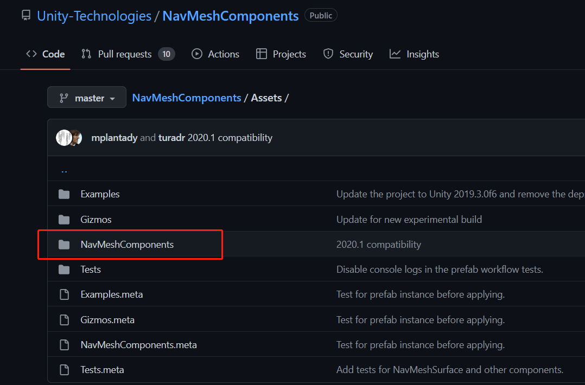

## 前言
之前我们讲解过Unity的Nav Mesh系统，其中提到过这个新版的Nav Mesh，它解决现有Nav Mesh的几个缺陷，比如无法动态烘焙，无法按照Agent的半径和高度适当的判断可行路径。现在新版Nav Mesh可以彻底解决这个问题！某种意义上讲，它只能算作一个补丁，因为它要依赖于原有的Nav Mesh系统，本篇文章就来讨论一下这个新版NavMesh系统到底是什么。

### 本系列提要
> Unity新版NavMesh专题博客共分成三篇来讲解： 【本篇为第一篇】
> - 第一篇（[点击直达]()）：新版NavMesh安装使用与概述
> - 第二篇（[待更新]()）：详解NavMeshSurface、NavMeshLink组件的参数和应用
> - 第三篇（[待更新]()）：详解NavMeshModifier、NavMeshModifierVolume组件的参数和应用

@[TOC](目录)

**Unity版本[2019.4.10f1] 梦小天幼 & 禁止转载**

> 视频讲解：
**[暂无视频](空地址)**

---
## 一、如何安装新版Nav Mesh
官方把该版本的NavMesh放到了GitHub上，目前还处于实验包阶段，使用起来是绝对没任何问题的，支持Unity5.6之后的版本，目前我使用的版本是2019.4.10f1，详细版本说明可以参考原GitHub页面版本说明
> 在Navigation属性栏的Bake选项卡上，官方就已经把链接贴了出来
> 
> https://github.com/Unity-Technologies/NavMeshComponents

### 两种安装方式
> __1.从GitHub下载把文件下来，然后直接拖入Asset文件夹即可__
> 主要是把这个文件夹（里面都是C#脚本，没啥神秘的）拖入自己项目的Asset文件夹中，其他都是一些案例演示
> 

> __2.从包管理器（Package Manager）中根据包名（Package name）下载__

> 首先打开包管理器（Window-Package Manager）
> 第二步
> 
> 第三步 输入包名 点击Add之后等待下载完毕  |  ==包名（com.unity.ai.navigation）==
> 

---
## 二、与旧版Nav Mesh区别
我们从组件方面入手来讲解

**旧:**
旧版NavMesh包括三个组件，NavMesh Agent、NavMesh Obstacle、Off MeshLink
分别用于AI寻路的代理、设置动态障碍物、设置外部链接

还有Navigation属性栏下的Agents、Areas、Bake、Object
分别用于代理的宽高、可爬坡角度、跨越高度设置，代理的区域代价设置，寻路路径烘焙设置，所选对象的区域设置、是否静态与外链接设置

**新:**
新版NavMesh包括四个组件，NavMeshSurface、NavMeshLink、NavMeshModifier、NavMeshModifierVolume
分别用于设置代理本身的寻路路径烘焙设置、根据层次结构来影响烘焙生成的模块、根据体积来影响烘焙生成的模块、新的外链接方式设置

---
## 三、新版的新增功能
本来想说新版的优点，但某种意义上来讲，新版不过是旧版的延伸罢了，还是要依赖旧版的，更像是一种补丁，或者说DLC，所以说用新增功能来表述更加合适

1.可根据不同的Agent的大小半径生成特定的导航网格（旧版全局只能使用一个Agent的参数）

2.可在**运行时**烘焙导航网格（旧版只能通过Bake选项卡在编辑时烘焙）

3.可以非常方便的修改某个物体或者**任意范围**的区域与代价设置（旧版只能通过Object选项卡中设置对象所属区域）

4.可以非常灵活的设置外链接（旧版只能被动生成或通过修改两点的position来设置外链接）

---
## 四、总结和参考资料
### 1.总结
无总结
### 2.参考资料
[1].Unity官方.[新版NavMesh GitHub页面](https://github.com/Unity-Technologies/NavMeshComponents)
[2].Unity官方.[按名称添加注册表包](https://docs.unity3d.com/2021.2/Documentation/Manual/upm-ui-quick.html)
[3].Unity官方.[新版NavMesh组件文档](https://docs.unity3d.com/Packages/com.unity.ai.navigation@1.0/manual/index.html)