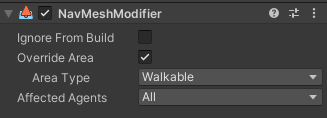
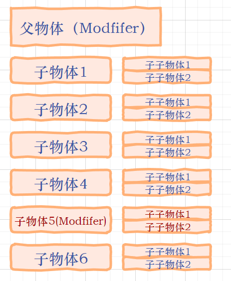
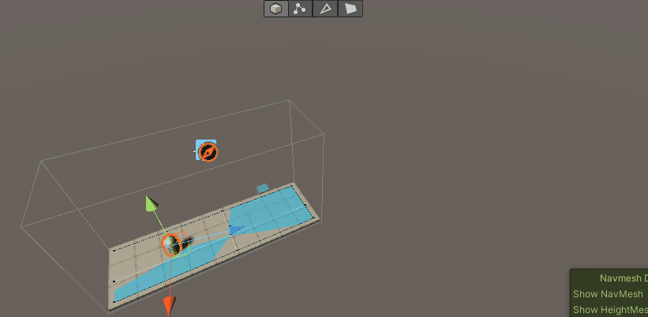
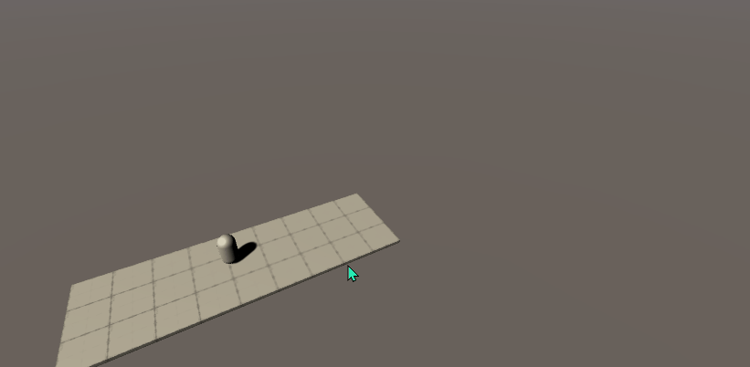
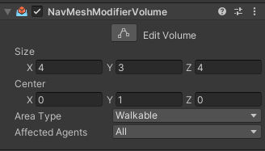
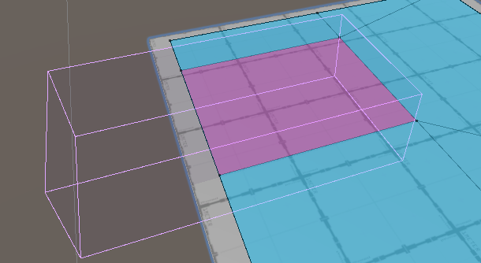

## 前言
通过前面两篇的介绍与讲解我们已经对新版NavMesh有了一个基础的了解和使用，本篇我们继续讲解剩余的两个组件NavMeshModifier、NavMeshModifierVolume，这两个组件是主要是用于影响导航网格的生成的。所以内容不是很主要，但也非常重要。

### 本系列提要
> Unity新版NavMesh专题博客共分成三篇来讲解： 【本篇为第三篇】
> - 第一篇（[点击直达]()）：新版NavMesh安装使用与概述
> - 第二篇（[待更新]()）：详解NavMeshSurface、NavMeshLink组件的参数和应用
> - 第三篇（[待更新]()）：详解NavMeshModifier、NavMeshModifierVolume组件的参数和应用

@[TOC](目录)

**Unity版本[2019.4.10f1] 梦小天幼 & 禁止转载**

> 视频讲解：
**[暂无视频](空地址)**

---
## 一、NavMeshModifier组件
> 该组件用于在**运行时**调整特定游戏对象在导航网格烘焙期间的行为方式
> 注意，本组件的最大作用是运行时烘焙，同时这也是新版NavMesh最具亮点的功能之一，它弥补了旧版系统对于性能消耗的无力感。



### 参数

参数|作用
-|-
Ignore From Build|若勾选，则从构建过程中排除游戏对象及其所有子对象
Override Area|勾选则启用Area Type
Area Type|选择想要应用的新区域类型
Affected Agents|选择受此组件影响的Agent，默认影响全部

### 影响范围
**按层次结构**来影响游戏对象，也就是说该组件附加的对象以及其所有子对象都会被影响。

如果子对象中也发现了该组件，则子对象的组件设置会覆盖更上方的组件，也会影响自身子对象。



### 动态烘焙
> 当AI走到特定位置，触发逻辑，于是重新烘焙场景




#### 逻辑步骤：
搭建好场景，分成两个部分，编辑器烘焙部分、运行时烘焙部分

编辑器烘焙部分保证游戏一开始AI就能够寻路，运行时烘焙部分则为了节省性能，只能当AI需要进入某个房间时，这个房间的内容才会被显示，路径才会被烘焙

其关键部分在于在进入场景前的位置放置一个触发器，一旦有AI触发，则显示场景，且重新烘焙场景

**主要代码**
```C Sharp
// 关键部分就两句代码，当触发逻辑时，重新烘焙“所有”场景，同时删除旧的烘焙数据
    public NavMeshSurface navOut;
    public NavMeshSurface navIn;
    private void Start()
    {
        navIn.BuildNavMesh();
        navOut.RemoveData();
    }
```

---
## 二、NavMeshModifierVolume组件
> 该组件根据特定体积来影响NavMesh区域类型的网格生成



### 参数

参数|作用
-|-
Size|影响范围的尺寸
Center|影响范围的中心点
Area Type|选择想要应用的新区域类型
Affected Agents|选择受此组件影响的Agent，默认影响全部

### 影响范围
该组件的影响范围跟父级子级毫无关系，只影响体积范围内的物体


---
## 三、总结和参考资料
### 1.总结
这里有一张图片，是有关NavMesh系统的全局总结图，但懒得画，先占坑hh
### 2.参考资料
[1].Unity官方.[NavMesh Modifier组件文档](https://docs.unity3d.com/Packages/com.unity.ai.navigation@1.0/manual/NavMeshModifier.html)
[2].Unity官方.[NavMesh ModifierVolume组件文档](https://docs.unity3d.com/Packages/com.unity.ai.navigation@1.0/manual/NavMeshModifierVolume.html)